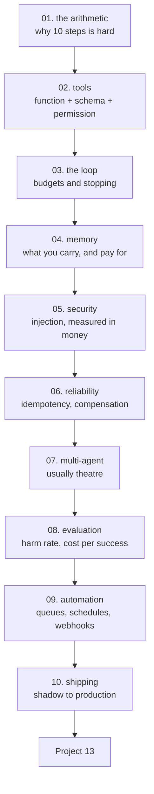

# AI Agents and Automation — Tayel AI Labs

The thirteenth course. An agent is a program whose control flow is chosen by a
statistical model, and the entire discipline is **making sure every guarantee
comes from the parts that are not the model**.

Python only. No n8n, no Zapier, no agent framework — the loop is twenty lines
and you will write it, because everything that matters happens in the code
around it.

**Prerequisites**

- [`../Python`](../Python) — both tracks
- [`../LLM-and-GenAI`](../LLM-and-GenAI) — lessons 09 (structured output) and
  10 (cost) are load-bearing here
- [`../Data-Science`](../Data-Science) — evaluation and monitoring

---

## The path



## Lessons

| # | Lesson | The measured result |
|---|---|---|
| 01 | [What an Agent Is](lessons/01-what-an-agent-is.md) | 95% per step is **59.9%** over 10 steps; one retry makes it 90.4% |
| 02 | [Tools](lessons/02-tools.md) | Seven calls, four rejections, each at a different layer |
| 03 | [The Agent Loop](lessons/03-the-loop.md) | At the minimum budget even a 0.9-skill agent succeeds 66.8% of the time |
| 04 | [Memory and State](lessons/04-memory.md) | A 12-step run costs **3.06x** what it needs to |
| 05 | [Security](lessons/05-security.md) | One poisoned note costs 1,610 EGP; business rules alone still leak 450 |
| 06 | [Reliability](lessons/06-reliability.md) | Three retries pay **1,350 EGP** for one 450 EGP refund |
| 07 | [Multi-Agent](lessons/07-multi-agent.md) | One agent at double budget (0.988) beats agent + perfect reviewer (0.856) |
| 08 | [Evaluating Agents](lessons/08-evaluating-agents.md) | Two agents both at 1.000 success: 2x cost apart, 14 points of harm apart |
| 09 | [Automation in Python](lessons/09-automation.md) | At-least-once + a naive handler overpays **25.1%** |
| 10 | [Shipping an Agent](lessons/10-shipping-an-agent.md) | Shadow, suggest, narrow, wide |

## Then

- **[`Project-13/`](Project-13/)** — one agent taken from shadow mode to a
  narrow slice of production, with its harm rate and its bill

---

## Setup

```bash
python3 -m venv .venv
source .venv/bin/activate
pip install -r requirements.txt
```

Most lessons are NumPy simulations and run in seconds. Lesson 02 writes a tool
module to `/tmp/office_tools.py`; lesson 03 uses `dispatch` from it, so **run
them in order**.

---

## What this course argues

1. **If you know the steps, write a workflow.** Agents are for when the sequence
   genuinely cannot be known in advance (lesson 01).
2. **The arithmetic decides feasibility before the prompt does.** 95% per step
   is 36% over 20 steps (lesson 01).
3. **The model should never name a tool.** It returns a decision; your code maps
   it to an action. That one rule removes most of the security problem
   (lesson 05).
4. **Retries need idempotency keys**, or reliability engineering becomes an
   overpayment engine (lesson 06).
5. **Multi-agent is usually a budget split with extra coordination.** Compare at
   equal budget before believing it (lesson 07).
6. **Success rate hides harm.** Two agents at 1.000 differed by 14 points of
   harm and 2x in cost (lesson 08).
