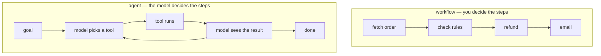

# Lesson 01 — What an Agent Is, and the Arithmetic

**Goal:** understand the one number that decides whether an agent can work —
and why most agent demos do not survive contact with ten steps.

## What you will learn

- The difference between a workflow and an agent
- Error compounding, in a table
- The per-step reliability your task actually requires
- Why retries and verification are not optional extras

---

## Agent or workflow?



**If you know the steps, write the workflow.** It is cheaper, faster,
debuggable, and it cannot decide to do something else. An agent earns its cost
only when the sequence genuinely cannot be known in advance — the number of
steps varies, the branch depends on what a previous tool returned, or the space
of tasks is too large to enumerate.

| Use a workflow | Use an agent |
|---|---|
| "Refund an order" — always the same 4 steps | "Resolve this support ticket" — could be 2 or 12 |
| The branch depends on a value you can test | The branch depends on judgement |
| Failure must be deterministic | Failure can be retried or escalated |
| You are automating a form | You are automating a person's decision |

Most projects described as "agentic" are workflows with a language model doing
one classification step. That is a good design, and it should be called what it
is.

---

## The arithmetic that decides everything

An agent succeeds only if **every** step is right. Independent steps multiply.

```python
import numpy as np

print(f"{'per-step reliability':>21}" + "".join(f"{n:>9}" for n in (1, 3, 5, 10, 20)))
for p in (0.99, 0.95, 0.90, 0.80):
    row = "".join(f"{p ** n:>9.3f}" for n in (1, 3, 5, 10, 20))
    print(f"{p:>21.2f}{row}")
print("\n(columns are the number of steps; cells are P(all steps correct))")
```

```text
 per-step reliability        1        3        5       10       20
                 0.99    0.990    0.970    0.951    0.904    0.818
                 0.95    0.950    0.857    0.774    0.599    0.358
                 0.90    0.900    0.729    0.590    0.349    0.122
                 0.80    0.800    0.512    0.328    0.107    0.012

(columns are the number of steps; cells are P(all steps correct))
```

Read the 0.95 row. A model that is right **95% of the time** — which sounds
excellent, and is roughly what a good model does on a well-specified tool
choice — completes a **10-step task 59.9% of the time** and a 20-step task
**35.8%** of the time.

This single table explains the entire gap between agent demos and agent
products. A demo is 3 steps: 0.857, which looks like magic. The real task is 12
steps, and two out of five attempts fail somewhere in the middle, often having
already sent an email or issued a refund.

```python
for target in (0.95, 0.99):
    print(f"to reach {target:.0%} end-to-end:")
    for steps in (3, 5, 10, 20):
        need = target ** (1 / steps)
        print(f"  {steps:>3} steps -> every step must be {need:.4f} reliable")
```

```text
to reach 95% end-to-end:
    3 steps -> every step must be 0.9830 reliable
    5 steps -> every step must be 0.9898 reliable
   10 steps -> every step must be 0.9949 reliable
   20 steps -> every step must be 0.9974 reliable
to reach 99% end-to-end:
    3 steps -> every step must be 0.9967 reliable
    5 steps -> every step must be 0.9980 reliable
   10 steps -> every step must be 0.9990 reliable
   20 steps -> every step must be 0.9995 reliable
```

To ship a 10-step agent at 95% success you need **99.49% per-step reliability**.
No amount of prompt engineering gets a language model there on an open-ended
choice.

So the three real strategies are:

1. **Reduce the number of steps.** Every step you remove multiplies back in.
   Merge tools, precompute, or replace three model decisions with one
   deterministic function.
2. **Make the steps easier.** A choice between 4 tools is more reliable than a
   choice between 40; a filled-in template is more reliable than free-form
   arguments.
3. **Catch failures instead of preventing them.** The next two sections.

---

## Retries, when failure is visible

```python
def success_with_retries(p_step, steps, retries):
    p_eff = 1 - (1 - p_step) ** (retries + 1)   # step succeeds within retries
    return p_eff ** steps
print(f"{'retries':>8}" + "".join(f"{f'{s} steps':>11}" for s in (3, 5, 10, 20)))
for r in (0, 1, 2):
    print(f"{r:>8}" + "".join(f"{success_with_retries(0.90, s, r):>11.3f}"
                               for s in (3, 5, 10, 20)))
print("\nper-step reliability 0.90, retries are independent")
```

```text
 retries    3 steps    5 steps   10 steps   20 steps
       0      0.729      0.590      0.349      0.122
       1      0.970      0.951      0.904      0.818
       2      0.997      0.995      0.990      0.980

per-step reliability 0.90, retries are independent
```

**One retry takes a 10-step task from 0.349 to 0.904.** Two retries take it to
0.990. Nothing else in this course produces an improvement of that size.

The condition hiding in that table is the important part: **the step must know
it failed.** A tool that raises an exception, returns an error, or violates a
schema can be retried. A tool that quietly refunds the wrong order cannot,
because nothing asked for a retry.

So: make failures loud. Validate every tool result. An agent whose tools return
`{"error": ...}` instead of raising is an agent that cannot retry.

---

## Verification, when failure is silent

```python
def with_verifier(p_step, steps, verifier_recall):
    """A checker that catches a fraction of bad steps and forces a redo."""
    p_eff = p_step + (1 - p_step) * verifier_recall * p_step
    return p_eff ** steps
print(f"{'verifier catches':>18}" + "".join(f"{f'{s} steps':>11}" for s in (3, 5, 10, 20)))
for v in (0.0, 0.5, 0.9, 0.99):
    print(f"{v:>18.0%}" + "".join(f"{with_verifier(0.90, s, v):>11.3f}"
                                  for s in (3, 5, 10, 20)))
```

```text
  verifier catches    3 steps    5 steps   10 steps   20 steps
                0%      0.729      0.590      0.349      0.122
               50%      0.844      0.754      0.568      0.323
               90%      0.944      0.909      0.825      0.681
               99%      0.968      0.947      0.896      0.803
```

A verifier that catches 90% of bad steps takes the 10-step task from 0.349 to
**0.825** — good, and noticeably worse than the 0.904 that one retry bought.

That ordering is the practical lesson. **A retry on a detected failure is worth
more than a verifier on an undetected one**, so the highest-value engineering is
whatever converts silent failures into loud ones: schemas, preconditions,
business rules, checksums, a read-back of what was written.

Build in this order:

```text
1. Make every step's failure detectable    (schemas, validation, preconditions)
2. Retry detected failures                  (bounded, with backoff)
3. Verify what cannot be detected           (a checker, a second model, a human)
4. Only then, reduce the step count
```

---

## Common mistakes

| Mistake | Why it hurts |
|---|---|
| Building an agent where a workflow would do | Slower, dearer, and it can surprise you |
| Judging feasibility from a 3-step demo | 0.857 at 3 steps is 0.599 at 10 |
| "The model is 95% accurate, so we are fine" | 95% per step is 36% at 20 steps |
| Tools that fail silently | Nothing to retry; you need a verifier instead, and it is worse |
| Unbounded retries | Unbounded cost, and a loop nobody notices |
| Adding steps for thoroughness | Every added step multiplies the failure rate |
| No step-count budget | The loop runs until the bill arrives |

---

## Exercises

1. Count the steps in an agent task you want to build. Using the first table,
   state the per-step reliability you need for 90% success — then say whether
   you believe you can reach it.
2. Redo the retry table for per-step reliability 0.95 and 0.99. At which point
   do retries stop being the cheapest improvement?
3. Take a tool you have written and list every way it can fail **silently**.
   For each, write the check that would make it loud.
4. Combine retries and verification in one model: a verifier with recall `v`
   plus `r` retries. Which pair reaches 0.95 at 10 steps most cheaply, if a
   retry costs one model call and the verifier costs two?

---

**Next:** [Lesson 02 — Tools](02-tools.md)
