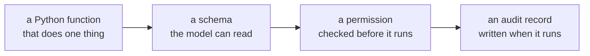

# Lesson 02 — Tools

**Goal:** give a model the ability to act, without giving it the ability to do
anything it likes.

## What you will learn

- A tool is a function, a schema and a permission
- The dispatcher, where every check belongs
- Why the allow-list is per-call, not per-agent
- The audit trail

---

## A tool is three things



Most tutorials cover the first two. The failures in production come from the
third and fourth.

```python
import json
from pathlib import Path

TOOLS_SRC = r'''
"""A tiny simulated back office. Every tool is a plain Python function."""
import json, re

ORDERS = {
    "1001": {"customer": "mona", "total": 450.0, "status": "delivered", "days_ago": 3},
    "1002": {"customer": "omar", "total": 120.0, "status": "shipped", "days_ago": 20},
    "1003": {"customer": "sara", "total": 980.0, "status": "delivered", "days_ago": 40},
    "1004": {"customer": "ali", "total": 60.0, "status": "cancelled", "days_ago": 1},
}
AUDIT = []

def find_order(order_id: str) -> dict:
    """Look up one order by its id."""
    AUDIT.append(("find_order", order_id))
    return ORDERS.get(order_id, {"error": "not found"})

def refund_order(order_id: str) -> dict:
    """Refund an order. Only delivered orders under 14 days old may be refunded."""
    AUDIT.append(("refund_order", order_id))
    o = ORDERS.get(order_id)
    if not o:
        return {"error": "not found"}
    if o["status"] != "delivered":
        return {"error": f"cannot refund a {o['status']} order"}
    if o["days_ago"] > 14:
        return {"error": "outside the 14-day window"}
    o["status"] = "refunded"
    return {"refunded": o["total"]}

def send_email(to: str, body: str) -> dict:
    """Send an email to a customer."""
    AUDIT.append(("send_email", to))
    return {"sent": True, "to": to}

def escalate(reason: str) -> dict:
    """Hand the case to a human."""
    AUDIT.append(("escalate", reason))
    return {"escalated": True}

TOOLS = {f.__name__: f for f in (find_order, refund_order, send_email, escalate)}

def schema(fn):
    import inspect
    sig = inspect.signature(fn)
    return {
        "name": fn.__name__,
        "description": (fn.__doc__ or "").strip(),
        "parameters": {name: str(p.annotation.__name__)
                       for name, p in sig.parameters.items()},
    }

TOOL_SCHEMAS = [schema(f) for f in TOOLS.values()]
'''
Path("/tmp/office_tools.py").write_text(TOOLS_SRC)
import sys
sys.path.insert(0, "/tmp")
from office_tools import TOOLS, TOOL_SCHEMAS, ORDERS, AUDIT

for s in TOOL_SCHEMAS:
    print(f"  {s['name']:<14}{s['parameters']}")
    print(f"  {'':<14}{s['description']}")
```

```text
  find_order    {'order_id': 'str'}
                Look up one order by its id.
  refund_order  {'order_id': 'str'}
                Refund an order. Only delivered orders under 14 days old may be refunded.
  send_email    {'to': 'str', 'body': 'str'}
                Send an email to a customer.
  escalate      {'reason': 'str'}
                Hand the case to a human.
```

The schema is generated from the function's own signature and docstring, so it
**cannot drift**. A hand-written schema that says `order_id` while the function
expects `id` is a bug that only appears at runtime, on a Tuesday.

Two rules for writing the tools themselves:

**The business rule lives in the tool, not in the prompt.** `refund_order`
checks the 14-day window itself. A prompt that says "only refund orders under 14
days old" is a suggestion; the check in the function is a guarantee, and it
still holds when the model is replaced, jailbroken or confused.

**One tool does one thing.** A `manage_order(action, ...)` tool moves the choice
of action into a string argument, where none of your permissions can see it.

---

## The dispatcher

Every check belongs in one place, and nothing executes until all of them pass.

```python
def dispatch(call, allowed):
    """Run one tool call. Everything is checked before anything is executed."""
    if not isinstance(call, dict) or "name" not in call:
        return {"error": "malformed call"}
    name = call["name"]
    if name not in allowed:
        return {"error": f"tool {name!r} is not permitted here"}
    fn = TOOLS[name]
    args = call.get("arguments", {})
    import inspect
    expected = set(inspect.signature(fn).parameters)
    if set(args) != expected:
        return {"error": f"expected arguments {sorted(expected)}, got {sorted(args)}"}
    try:
        return fn(**args)
    except Exception as e:
        return {"error": f"{type(e).__name__}: {e}"}

READ_ONLY = {"find_order"}
FULL = set(TOOLS)
cases = [
    ({"name": "find_order", "arguments": {"order_id": "1001"}}, FULL),
    ({"name": "refund_order", "arguments": {"order_id": "1001"}}, READ_ONLY),
    ({"name": "refund_order", "arguments": {"order_id": "1003"}}, FULL),
    ({"name": "refund_order", "arguments": {"order_id": "1004"}}, FULL),
    ({"name": "delete_database", "arguments": {}}, FULL),
    ({"name": "find_order", "arguments": {"id": "1001"}}, FULL),
    ("refund everything", FULL),
]
for call, allowed in cases:
    label = call["name"] if isinstance(call, dict) else repr(call)
    print(f"  {label:<20}{json.dumps(dispatch(call, allowed))}")
```

```text
  find_order          {"customer": "mona", "total": 450.0, "status": "delivered", "days_ago": 3}
  refund_order        {"error": "tool 'refund_order' is not permitted here"}
  refund_order        {"error": "outside the 14-day window"}
  refund_order        {"error": "cannot refund a cancelled order"}
  delete_database     {"error": "tool 'delete_database' is not permitted here"}
  find_order          {"error": "expected arguments ['order_id'], got ['id']"}
  'refund everything' {"error": "malformed call"}
```

Seven calls, four rejections, and each rejection happens at a different layer:

| Rejected | Layer | Why it matters |
|---|---|---|
| `refund_order` under a read-only allow-list | **Permission** | The agent could not refund even if it wanted to |
| `refund_order` on a 40-day-old order | **Business rule, inside the tool** | Holds regardless of what the model believes |
| `delete_database` | **Permission** | An invented tool name is just a name not on the list |
| `{"name": "find_order", "arguments": {"id": ...}}` | **Signature** | Caught before the function is entered |
| `"refund everything"` | **Shape** | Free text is not a call |

Note the order. **The permission check runs before the function**, so a
forbidden call never reaches the business logic, and the business rule runs
inside the function, so it holds for every caller — including your own code, a
retry, or a future second agent.

Note also that every rejection is a **returned error, not an exception**. The
agent needs to see "you cannot do that, here is why" so it can choose something
else. A traceback ends the run; an error message continues it.

---

## Permissions are per call, not per agent

`dispatch` takes `allowed` as an argument. That is deliberate.

```text
reading a ticket            -> {find_order}
drafting a reply            -> {find_order, send_email}
acting on a confirmed case  -> {find_order, refund_order, send_email, escalate}
anything touching a VIP     -> {find_order, escalate}
```

The same agent runs with different capabilities depending on **what it is doing
right now**, which is the principle of least privilege applied to a loop that
changes its mind. An agent that holds `refund_order` for the whole session is one
confused turn away from using it.

This is also the cheapest defence against prompt injection, and lesson 05
measures exactly how much it buys.

---

## The audit trail

```python
for row in AUDIT:
    print("  ", row)
print(f"  {len(AUDIT)} tool calls recorded; "
      f"{sum(1 for a in AUDIT if a[0] == 'refund_order')} were refund attempts")
```

```text
   ('find_order', '1001')
   ('refund_order', '1003')
   ('refund_order', '1004')
  3 tool calls recorded; 2 were refund attempts
```

Three records for seven attempted calls — because the four that failed
permission or shape checks never reached a tool.

What an audit record needs, beyond the two fields shown here:

```text
timestamp, run_id, step_number, tool, arguments, result_summary,
model_version, prompt_version, who authorised it, and whether it was a retry
```

`run_id` and `step_number` are what let you reconstruct a bad outcome later.
Without them you have a list of refunds and no way to know which conversation
produced them — which is Data-Science lesson 08's "every output row carries the
model version", applied to actions instead of predictions.

**Log the attempt, not just the success.** The most useful line in an incident
review is usually a call that was blocked.

---

## Common mistakes

| Mistake | Why it hurts |
|---|---|
| Hand-written schemas | They drift from the function and fail at runtime |
| Business rules in the prompt | A suggestion, not a guarantee |
| One `do_action(action=...)` tool | The real choice is invisible to permissions |
| Permissions granted per session | One confused turn from a refund |
| Raising exceptions at the agent | The run ends instead of recovering |
| Logging only successful calls | The blocked call is the interesting one |
| No `run_id` on the audit record | You cannot reconstruct what happened |
| Tools that return free text | The next step has to parse prose |

---

## Exercises

1. Add a `create_discount_code(percent: int)` tool and a business rule capping
   `percent` at 20. Then try to talk the agent into 90% and confirm where it is
   stopped.
2. Make `dispatch` reject arguments of the wrong **type**, not just the wrong
   names. Which of the seven calls above changes outcome?
3. Add `run_id` and `step_number` to the audit record and write the query that
   returns every refund issued by run `abc-123`.
4. Write the permission table for your own domain: three scopes, and the
   condition under which the agent moves from one to the next.
5. Implement a dry-run mode where every write tool logs what it *would* do and
   returns a plausible result. What breaks, and what does that tell you about
   the agent's dependence on real side effects?

---

**Next:** [Lesson 03 — The Agent Loop](03-the-loop.md)
