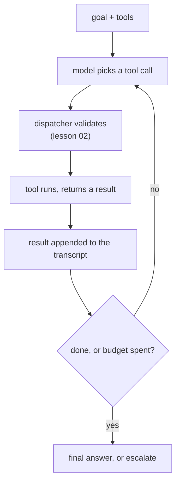

# Lesson 03 — The Agent Loop

**Goal:** write the loop, give it a budget, and see what the budget buys.

## What you will learn

- The ReAct loop in twenty lines
- Step budgets, measured against task success
- What a failed run costs you
- Stopping conditions that are not "the model said done"

---

## The loop



That is the whole architecture. Everything else — planning, reflection,
scratchpads — is a variation on what goes into the transcript before the model
picks again.

```python
# no-run: uses dispatch() from lesson 02
def agent_loop(goal, tools_allowed, choose_action, max_steps=8):
    """choose_action(goal, transcript) -> a tool call dict, or None when finished."""
    transcript = []
    for step in range(max_steps):
        call = choose_action(goal, transcript)
        if call is None:
            return {"status": "done", "steps": step, "transcript": transcript}
        result = dispatch(call, tools_allowed)      # lesson 02
        transcript.append({"step": step, "call": call, "result": result})
        if isinstance(result, dict) and result.get("escalated"):
            return {"status": "escalated", "steps": step + 1, "transcript": transcript}
    return {"status": "budget_exhausted", "steps": max_steps, "transcript": transcript}
```

Three details that separate this from the version in most tutorials:

- **`max_steps` is a hard stop**, not a suggestion. Without it, a model that
  cannot finish will loop until someone notices the bill.
- **`budget_exhausted` is a distinct outcome** from `done`. A run that ran out
  of steps is a failure that must be counted as one, not a partial success.
- **The transcript stores the call and the result**, not prose. That is what
  makes lesson 08's evaluation possible.

---

## What does the budget buy?

Simulate an agent whose per-step "skill" is the probability of choosing the
right next action, on a task that needs four correct actions.

```python
import numpy as np

class World:
    """Answer requires: find_order -> check eligibility -> refund -> send_email."""
    PLAN = ["find_order", "check_rules", "refund_order", "send_email"]
    def __init__(self, skill, seed):
        self.rng = np.random.default_rng(seed); self.skill = skill; self.done = 0
    def step(self):
        if self.rng.random() < self.skill:
            self.done += 1                      # correct next action
        return self.done >= len(self.PLAN)

def run(skill, max_steps, seed):
    w = World(skill, seed)
    for i in range(max_steps):
        if w.step():
            return True, i + 1
    return False, max_steps

print(f"{'step budget':>12}" + "".join(f"{f'skill {s}':>12}" for s in (0.5, 0.7, 0.9)))
for budget in (4, 6, 8, 12, 20):
    row = ""
    for skill in (0.5, 0.7, 0.9):
        outs = [run(skill, budget, s) for s in range(2000)]
        row += f"{np.mean([o[0] for o in outs]):>12.3f}"
    print(f"{budget:>12}{row}")
print("\nthe task needs 4 correct actions; cells are task success rate")
```

```text
 step budget   skill 0.5   skill 0.7   skill 0.9
           4       0.067       0.260       0.668
           6       0.341       0.743       0.983
           8       0.631       0.936       0.999
          12       0.926       0.999       1.000
          20       1.000       1.000       1.000

the task needs 4 correct actions; cells are task success rate
```

Read the first row. With a budget of exactly four steps — the minimum the task
needs — **even a 0.9-skill agent succeeds only 66.8% of the time**, and a
0.5-skill agent 6.7%.

Then read down the columns. Giving the 0.5-skill agent **20 steps instead of 4
takes it from 0.067 to 1.000.** Slack is the single cheapest improvement
available, because a wrong step is not fatal when there is room to take another.

This is the counterweight to lesson 01's compounding table. Compounding applies
when *every* step must be right the first time; a loop that can observe a
failure and try again converts multiplication into something much gentler. The
engineering job is to make sure the failure is **visible** so the loop can react
— which is lesson 01's conclusion arriving from the other direction.

---

## What a failure costs

```python
for skill in (0.5, 0.9):
    outs = [run(skill, 20, s) for s in range(2000)]
    succ = [o[1] for o in outs if o[0]]
    fail = [o[1] for o in outs if not o[0]]
    print(f"skill {skill}: success {np.mean([o[0] for o in outs]):.3f}, "
          f"mean steps when it works {np.mean(succ):.1f}, "
          f"wasted steps when it fails {np.mean(fail) if fail else 0:.1f}")
```

```text
skill 0.5: success 1.000, mean steps when it works 8.0, wasted steps when it fails 20.0
skill 0.9: success 1.000, mean steps when it works 4.4, wasted steps when it fails 0.0
```

At a budget of 20 both agents reach 1.000 — but the weak agent takes **8 steps
on average** where the strong one takes 4.4.

So the budget does not only bound the worst case; the *average* cost of a run is
set by the agent's skill. Two agents with identical success rates can differ by
2x in cost per task, and only the skill difference shows it. **Measure mean
steps per successful task, not just success rate** — it is the number that
appears on the invoice.

And note the asymmetry a failing run creates: a run that exhausts its budget
spends **every** step it was given and delivers nothing. Failures are the most
expensive outcome per unit of value, which is why a cheap early escalation beats
an expensive late failure.

---

## Stopping conditions

"The model said it was finished" is one stopping condition, and the least
reliable one. A production loop needs all of these:

| Condition | Why |
|---|---|
| **Step budget** | The only guaranteed termination |
| **Token / cost budget** | A single step can be huge; steps are not a proxy for cost |
| **Wall-clock timeout** | A user is waiting, or a queue is backing up |
| **Goal check, in code** | "Is the order refunded?" is checkable; ask the database, not the model |
| **No-progress detector** | The same tool with the same arguments twice is a loop |
| **Escalation** | Some outcomes should end in a human, deliberately |

The **goal check in code** is the one worth building first. If you can write a
function that answers "is this task complete?", the agent's opinion stops
mattering, and you have also written most of lesson 08's evaluator.

The **no-progress detector** is three lines and catches the most common runaway:

```python
# no-run
def stuck(transcript, window=3):
    recent = [(t["call"]["name"], str(t["call"].get("arguments"))) for t in transcript[-window:]]
    return len(recent) == window and len(set(recent)) == 1
```

---

## Common mistakes

| Mistake | Why it hurts |
|---|---|
| No step budget | The loop runs until someone reads the bill |
| Budget equal to the minimum steps | 66.8% success even at skill 0.9 |
| Counting `budget_exhausted` as success | Hides the most expensive failure mode |
| Trusting the model's "I'm done" | It is a prediction, not a check |
| Measuring success rate without mean steps | Two agents at 1.000 can differ 2x in cost |
| Storing prose in the transcript | Nothing downstream can evaluate it |
| No no-progress detector | The same call, forever |

---

## Exercises

1. Add a token budget alongside the step budget and make the loop stop on
   whichever binds first. Which one binds in your task?
2. Implement `stuck()` in the loop and measure how many runs it saves at skill
   0.5, budget 20.
3. Write the code-based goal check for the refund task. How much of lesson 08's
   evaluator have you now written?
4. Re-run the budget table with the task needing 8 correct actions instead of 4.
   How much budget does skill 0.7 now need to reach 0.95?
5. Add a cost per step and compute expected cost per *successful* task at each
   skill and budget. Where is the cheapest configuration, and is it the one with
   the highest success rate?

---

**Next:** [Lesson 04 — Memory and State](04-memory.md)
