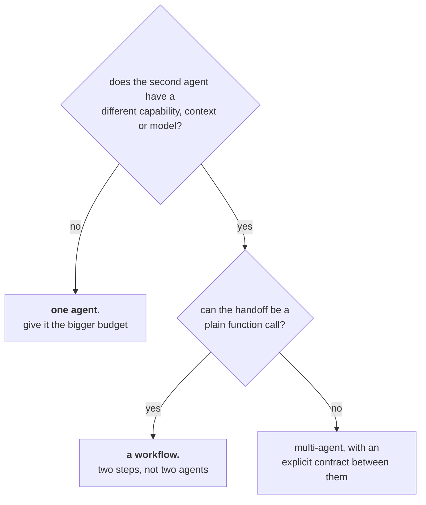

# Lesson 07 — Multi-Agent, and When It Is Theatre

**Goal:** find out whether a second agent beats simply giving the first one more
room.

## What you will learn

- The honest comparison, at equal budget
- Where multi-agent genuinely helps
- The coordination cost nobody prices
- A decision rule

---

## The comparison nobody runs

Multi-agent systems are usually compared against a single agent with a *smaller*
budget. Compare at **equal total budget** instead.

```python
import numpy as np

class World:
    """Answer requires: find_order -> check eligibility -> refund -> send_email."""
    PLAN = ["find_order", "check_rules", "refund_order", "send_email"]
    def __init__(self, skill, seed):
        self.rng = np.random.default_rng(seed); self.skill = skill; self.done = 0
    def step(self):
        if self.rng.random() < self.skill:
            self.done += 1                      # correct next action
        return self.done >= len(self.PLAN)

def run(skill, max_steps, seed):
    w = World(skill, seed)
    for i in range(max_steps):
        if w.step():
            return True, i + 1
    return False, max_steps

def single(skill, budget, seed):
    return run(skill, budget, seed)[0]

def reviewer(skill, budget, seed, reviewer_recall):
    """One agent acts, a second checks and can force one redo."""
    rng = np.random.default_rng(seed + 10_000)
    ok = run(skill, budget, seed)[0]
    if not ok and rng.random() < reviewer_recall:
        ok = run(skill, budget, seed + 500_000)[0]     # one more attempt
    return ok

print(f"{'setup':<34}{'skill 0.5':>11}{'skill 0.7':>11}{'skill 0.9':>11}")
for label, fn in [("one agent, budget 8", lambda s, seed: single(s, 8, seed)),
                  ("one agent, budget 16", lambda s, seed: single(s, 16, seed)),
                  ("agent + reviewer (recall 1.0)",
                   lambda s, seed: reviewer(s, 8, seed, 1.0))]:
    row = "".join(f"{np.mean([fn(s, seed) for seed in range(2000)]):>11.3f}"
                  for s in (0.5, 0.7, 0.9))
    print(f"{label:<34}{row}")
```

```text
setup                               skill 0.5  skill 0.7  skill 0.9
one agent, budget 8                     0.631      0.936      0.999
one agent, budget 16                    0.988      1.000      1.000
agent + reviewer (recall 1.0)           0.856      0.997      1.000
```

Row two and row three cost the same: **16 steps total.** One agent with all 16
scores **0.988** at skill 0.5; an agent with 8 steps plus a perfect reviewer who
can grant one more 8-step attempt scores **0.856**.

**Doubling one agent's budget beat adding a second agent**, with a reviewer that
was given *perfect* failure detection — a generous assumption that no real
reviewer meets.

The reason is structural. Splitting a budget into two independent attempts
throws away the partial progress of the first: the reviewer's retry starts from
scratch, while the single agent's step 9 builds on steps 1 to 8. **Continuation
beats restarting**, unless the first attempt has poisoned the state.

And at skill 0.9 all three are 0.999 or 1.000. When the underlying agent is
good, the architecture question does not arise.

---

## Where multi-agent actually helps

Not never — but for specific, checkable reasons:

| Reason | Example | Why it works |
|---|---|---|
| **Different tool permissions** | A researcher that can only read; an executor that can write | Lesson 05: the capability boundary is real, not decorative |
| **Different context** | One agent per document, results merged | Each context stays small (lesson 04) |
| **Genuine parallelism** | 200 tickets, 10 workers | Wall-clock, not accuracy |
| **A different model** | Cheap model drafts, expensive model reviews | Cost routing (LLM lesson 10) |
| **An independent check** | A verifier that sees only the output, not the reasoning | Independence is the point; the same model in the same context is not independent |

And where it does not:

| Pattern | What it usually is |
|---|---|
| "Planner + executor" on a 4-step task | One agent, two prompts, twice the cost |
| A "critic" with the same model and context | Correlated errors: it agrees with itself |
| Five personas debating | Five times the tokens, one distribution |
| A hierarchy of managers | Coordination cost with no capability difference |

The test: **name the capability, context or model that the second agent has and
the first does not.** If the answer is "a different system prompt", you have
added cost, latency and a new failure mode to buy nothing.

---

## The coordination cost

Every extra agent adds:

- **Tokens**: its own system prompt and context, on every turn
- **Latency**: usually sequential, because B waits for A
- **A new failure mode**: the handoff. A drops something, B misreads it, both
  wait for the other
- **A harder audit**: which agent issued the refund? lesson 02's `run_id` now
  needs an `agent_id` beside it
- **Compounding**: lesson 01's table applies to the *combined* step count

That last point is the one that catches teams. Two 6-step agents is a 12-step
system, and 0.95 per step over 12 steps is 0.54.

---

## The decision rule



Most honest answers land on the left or in the middle. When you do reach the
right-hand box, make the contract between agents a **schema**, not prose —
everything in LLM lesson 09 applies to agent-to-agent messages, and an untyped
handoff is the single most common source of multi-agent flakiness.

---

## Common mistakes

| Mistake | Why it hurts |
|---|---|
| Comparing multi-agent against a smaller single-agent budget | The comparison is rigged |
| A critic using the same model and context | Correlated errors; it agrees with itself |
| Personas instead of capabilities | Cost without a difference |
| Ignoring the combined step count | Two 6-step agents is lesson 01's 12-step row |
| Prose handoffs | Untyped messages, unbounded interpretation |
| No `agent_id` in the audit | You cannot tell who did what |
| Parallel agents writing to the same state | Races, in a system with no transactions |

---

## Exercises

1. Re-run the comparison with a reviewer whose recall is 0.6 instead of 1.0.
   How much further behind does the two-agent setup fall?
2. Change the reviewer so it **continues** the failed run instead of restarting
   it. Does it now beat the single agent at equal budget?
3. Take a multi-agent design you have seen and name, for each agent, the
   capability the others lack. How many survive?
4. Give two agents a typed contract (a JSON schema) and measure handoff failures
   before and after.
5. Compute the combined step count of your design and look it up in lesson 01's
   table. Is the end-to-end success rate one you would ship?

---

**Next:** [Lesson 08 — Evaluating Agents](08-evaluating-agents.md)
