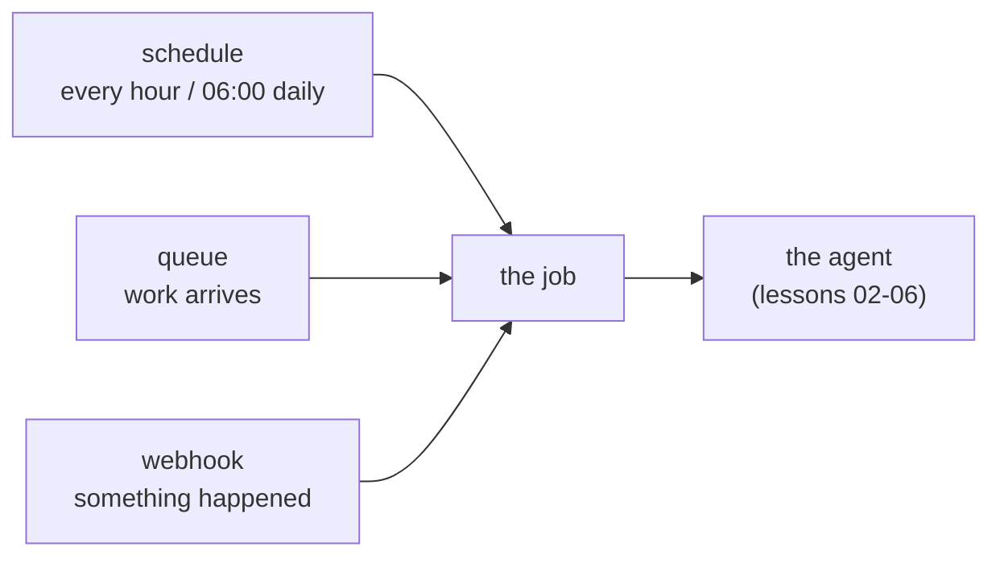

# Lesson 09 — Automation in Python

**Goal:** run the agent without a person clicking a button, and survive the
failure modes that only appear when nobody is watching.

## What you will learn

- Delivery guarantees, measured
- Why "exactly once" is a design, not a setting
- Scheduling, queues and webhooks in plain Python
- The unattended-job checklist

---

## Nothing runs exactly once

Every queue, scheduler and webhook offers one of two guarantees, and neither is
the one you want.

```python
import numpy as np

class Queue:
    def __init__(self, failure_rate, seed=0):
        self.rng = np.random.default_rng(seed); self.fail = failure_rate
    def deliver(self, mode):
        """Returns how many times the handler ran for one logical message."""
        if mode == "at_most_once":
            return 0 if self.rng.random() < self.fail else 1
        runs = 0
        while True:
            runs += 1
            if self.rng.random() >= self.fail:   # ack succeeded
                return runs

for fail in (0.05, 0.2):
    for mode in ("at_most_once", "at_least_once"):
        q = Queue(fail, seed=1)
        runs = [q.deliver(mode) for _ in range(20_000)]
        lost = np.mean([r == 0 for r in runs])
        dup = np.mean([r > 1 for r in runs])
        print(f"failure {fail:.0%}  {mode:<15} lost {lost:>6.1%}  duplicated {dup:>6.1%}  "
              f"mean runs {np.mean(runs):.2f}")
```

```text
failure 5%  at_most_once    lost   5.1%  duplicated   0.0%  mean runs 0.95
failure 5%  at_least_once   lost   0.0%  duplicated   5.1%  mean runs 1.05
failure 20%  at_most_once    lost  20.2%  duplicated   0.0%  mean runs 0.80
failure 20%  at_least_once   lost   0.0%  duplicated  19.8%  mean runs 1.25
```

**At-most-once loses 5.1% of messages at a 5% failure rate. At-least-once
duplicates 5.1% of them.** There is no third column; you choose which failure
you prefer.

Almost always you choose **at-least-once**, because a lost refund is worse than
a duplicated attempt — and then you make the duplicate harmless.

```python
for fail in (0.05, 0.2):
    q = Queue(fail, seed=1)
    runs = [q.deliver("at_least_once") for _ in range(20_000)]
    naive = sum(runs) * 450
    idem = len(runs) * 450
    print(f"failure {fail:.0%}: naive handler pays {naive:,} EGP, "
          f"idempotent pays {idem:,} EGP  (overpayment {naive / idem - 1:.1%})")
```

```text
failure 5%: naive handler pays 9,486,450 EGP, idempotent pays 9,000,000 EGP  (overpayment 5.4%)
failure 20%: naive handler pays 11,262,150 EGP, idempotent pays 9,000,000 EGP  (overpayment 25.1%)
```

At a 20% failure rate the naive handler pays **25.1% more than it owes**. The
idempotent handler pays exactly the right amount at both failure rates, because
lesson 06's key turns a duplicate delivery into a no-op.

**"Exactly once" is at-least-once delivery plus an idempotent handler.** It is
not a checkbox in your queue's configuration, and any system that offers it is
doing this underneath.

---

## The three triggers



### Schedule

```python
# no-run: needs apscheduler installed
# every weekday at 06:00, with a lock so two runs never overlap
from apscheduler.schedulers.blocking import BlockingScheduler

sched = BlockingScheduler()

@sched.scheduled_job("cron", day_of_week="mon-fri", hour=6, max_instances=1,
                     misfire_grace_time=600)
def morning_run():
    with advisory_lock("morning_run"):        # a row in your database
        run_agent_batch()
```

`max_instances=1` and an advisory lock are not optional. A job that takes 70
minutes on a hourly schedule will otherwise run twice concurrently, and the
second copy will process the same rows.

`misfire_grace_time` decides what happens after an outage: run the missed job
if it is less than 10 minutes late, otherwise skip it. Without it, a two-hour
outage fires two hours of backlog at once.

### Queue

```python
# no-run: illustrative; queue is your provider's client
def worker(queue, handler, max_attempts=3):
    while True:
        msg = queue.receive(visibility_timeout=300)
        if msg is None:
            continue
        try:
            handler(msg.body, idempotency_key=msg.id)   # lesson 06
            queue.ack(msg)
        except RetryableError:
            if msg.attempts >= max_attempts:
                queue.to_dead_letter(msg)               # a human looks at these
            else:
                queue.nack(msg, delay=2 ** msg.attempts)
        except Exception:
            queue.to_dead_letter(msg)                   # never retry a bug
```

Three things that turn a queue consumer into a production one:

- **Visibility timeout longer than the job.** If the job takes 6 minutes and the
  timeout is 5, another worker picks it up while the first is still running.
- **A dead-letter queue, and someone who reads it.** An unmonitored DLQ is a
  folder where work goes to be forgotten.
- **Exponential backoff.** Retrying immediately against a service that is down is
  how you keep it down.

### Webhook

```python
# no-run: illustrative FastAPI handler
@app.post("/hooks/order-updated")
def hook(payload: dict, signature: str = Header(...)):
    if not verify_signature(payload, signature):      # always, first
        raise HTTPException(401)
    queue.send(payload, dedupe_key=payload["event_id"])
    return {"received": True}                        # fast, then work later
```

**Verify the signature, enqueue, return.** Never run the agent inside the
webhook handler: the sender's timeout is a few seconds, and a slow handler means
the sender retries — which is at-least-once delivery arriving from outside your
system, with the same duplicate problem.

---

## The unattended checklist

- [ ] **Idempotency key** on every write (lesson 06)
- [ ] **Lock** so two runs never overlap
- [ ] **Dead-letter queue**, monitored by a person
- [ ] **Bounded attempts** with exponential backoff
- [ ] **Budgets** — steps, tokens, money — enforced per run (lesson 03)
- [ ] **A heartbeat**: the job records that it ran, and an alert fires when it
      does not. **A job that silently stops is the most common production
      failure of all**, and no error appears anywhere
- [ ] **Structured logs** with `run_id`, so one run can be reconstructed
- [ ] **A dry-run flag**, and a staging environment where it is the default
- [ ] **A kill switch** a non-engineer can use
- [ ] **A daily summary** to a human: runs, successes, escalations, cost

The heartbeat is worth its own sentence. Every alert you have fires on something
happening. Nothing fires on **nothing happening**, and an agent that stopped
running in silence looks exactly like an agent with no problems.

---

## Common mistakes

| Mistake | Why it hurts |
|---|---|
| Expecting exactly-once from the queue | 5.1% lost or 5.1% duplicated; those are the options |
| A non-idempotent handler on at-least-once | 25.1% overpayment at a 20% failure rate |
| Running the agent inside the webhook | The sender times out and retries |
| Not verifying webhook signatures | Anyone can trigger your agent |
| Visibility timeout shorter than the job | Two workers, one message |
| An unmonitored dead-letter queue | Work disappears quietly |
| No heartbeat | A stopped job looks like a healthy one |
| No lock on a scheduled job | Overlapping runs process the same rows |

---

## Exercises

1. Simulate a 6-minute job with a 5-minute visibility timeout and count how many
   messages get processed twice.
2. Add a heartbeat table and an alert that fires when the last run is older than
   90 minutes. Test it by stopping the scheduler.
3. Implement the dead-letter path and put one poison message through it. Who
   gets told, and how?
4. Compute the overpayment for your own most expensive action at a 10% failure
   rate, with and without an idempotency key.
5. Write the dry-run mode for your scheduled job so it can run in production
   against real data with all writes disabled.

---

**Next:** [Lesson 10 — Shipping an Agent](10-shipping-an-agent.md)
