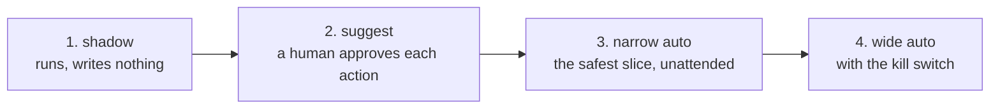

# Lesson 10 — Shipping an Agent

**Goal:** put an agent in front of real users and real money without losing
either.

## What you will learn

- The staged rollout that catches what testing does not
- Human-in-the-loop, placed where it pays
- What to log, and what to alert on
- The pre-launch checklist

---

## Ship it in four stages



**1. Shadow.** The agent runs on real inputs with every write tool in dry-run
mode. You compare its proposed actions against what the humans actually did. It
costs tokens and nothing else, and it produces the only honest estimate of harm
rate you will get before launch — on real data, which your task set is not.

**2. Suggest.** The agent proposes; a person clicks yes. Approval rate is now a
live metric, and every rejection is a new eval case (lesson 08). Stay here until
approval rate is boring.

**3. Narrow automation.** Pick the slice where the action is cheapest to reverse
and the rule is clearest — refunds under 200 EGP on delivered orders inside the
window. Unattended, but small.

**4. Widen**, one slice at a time, watching harm rate at each step.

Most teams jump from a demo to stage 4. The stages are not bureaucracy; each one
answers a question the previous one could not.

---

## Where to put the human

A human in the loop is expensive, so put them where they change the outcome:

| Placement | Cost | Value |
|---|---|---|
| Approve every action | Very high | High at first, then pure friction |
| **Approve writes above a threshold** | Low | Catches the expensive mistakes |
| **Approve when confidence is low** | Low | Catches the uncertain ones |
| Review a sample afterwards | Very low | Finds drift; too late to prevent harm |
| Handle escalations only | Low | Necessary regardless |

The middle two are the ones that pay. A threshold on **value** and a threshold
on **confidence** between them cover most of the loss, at a fraction of the
review volume.

And design the queue for the human, not for the agent: show the proposed action,
the evidence, and a one-click approve or reject. A reviewer who has to read a
transcript to decide will stop reading within a week.

---

## Logging

Every step, one row:

```text
run_id, step, timestamp, agent_version, model_version, prompt_version,
tool, arguments, result_summary, latency_ms, tokens_in, tokens_out,
permission_scope, was_retry, outcome
```

And one row per run:

```text
run_id, task_type, status (done|escalated|budget_exhausted|error),
steps, total_tokens, cost, harm_flag, human_approved, duration_ms
```

The version columns are what make an incident investigable. When behaviour
changes on a Tuesday, the question is always *what changed*, and the answer is
one of: the model, the prompt, the agent code, the tools, or the data. Without
those columns you cannot tell which, and a prompt edit looks exactly like a
provider upgrade.

---

## Alerting

| Alert | Threshold | Severity |
|---|---|---|
| Harm rate above zero | any | **page** |
| A forbidden tool call attempted | any | **page** |
| Budget exhausted | > 10% of runs | investigate today |
| Escalation rate | +50% relative, week on week | investigate today |
| Steps per success | +30% | investigate this week |
| Cost per day | above the agreed cap | page |
| No runs in the expected window | any | **page** (lesson 09's heartbeat) |
| Tool error rate | +2x | investigate today |

Two of those are pages rather than tickets because they mean the agent is
actively doing damage. Everything else is a trend.

---

## The pre-launch checklist

**Correctness**
- [ ] A task set with refusal, ambiguity, tool-failure and adversarial cases
- [ ] `success_check` is code for every task
- [ ] Harm rate measured, and explicitly accepted by a named person
- [ ] Cost per success measured at the budget you will ship

**Safety**
- [ ] The model never names a tool; code maps decisions to actions (lesson 05)
- [ ] Permissions scoped per step and per argument
- [ ] Business rules live inside the tools
- [ ] Injection tests pass, including through retrieved data
- [ ] Irreversible actions are last, and fewest

**Reliability**
- [ ] Idempotency keys on every write
- [ ] Bounded retries with backoff; timeouts read before they retry
- [ ] Step, token and money budgets enforced
- [ ] No-progress detector
- [ ] Resumable from the audit log

**Operations**
- [ ] Shadow mode ran on real data, with the comparison written down
- [ ] Dry-run flag, default in staging
- [ ] Kill switch a non-engineer can use, and has used once in a drill
- [ ] Heartbeat alert for "no runs"
- [ ] Dead-letter queue with an owner
- [ ] Daily summary to a human: runs, successes, escalations, harm, cost

**Accountability**
- [ ] Every action traceable to a run, a version and an authorisation
- [ ] The customer-facing failure message is written and tested
- [ ] A named owner, and a review date

The three that get skipped and cause the most grief: **shadow mode**, the
**heartbeat**, and the **kill-switch drill**. All three are cheap, and each one
has saved a project somewhere.

---

## The thing to remember

An agent is a program whose control flow is decided by a statistical model. Every
guarantee your system has must come from the parts that are **not** the model:
the tools, the permissions, the schemas, the budgets, the idempotency keys and
the audit log.

Build those first. The model is the easiest part to replace, and the last part
you should be depending on.

---

## Common mistakes

| Mistake | Why it hurts |
|---|---|
| Demo to full automation in one jump | Every stage answers a question the last could not |
| Human approval on everything, forever | Friction; reviewers stop reading |
| No version columns in the logs | "What changed on Tuesday?" is unanswerable |
| Alerting on cost but not on harm | The cheap incident pages; the expensive one does not |
| No heartbeat | A stopped agent looks like a healthy one |
| An untested kill switch | It is not a control until someone has used it |
| Depending on the model for a guarantee | Guarantees come from the parts that are not the model |

---

## Exercises

1. Run your agent in shadow mode for 100 real cases and compare its proposals
   with what humans did. Report the agreement rate and the disagreements you
   would have regretted.
2. Set a value threshold for human approval and compute the review volume and
   the loss it prevents at your real distribution of order values.
3. Add the version columns to your logs, change a prompt, and write the query
   that isolates the behaviour change to that edit.
4. Run a kill-switch drill with someone who is not an engineer. Time it.
5. Write the customer-facing message for each failure status and test that the
   right one appears.

---

**Done with the lessons.** Next: [Project 13](../Project-13/) — one agent, from
shadow mode to a narrow slice of production.
