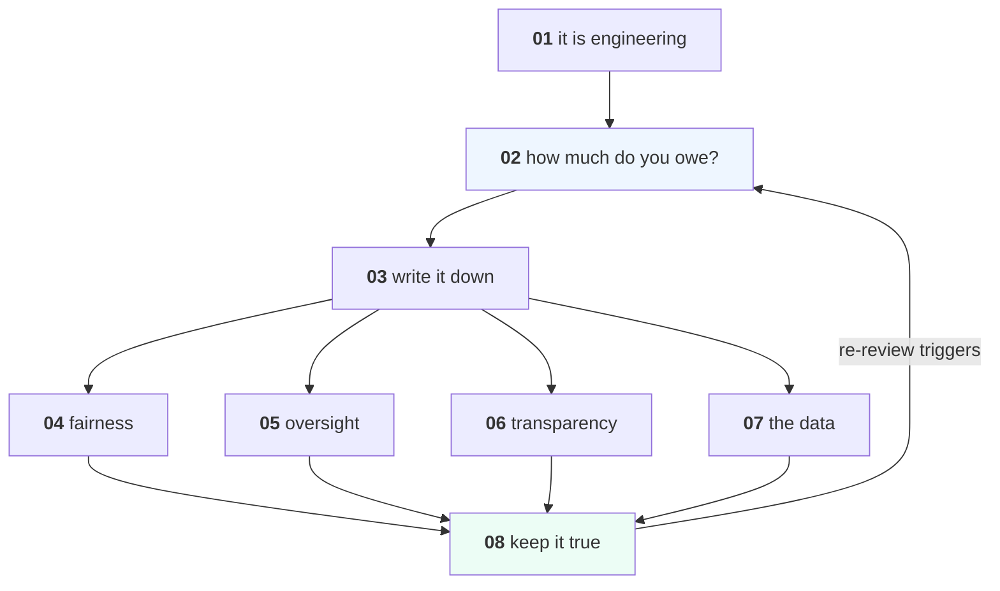

# AI Governance

What you owe the people a system decides about, and how to build it.

This is the engineering half of compliance. Every obligation in it resolves to
an artefact — a model card, a subgroup metric, an override path, a log field, a
deletion job, a name — and most of them are things
[MLOps](../MLOps/) already asked you to build for practical reasons.

**It is not legal advice.** Regimes differ and change; your legal team owns the
interpretation. This course owns what to build, what to measure, and the
several places where a system passes the standard test and is still doing harm.

Everything runs on a laptop with numpy, pandas and scikit-learn.

---

## Lessons

| # | Lesson | The measured finding |
|---|---|---|
| 01 | [Governance Is Engineering](lessons/01-governance-is-engineering.md) | Every legal ask is an artefact you have or do not have |
| 02 | [Classifying Risk](lessons/02-classifying-risk.md) | Four tiers, seven questions, and a tier where the answer is **no** |
| 03 | [The Record](lessons/03-the-record.md) | "Why was customer 48,219 declined on 14 March?" — the time it takes you is your maturity |
| 04 | [Fairness Obligations](lessons/04-fairness-obligations.md) | **Passes the four-fifths rule at every threshold** while wrongly rejecting 60 → 1,143 qualified people |
| 05 | [Human Oversight](lessons/05-human-oversight.md) | A reviewer catching **60% of errors** who doubts 10% of good calls makes it **worse** |
| 06 | [Transparency](lessons/06-transparency.md) | An explanation with **0.35 fidelity** that names the wrong feature |
| 07 | [Data Obligations](lessons/07-data-obligations.md) | Five ordinary columns, no identifiers: **88.8% of 50,000 people are unique** |
| 08 | [Running the Process](lessons/08-running-the-process.md) | Eight questions, a scorecard, and an incident clock you did not know was running |

Every lesson is also a notebook: `lessons/NN-name.ipynb`, generated from the
markdown by `tools/build_notebooks.py`.

---

## The shape of the course



Lesson 02 decides how much of lessons 04-07 you owe. **Lesson 08 is the one
that matters a year later**, and the one every programme skips.

---

## The argument this course makes

Four of its eight lessons measure the same shape: **the standard test passes
and the harm is still there.**

```text
four-fifths rule   PASS at every threshold, 1,143 qualified people rejected
human oversight    a real reviewer, catching 60% of errors, making it worse
explanations       0.35 fidelity, naming a feature the model does not use
"anonymised"       no names, no ids, 88.8% of people uniquely identifiable
```

A compliance checklist cannot catch any of those. A measurement can, and each
one here is a dozen lines of code. **That is the course: the checkbox is the
floor, and the number is the work.**

---

## Project

**[Project 26 — Govern One System](Project-26/)** — take a real system and
produce everything it owes.

---

## Prerequisites

| You need | From |
|---|---|
| A model you have shipped, or can see | [Data-Science](../Data-Science/), [MLOps](../MLOps/) |
| Measuring fairness and subgroups | [Data-Science 10](../Data-Science/lessons/10-limits-and-fairness.md) |
| Model cards and artifacts | [Communication 06](../Communication-and-Documentation/lessons/06-artifacts.md) |
| Gates, monitors, thresholds | [MLOps 04](../MLOps/lessons/04-ci-gate.md), [07](../MLOps/lessons/07-monitoring.md) |
| What leaks out of a model | [Data-Security-for-AI](../Data-Security-for-AI/) |

---

## What this course does not cover

- **The statutes themselves.** They differ by jurisdiction and change; nothing
  here is quoted or interpreted.
- **Measuring fairness in depth** — [Data-Science 10](../Data-Science/lessons/10-limits-and-fairness.md)
  is the measurement; this is the obligation.
- **Attacks and leakage** — [Data-Security-for-AI](../Data-Security-for-AI/).
- **Security operations** — [`Cyber-Ai`](https://github.com/Tayel-Ai-Labs-Courses/Cyber-Ai),
  a separate repository, is AI *for* security.

---

## Setup

```bash
pip install -r requirements.txt
```
