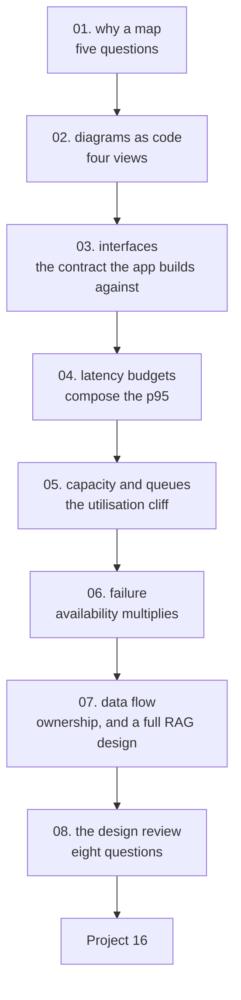

# AI System Design and Architecture — Tayel AI Labs

The sixteenth course, and the one that comes **before** the code. An AI engineer
who cannot draw the system cannot hand it to the frontend team, cannot promise a
latency, and cannot say what happens when the model is down.

This course is half diagrams and half arithmetic. The diagrams are what you
show people; the arithmetic is what makes them honest.

**Prerequisites**

- [`../Data-Science`](../Data-Science) — lessons 06, 08 and 09
- [`../LLM-and-GenAI`](../LLM-and-GenAI) — lesson 06 and 10, if you are designing
  a RAG system
- [`../Communication-and-Documentation`](../Communication-and-Documentation) —
  this course is that one, applied to architecture

**Where it fits:** do lessons 01-03 **before** starting
[`../Advanced-Practical-AI`](../Advanced-Practical-AI) or any project that other
people will integrate with.

---

## The path



## Lessons

| # | Lesson | The measured result |
|---|---|---|
| 01 | [Why a Map](lessons/01-why-a-map.md) | The five questions, and the ten lines the mobile team needs |
| 02 | [Diagrams as Code](lessons/02-diagrams-as-code.md) | Four views in Mermaid; the sequence diagram is the one to draw first |
| 03 | [Interfaces and Contracts](lessons/03-interfaces.md) | A retrain is a breaking change with no schema change |
| 04 | [Latency Budgets](lessons/04-latency-budgets.md) | Halving the wrong stage bought **21 ms**; halving the right one bought **796** |
| 05 | [Capacity and Queues](lessons/05-capacity-and-queues.md) | 200 ms of work, **2,000 ms** of waiting at 90% utilisation |
| 06 | [Failure and Degradation](lessons/06-failure-and-degradation.md) | Five services at 99.9% give a chain at **99.50%** — 44 hours a year |
| 07 | [Data Flow and State](lessons/07-data-flow-and-state.md) | A complete RAG architecture, with the arrow that prevents most hallucinations |
| 08 | [The Design Review](lessons/08-the-design-review.md) | Eight questions, in sixty minutes |

## Then

- **[`Project-16/`](Project-16/)** — design a system on paper, have it reviewed
  by a real frontend or backend engineer, then build the part you promised

---

## Setup

```bash
python3 -m venv .venv
source .venv/bin/activate
pip install -r requirements.txt
```

Only lessons 04, 05 and 06 run code, and it is NumPy arithmetic that finishes in
under a second. The diagrams render in GitHub, VS Code and most markdown
viewers without anything installed.

---

## What this course argues

1. **A diagram is the cheapest place to be wrong.** Moving a box costs a minute;
   moving a service costs a month (lesson 01).
2. **The frontend team is your most important reader**, and they need the
   sequence diagram and the ten-line contract, not your model's architecture
   (lessons 02, 03).
3. **Optimise the stage that owns the budget.** Halving a 3.8% stage bought
   21 ms; halving the 93.6% stage bought 796 (lesson 04).
4. **High utilisation is not efficiency.** A 200 ms service at 90% load makes
   users wait 2,000 ms (lesson 05).
5. **Availability multiplies**, so every synchronous dependency is a decision
   with an arithmetic cost (lesson 06).
6. **A degraded answer that is labelled beats an error, and beats a wrong answer
   presented as normal** (lesson 06).
7. **Every fact has exactly one owner.** Two is a future incident (lesson 07).
