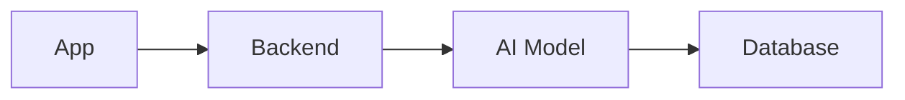
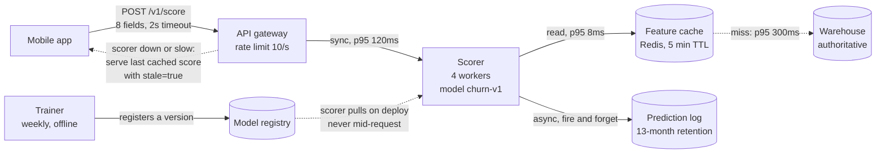

# Lesson 01 — Why a Map

**Goal:** draw the system before building it, because the drawing is where the
expensive mistakes are cheap to fix.

## What you will learn

- What a system map prevents
- The four people who read yours
- Why the frontend team is your most important reader
- The five questions a map must answer

---

## The problem a map solves

An AI engineer finishes a model, wraps it in an endpoint, and hands it over.
Then:

- The mobile team asks what happens on a timeout. Nobody decided.
- The frontend team discovers the response takes 1.6 seconds and their design
  assumed instant.
- Somebody asks where the customer's data goes. Three answers appear.
- The retention team asks for the score in their dashboard. It needs a batch
  path that does not exist.
- The model is retrained. Nothing tells the consumers the numbers moved.

**None of those are modelling problems.** Every one of them is a question a
diagram drawn in week one would have forced somebody to answer.

A system map is not documentation of what you built. It is **the cheapest place
to be wrong**, because moving a box costs a minute and moving a service costs a
month.

---

## Four readers

| Reader | Asks the map | Course |
|---|---|---|
| **Frontend / mobile** | What do I call, what comes back, how slow, what on failure? | This course, lesson 03 |
| **Backend / platform** | Where does it run, what does it depend on, what scales? | Lessons 04-06 |
| **Data / privacy** | Where does personal data flow and rest? | Data-Security 01 |
| **Your future self** | Why is it shaped like this? | Communication 05 |

The first row is the one AI engineers underserve, and it is the one the user's
experience depends on. **The frontend team consumes your API and writes the
loading state, the error state, the retry and the empty state.** They cannot do
that from "it returns a prediction".

What they actually need, on the diagram:

```text
endpoint        POST /v1/score
request         one customer object, 8 fields, all required
response        {probability, action, model_version}
p50 / p95       40 ms / 120 ms
timeout         2 s, client-side
on timeout      show the last cached score with a "stale" badge
on 5xx          hide the risk panel entirely - do not show a wrong number
on 422          show which field was rejected
rate limit      10 req/s per account, 429 with Retry-After
versioning      /v1 frozen; breaking changes ship as /v2
```

Ten lines. A frontend developer can build against that without a single message
to you, and every line is a decision that has to be made by somebody — so it
should be made deliberately, on a diagram, rather than accidentally, in
production.

---

## The five questions

A system map earns its place when it answers these. If it cannot, it is a
picture.

```text
1. WHAT CALLS WHAT      every arrow, with a direction and a protocol
2. WHAT DATA MOVES      what is in the payload, and how sensitive it is
3. WHAT IS SYNCHRONOUS  who is waiting, and for how long
4. WHERE STATE LIVES    which box owns which data, authoritatively
5. WHAT HAPPENS WHEN    each box fails - the arrow that is not the happy path
```

Question 5 is the one that separates a design from a drawing. A diagram with
only happy-path arrows describes a system that has never run.

---

## An example, twice

**The picture** — this is what most "architecture diagrams" look like:



Four boxes, three arrows, zero answers. It could describe a hundred different
systems with wildly different behaviour, cost and failure modes.

**The map** — the same system, answering the five questions:



Same four components. Now a frontend developer knows the timeout and the
degraded state, a backend engineer knows what is synchronous and what is not, a
privacy reviewer can see that predictions are logged for 13 months, and
everybody can see that the trainer never touches the request path.

**The dotted arrows are the ones worth the most.** They are the failure paths,
and they are missing from almost every diagram anyone draws.

---

## When to draw it

```text
BEFORE you write the backend        when boxes are free to move
BEFORE you promise a latency        lesson 04 makes that promise checkable
BEFORE the frontend team estimates  they are blocked on your contract
AFTER an incident                   the map was wrong somewhere; fix it
WHEN a new person joins             if they cannot follow it, it is wrong
```

And keep it in the repository, as text (lesson 02). A diagram in a slide deck
is out of date within a month and nobody can tell.

---

## Common mistakes

| Mistake | Why it hurts |
|---|---|
| Drawing it after building | The expensive decisions were already made |
| Boxes with no arrows labelled | "App -> Backend" describes nothing |
| No failure arrows | You have documented a system that has never run |
| No latency on the arrows | The frontend cannot design a loading state |
| Hiding the async parts | Nobody knows what they are waiting for |
| No state ownership | Two boxes both "have" the customer, and they disagree |
| A diagram only you can read | Its job was communication |

---

## Exercises

1. Draw the picture version of a system you own, then the map version. Count
   the questions the second one answers that the first does not.
2. Write the ten-line API contract block for an endpoint you already expose.
   How many lines did you have to go and find out?
3. Add the failure arrows to an existing diagram. How many are there, and how
   many had a decided behaviour?
4. Give your map to someone on the frontend or mobile team and ask what they
   still need to ask you.
5. For each box, name the data it owns authoritatively. Any data owned by two
   boxes is a bug you have not hit yet.

---

**Next:** [Lesson 02 — Diagrams as Code](02-diagrams-as-code.md)
