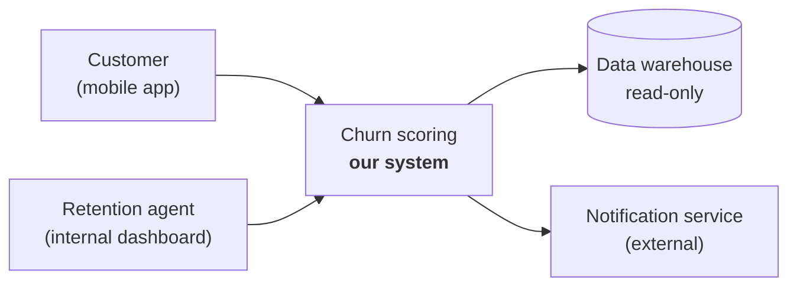
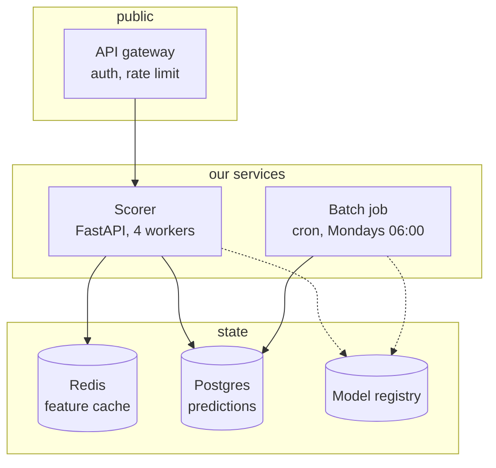
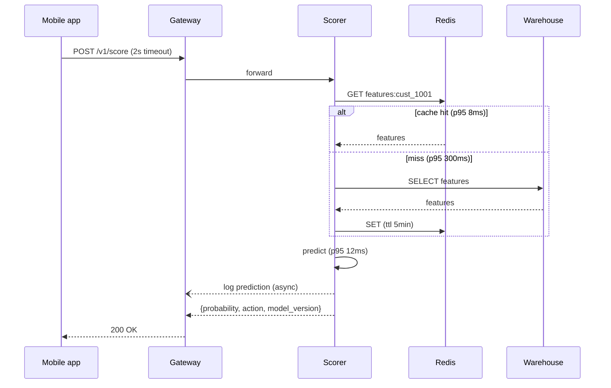
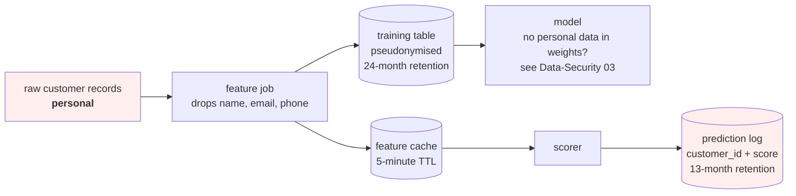

# Lesson 02 — Diagrams as Code

**Goal:** write diagrams in text, in the repository, so they are reviewable and
cannot silently rot.

## What you will learn

- Mermaid, enough of it
- The four views, and when each is the right one
- Keeping diagrams honest
- The sequence diagram, which is the one the frontend team needs

---

## Why text

| Drawing tool | Diagrams as code |
|---|---|
| Lives in a slide or a cloud app | Lives next to the code it describes |
| Changes are invisible | Changes appear in a diff, and get reviewed |
| One person can edit it | Anyone can send a pull request |
| Out of date within a month | Updated in the same commit as the change |
| Screenshot in a README | Rendered by GitHub, GitLab, VS Code, Obsidian |

Mermaid renders natively in GitHub, which is why every diagram in these sixteen
courses is written in it. You already know it from reading them.

**The rule: a diagram that is not in version control is a diagram that is
wrong.**

---

## The four views

Most systems need exactly four diagrams. More than that and nobody reads any of
them.

### 1. Context — who uses this, and what does it touch?



One box for your system, one for each actor and external dependency. This is the
diagram for a manager, and it takes five minutes.

### 2. Container — what runs where?



Every deployable unit and every store. This is the diagram for the backend team,
and it is the one that answers "what do I need to run this locally?".

### 3. Sequence — what happens, in what order?



**This is the diagram the frontend and mobile teams actually need.** It shows
what is waited for, what is not (`--)` is the async arrow), where the slow path
is, and what the response contains.

If you draw only one diagram, draw this one.

### 4. Data flow — where does personal data go and rest?



Red for anything personal, retention written on every store. This is the diagram
your privacy reviewer asks for and that nobody has, and it is Data-Security
lesson 08's review, drawn.

---

## Keeping diagrams honest

Diagrams rot faster than code because nothing fails when they are wrong. Four
habits that slow it down:

1. **Same commit.** Changing an arrow is part of changing the service. A pull
   request that adds a dependency and not an arrow is incomplete.
2. **Date and owner in the file**, as a comment. A diagram with no date is
   assumed current, and that assumption is how incidents happen.
3. **One source of truth per view.** Four files, named `01-context.md` ...
   `04-data-flow.md`, not fourteen partially-overlapping pictures.
4. **Review it after every incident.** An incident is evidence that the map was
   wrong; update it while you still remember how.

---

## Mermaid, the parts you need

```text
flowchart LR / TD          left-to-right or top-down
A["label"] --> B["label"]  solid arrow: the normal path
A -.-> B                   dotted: fallback, failure, async, "only on deploy"
A -->|"label"| B           put the protocol and the latency here
A[("store")]               a cylinder: this box owns state
subgraph name["title"]     a boundary: a machine, a network, a trust zone
style A fill:#fee          colour only for emphasis, never as the only signal
```

For sequence diagrams:

```text
participant X as Name
X->>Y: synchronous call
Y-->>X: response
X--)Y: async, fire and forget
alt / else / end           branches
Note over X,Y: text        a constraint, a timeout, a budget
```

That is 90% of what any system map needs. Resist the rest — a diagram that needs
a legend has stopped communicating.

---

## Common mistakes

| Mistake | Why it hurts |
|---|---|
| Diagrams in a slide deck | Out of date in a month, and nobody can tell |
| One giant diagram | Nobody reads it, including you |
| No sequence diagram | The team consuming your API is guessing |
| No data-flow diagram | The privacy question has no answer |
| Unlabelled arrows | The diagram says "these things talk" |
| Updating the diagram "later" | Later is after the incident |
| Colour as the only meaning | Invisible in print and to some readers |

---

## Exercises

1. Write the four views for a system you own, as four Mermaid files in its
   repository.
2. Draw the sequence diagram for your slowest endpoint, with real p95 numbers on
   each call.
3. Mark every store on your data-flow diagram with its retention period. How
   many did you know?
4. Find a diagram in your organisation that is out of date and work out when it
   stopped being true.
5. Add "diagram updated?" to your pull-request template and see how often it is
   ticked in the first month.

---

**Next:** [Lesson 03 — Interfaces and Contracts](03-interfaces.md)
