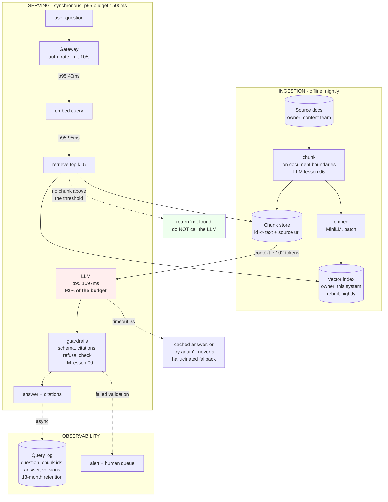

# Lesson 07 — Data Flow and State

**Goal:** know which box owns which data, and design a full RAG system on one
page.

## What you will learn

- State ownership, and what happens without it
- The four places data rests in an AI system
- A complete RAG architecture, annotated
- The questions a data-flow diagram must answer

---

## Every piece of data has exactly one owner

The most common architectural bug is not a missing component; it is **two
components that both think they own the same fact.**

```text
the customer's plan       owned by billing       everyone else caches it
the churn score           owned by the scorer    the dashboard displays it
the call outcome          owned by the CRM       the trainer reads it
the model version live    owned by the registry  the scorer pulls it
the retention threshold   owned by config        the scorer reads it, never stores it
```

The test: **if two boxes disagree, which one is right?** If the answer is "it
depends", you have found the bug before it happened.

Write ownership on the diagram. It costs one word per store and prevents the
class of incident where the dashboard says one thing and the API says another.

---

## Four places data rests

| Store | Holds | Lives for | Consistency |
|---|---|---|---|
| **Source of truth** | The business fact | Forever, by policy | Strong |
| **Feature store / cache** | A derived value, fast to read | Minutes to hours | **Eventually, and that is a decision** |
| **Model artefacts** | Weights, thresholds, versions | Until superseded, then archived | Immutable once registered |
| **Prediction log** | What was decided, when, by which version | Retention policy | Append-only |

The prediction log is the one AI systems add and the one teams forget. Without
it, Data-Science lessons 09 and 10 are impossible: no drift monitoring, no
holdout analysis, no answer to "which customers did this affect?".

**Append-only, with the model version on every row, from day one.** You cannot
add it retroactively.

### Staleness is a design decision

A five-minute cache TTL means **your model can be scoring on data five minutes
old**. That is fine for churn and fatal for fraud. Write the number on the
diagram, next to the store, and make somebody agree to it.

---

## A complete RAG system, on one page

This is the architecture the user asked for as a worked example — every arrow
labelled, every store owned, failure paths dotted.



Six things this diagram decides that a four-box picture does not:

1. **Ingestion is offline and nightly.** The request path never chunks or
   embeds documents, so a large upload cannot slow a user's question.
2. **k=5 and ~102 context tokens** — from LLM lesson 06's measured ceiling, not
   from a guess. The number is on the diagram so it can be challenged.
3. **The LLM is 93% of the latency budget** (lesson 04), marked in red. Anyone
   optimising anything else is wasting a week.
4. **The green box is the most important arrow in the system**: when retrieval
   finds nothing above threshold, **do not call the model at all.** That single
   arrow removes most hallucinations, and it is missing from almost every RAG
   diagram.
5. **The chunk store is separate from the vector index.** The index holds
   vectors and ids; the text lives elsewhere. Rebuilding the index does not
   touch the text, and citations resolve to a source url.
6. **Query logs record the chunk ids**, not just the answer — so you can measure
   `ctx@k` in production, which is the metric LLM lesson 06 says decides
   everything.

---

## The questions a data-flow diagram must answer

```text
1. WHERE does personal data enter?
2. WHERE does it rest, and for how long?
3. WHO owns each store, authoritatively?
4. WHAT crosses a trust boundary - to a vendor, a device, a log?
5. WHAT is stale, and by how much?
6. HOW is it deleted, and how is that verified?
```

Questions 4 and 6 are Data-Security lesson 08's review, and they are much easier
to answer from a diagram than from a codebase.

Question 4 has a specific AI form: **every prompt sent to a hosted model leaves
your building**, including the retrieved context. If that context contains
customer records, the data-flow diagram should show an arrow crossing the
boundary — and somebody should have approved it.

---

## Common mistakes

| Mistake | Why it hurts |
|---|---|
| Two boxes owning the same fact | They disagree, and nobody knows which is right |
| No prediction log | Drift, holdout and incident scope all become impossible |
| Cache TTL not on the diagram | Nobody agreed how stale is acceptable |
| Ingestion on the request path | A big upload becomes a user-facing outage |
| No "retrieved nothing" arrow | The model invents an answer |
| Vector index and text in one store | Rebuilding the index risks the citations |
| Retention not written per store | The legal question has no answer |
| Prompts crossing a vendor boundary silently | Personal data left the building unapproved |

---

## Exercises

1. Mark every store in your system with its owner and retention. How many were
   unknown?
2. Find a fact owned by two components. Decide which one wins, and write it down.
3. Draw your RAG or scoring system with failure arrows. How many did you have to
   invent on the spot?
4. Add the "retrieved nothing" path and measure how often it fires on real
   traffic.
5. Draw every arrow that crosses a trust boundary, and for each, name who
   approved it.

---

**Next:** [Lesson 08 — The Design Review](08-the-design-review.md)
