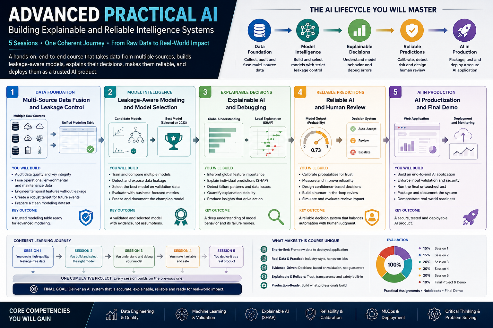

<p align="center">
  
</p>

<p align="center">
  <a href="https://github.com/AIBabyTeaching"></a>
  
  
  
  
</p>

---

## What this course is

One complete AI decision system built end-to-end — from **defective raw data** to a **tested, explainable application** that can:

- justify its model choice with evidence,
- explain individual predictions,
- defer uncertain cases to human review,
- reject impossible inputs,
- and rebuild from persisted artifacts.

**No GPU, no paid APIs, no cloud credentials, no Docker required** — everything runs on a laptop, yet every step follows production-grade practice.

## The journey

```
RAW SOURCES -> DATA CONTRACT -> SAFE FUSION -> GENERALIZATION
   -> MODEL SELECTION -> EXPLANATION -> RELIABILITY POLICY -> APPLICATION
```

## Repository layout

| Path | Purpose |
|---|---|
| `pdfs/` | Six 16:9 visual session guides (roadmap + 5 sessions) |
| `notebooks/live_workspaces/` | TODO-driven lab notebooks for hands-on work |
| `notebooks/complete_reference/` | Fully implemented reference notebooks |
| `src/reliable_ai/` | Modular production Python package |
| `src/scripts/` | Session runner scripts (one per session) |
| `src/tests/` | Automated regression tests |
| `src/data/` | Raw multi-source data + fused/audited datasets |
| `src/model/` | Persisted, evidence-selected model artifacts |
| `src/reports/` | Reproducible evidence records (CSV/JSON/PNG) |
| `index.html` | Interactive visual overview of the system — open in any browser |

## Session artifacts

| Session | What you build |
|---|---|
| 1 — Multi-Source Data Fusion | AI Data Fusion Inspector |
| 2 — Leakage-Aware Modeling | Model Selection & Leakage Report |
| 3 — Explainable AI & Debugging | AI Explanation Casebook |
| 4 — Reliable AI & Human Review | Reliable AI Decision Router |
| 5 — AI Productization | Reliable AI Risk Intelligence Application |

## Quickstart

```bash
pip install -r requirements.txt
```

Run the pipeline in exact order:

```bash
cd src
python scripts/01_data_fusion.py
python scripts/02_modeling_validation.py
python scripts/03_explainability.py
python scripts/04_reliability.py
python train_model.py
pytest -q
python app.py
```

## Reference metrics (reproducible)

- **840** final rows · **0** duplicate keys · **0** missing model cells
- **16** approved model features · **2** prohibited future fields
- Logistic Regression selected (**macro F1 ≈ 0.8008**) over corrected XGBoost (**≈ 0.7466**)
- Leaky model **excluded before ranking** despite ≈ 0.915 macro F1
- Review threshold **≈ 0.625** · 2025 coverage **≈ 75%** · selective accuracy **≈ 86.7%**

## Important notes

- The leaky model is **deliberately invalid** and must never be selected — it exists to teach detection.
- The evidence-selected model is persisted as `src/model/risk_model.joblib`.
- Calibration evidence can be negative and remains visible — no cherry-picking.
- Every number above is regenerated deterministically by the scripts in this repository.

---

<p align="center">
  <i>Built with students of <a href="https://github.com/AIBabyTeaching">AIBabyTeaching</a> — Summer 2026.</i>
</p>