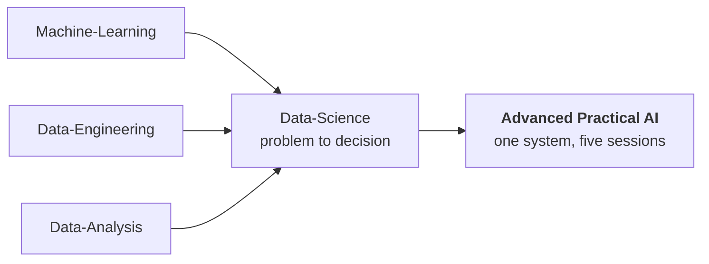

# Advanced Practical AI — one system, end to end

The applied capstone of the track. Five sessions build **a single AI decision
system**, from five defective raw data sources to a tested application that
explains itself, refuses impossible inputs, and hands uncertain cases to a
human.

The domain is agricultural risk: weather, soil, disease, region and outcome
tables for 2019-2025, and the question is how much crop-loss risk a region
faces next season.

**No GPU, no paid API, no cloud account, no Docker.** It runs on a laptop.

---

## Where this sits in the track



Data-Science teaches the discipline one lesson at a time on a synthetic
dataset. This course does the whole thing once, on messy multi-source data,
and ends with an application you can run.

Do the [`../Data-Science`](../Data-Science) lessons first if you have not.
Sessions 2 and 4 here assume you already know what leakage and calibration
are.

---

## The five sessions

| # | Session | What you build | Slides |
|---|---|---|---|
| 1 | Multi-Source Data Fusion | AI Data Fusion Inspector | [`slides/01`](slides/01_Session_1_Multi_Source_Data_Fusion.pdf) |
| 2 | Leakage-Aware Modeling | Model Selection & Leakage Report | [`slides/02`](slides/02_Session_2_Leakage_Aware_Modeling.pdf) |
| 3 | Explainable AI & Debugging | AI Explanation Casebook | [`slides/03`](slides/03_Session_3_Explainability_Story_Symbols_Reduced.pdf) |
| 4 | Reliable AI & Human Review | Reliable AI Decision Router | [`slides/04`](slides/04_Session_4_Reliable_AI_Human_Review_SYMBOLS_TERMS_FINAL.pdf) |
| 5 | AI Productization | Risk Intelligence Application | [`slides/05`](slides/05_Session_5_AI_Productization_FINAL.pdf) |

The [course roadmap](slides/00_Advanced_Practical_AI_Course_Roadmap.pdf) is the
deck to read first.

```text
RAW SOURCES -> DATA CONTRACT -> SAFE FUSION -> GENERALIZATION
   -> MODEL SELECTION -> EXPLANATION -> RELIABILITY POLICY -> APPLICATION
```

---

## How to work through it

Each session has two notebooks. Open the **live workspace**, which is
TODO-driven, and keep the **complete reference** shut until you are stuck.

| Path | What it is |
|---|---|
| [`notebooks/live_workspaces/`](notebooks/live_workspaces/) | Your hands-on lab, with gaps to fill |
| [`notebooks/complete_reference/`](notebooks/complete_reference/) | The finished version, executed |
| [`src/reliable_ai/`](src/reliable_ai/) | The same logic as a real Python package |
| [`src/scripts/`](src/scripts/) | One runner per session |
| [`src/tests/`](src/tests/) | Ten regression tests |
| [`src/data/raw/`](src/data/raw/) | The five defective source tables |
| [`src/model/`](src/model/) | Persisted, evidence-selected artifacts |
| [`src/reports/`](src/reports/) | Every number above, regenerated |
| `index.html` | A visual overview — open it in a browser |

**Note on notebooks.** Unlike every other course here, these `.ipynb` files are
hand-written source, not generated from markdown by `tools/build_notebooks.py`.
Edit them directly. They are deliberately excluded from the notebook-freshness
check in CI.

---

## Setup and run

```bash
python3 -m venv .venv
source .venv/bin/activate
pip install -r requirements.txt
```

Run the pipeline in this exact order — each step reads what the previous one
wrote:

```bash
cd src
python scripts/01_data_fusion.py
python scripts/02_modeling_validation.py
python scripts/03_explainability.py
python scripts/04_reliability.py
python train_model.py
pytest -q
python app.py
```

The four `.joblib` artifacts in `src/model/` are **not in git** — the
repository's `.gitignore` excludes binary model files. `train_model.py`
regenerates all of them, which is why it comes before `pytest` and `app.py` in
the order above. The small artifacts that *are* committed (`metadata.json`,
`model_comparison.csv`, `threshold_analysis.csv`, `artifact_manifest.json`) are
the evidence record, and they are text so you can diff them.

`app.py` needs `gradio`, which the requirements file installs. `shap` is
optional: session 3 prints its own permutation-importance and occlusion
analysis either way, and skips the Tree SHAP demonstration if the package is
missing.

---

## Verified results

Every number below was regenerated on 2026-09-27 with Python 3.12,
scikit-learn 1.9.1 and XGBoost 3.4.1:

| Stage | Result |
|---|---|
| Fusion | **840** rows, **0** duplicate keys, **0** missing model cells, status PASSED |
| Features | **16** approved, **2** rejected as post-outcome |
| Selection | `logistic`, macro F1 **0.6357** on the 2025 future test |
| Leakage | leaky model scored **0.9654** and was **excluded before ranking** |
| Calibration | ECE **0.0988 -> 0.0934**, temperature **1.0883** |
| Reliability | review threshold **0.65**, 2025 coverage **70.8%**, selective accuracy **80.0%** |
| Tests | **10 passed** |

Two of these deserve a sentence.

**The leaky model scores 0.9654 and is thrown away.** It uses
`future_loss_index`, a field recorded after the outcome. It is excluded by the
feature contract *before* any ranking happens, which is the point of the
exercise: a leak that wins a leaderboard is not a candidate to be compared, it
is a candidate to be disqualified. This is Data-Science lesson 03 with the
disqualification automated.

**Selective accuracy is 80.0% at 70.8% coverage.** The system answers seven
cases in ten and sends the rest to a human, and on the ones it answers it is
right four times in five. A single accuracy number for all cases would hide
both halves of that.

### A note on the original figures

The upstream [`ORIGINAL_README.md`](ORIGINAL_README.md) quotes macro F1
**0.8008** for the selected model and **0.915** for the leaky one, against the
0.6357 and 0.9654 measured here. The archive's own
`src/model/metadata.json` already records 0.6357, so the README was written
against an earlier run with different library versions. The pipeline is
deterministic for a given environment; the figures are not portable across
scikit-learn releases.

That is itself the lesson from Data-Science lesson 07: **a number without the
environment that produced it is not reproducible.** Every figure in the table
above carries its versions.

---

## Attribution

This material was built with students of
[AIBabyTeaching](https://github.com/AIBabyTeaching) as *Advanced AI — Summer
2026*, and is included here with its original README preserved as
[`ORIGINAL_README.md`](ORIGINAL_README.md). The slides, notebooks, source
package and data are the original authors' work. This `README.md`, the verified
results table above and the placement in this track are the only additions.

If you are redistributing this repository publicly, keep the attribution, and
check the licence terms with the original authors.
