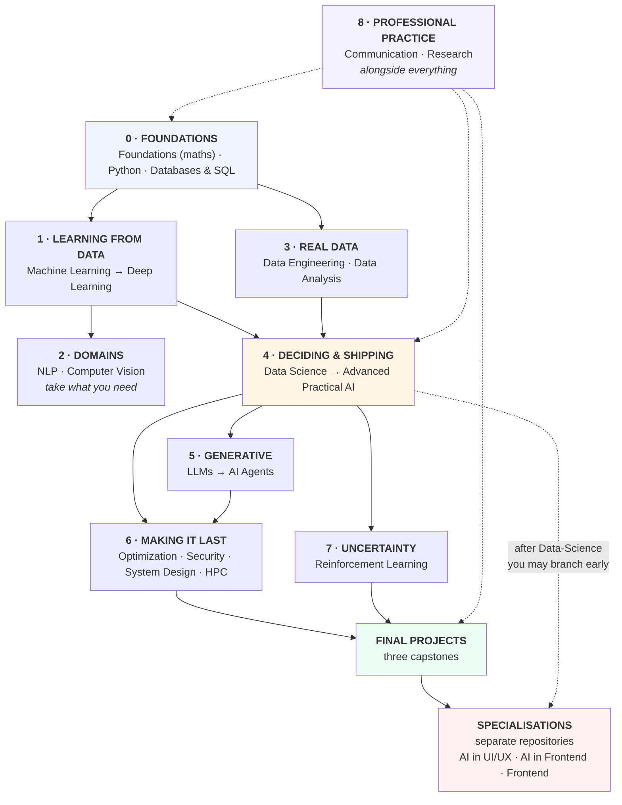

# The Curriculum — Everything, in Order

**Twenty-one courses, twenty projects, three capstones, 222 notebooks.**

This page is the single ordering: what comes after what, where the later
additions slot in, where the specialisations live, and what is still missing.

- **New here?** [`README.md`](README.md) — the landing page
- **Which level am I?** [`LEVELS.md`](LEVELS.md)
- **Shared data?** [`DATASETS.md`](DATASETS.md)
- **This page** is the definitive order, including the lessons added after their
  course was written.

---

## The nine blocks



---

## Block 0 — Foundations

| Order | Course | Lessons | Project | Note |
|---|---|---|---|---|
| 1a | [`Foundations`](Foundations) | 8 | 19 | **Optional-but-recommended.** Four maths ideas. Can be done alongside later courses, one lesson per symptom |
| 1b | [`Python/Basic-Python`](Python/Basic-Python) | 10 + 5 libraries | 1 | No shortcuts. Everything assumes it |
| 1c | [`Python/Advanced-Python`](Python/Advanced-Python) | 7 | 2 | |
| 1d | [`Databases-and-SQL`](Databases-and-SQL) | 8 | 20 | **Before Data-Engineering.** Every dataset came out of a database |

**Two valid routes through Foundations:** all eight lessons first, or one lesson
at a time when a symptom appears. Its [lesson 01](Foundations/lessons/01-what-you-need.md)
has the symptom table; the second route is the honest recommendation.

---

## Block 1 — Learning from data

| Order | Course | Lessons | Project |
|---|---|---|---|
| 2 | [`Machine-Learning`](Machine-Learning) | 13 | 3 |
| 3 | [`Deep-Learning`](Deep-Learning) | 13 | 4 |

Deep Learning is optional until a project needs it. Machine Learning is not.

---

## Block 2 — Domains (take what your work needs)

| Course | Lessons | Project | Take it when |
|---|---|---|---|
| [`NLP`](NLP) | 12 | 6 | The data is text |
| [`Computer-Vision`](Computer-Vision) | 12 | 7 | The data is images |

---

## Block 3 — Real data

| Order | Course | Lessons | Project |
|---|---|---|---|
| 4 | [`Data-Engineering`](Data-Engineering) | 12 | 8 |
| 5 | [`Data-Analysis`](Data-Analysis) | 8 Basic + 8 Advanced | 9 |

**The two most-skipped courses in the track**, and the reason most models never
leave a notebook. Do [`Databases-and-SQL`](Databases-and-SQL) first.

---

## Block 4 — Deciding and shipping

| Order | Course | Lessons | Project |
|---|---|---|---|
| 6 | [`Data-Science`](Data-Science) | 12 | 10 |
| 7 | [`Advanced-Practical-AI`](Advanced-Practical-AI) | 5 sessions | the system |

### Data-Science reading order

Lessons 11 and 12 were added after the course was written. Numbering stayed
sequential so links keep working; **read them where they belong**:

```text
01 → 02 → 03 → 04 → 05 → 06 → [12 prototypes] → 07 → [11 tracking] → 08 → 09 → 10
                                    ▲                    ▲
                     show a stakeholder before      the tool version of
                     you build the API              lesson 07's run records
```

Before Advanced-Practical-AI, do **[`AI-System-Design`](AI-System-Design)
lessons 01-03** — that course builds a system other people integrate with, and
those three lessons are how you hand it over.

---

## Block 5 — Generative

| Order | Course | Lessons | Project |
|---|---|---|---|
| 8 | [`LLM-and-GenAI`](LLM-and-GenAI) | 10 | 12 |
| 9 | [`AI-Agents`](AI-Agents) | 10 | 13 |

**LLM evaluation and guardrails live here**, not in a separate course:

| Topic | Where |
|---|---|
| Evaluating LLM output, metric failure modes | [LLM 07](LLM-and-GenAI/lessons/07-evaluation.md) |
| Hallucination control through grounding | [LLM 06](LLM-and-GenAI/lessons/06-rag.md) |
| Structured output, schemas, retries | [LLM 09](LLM-and-GenAI/lessons/09-structured-output.md) |
| Refusal paths and "not in context" | [LLM 06](LLM-and-GenAI/lessons/06-rag.md), [07](LLM-and-GenAI/lessons/07-evaluation.md) |
| Prompt injection and permissions | [AI-Agents 05](AI-Agents/lessons/05-security.md) |
| Business-rule guardrails beyond the schema | [AI-Agents 02](AI-Agents/lessons/02-tools.md) |

---

## Block 6 — Making it last

| Course | Lessons | Project | For |
|---|---|---|---|
| [`Optimization`](Optimization) | 15 | 5 | Cost, latency, size, local and edge |
| [`Data-Security-for-AI`](Data-Security-for-AI) | 8 | 14 | Privacy, poisoning, extraction, adversarial |
| [`AI-System-Design`](AI-System-Design) | 8 | 16 | The map, the contract, the budget |
| [`HPC-and-Cloud`](HPC-and-Cloud) | 8 | 17 | Fitting a model, renting a GPU, predicting the bill |

### Optimization reading order

```text
01-07  training side: what to optimise, optimisers, schedules, PEFT
08-12  inference side: quantisation, pruning, distillation, compile, serve
13     derivative-free search: PSO, DE, random search
14-15  somebody else's hardware: local models (Ollama), edge devices
```

---

## Block 7 — Deciding under uncertainty

| Course | Lessons | Project | Take it when |
|---|---|---|---|
| [`Reinforcement-Learning`](Reinforcement-Learning) | 10 | 11 | The action changes what happens next |

Most business problems are bandits, or supervised problems with a decision
attached. [RL lesson 01](Reinforcement-Learning/lessons/01-what-rl-is.md) has
the flowchart that tells you which you have.

---

## Block 8 — Professional practice (alongside everything)

| Course | Lessons | Project | When |
|---|---|---|---|
| [`Communication-and-Documentation`](Communication-and-Documentation) | 8 | 15 | **Lessons 01-04 in week one**, at any level |
| [`Research-and-Review`](Research-and-Review) | 8 | 18 | When you start reading papers, or reviewing others' work |

Everything else in this track is worth less without Communication. Research
[lesson 03](Research-and-Review/lessons/03-what-the-numbers-hide.md) is the one
lesson every level should read, whatever else they skip.

---

## After everything — the capstones

**[`Final-Projects/`](Final-Projects/)**. Three alternatives; do one.

| Capstone | Hard part | Pulls from |
|---|---|---|
| [A — The Decision System](Final-Projects/A-decision-system.md) | Deciding correctly on business data | 12 courses |
| [B — The Assistant](Final-Projects/B-the-assistant.md) | Reliable text generation and retrieval | 11 courses |
| [C — The Efficient Model](Final-Projects/C-efficient-model.md) | Cost, latency, devices | 10 courses |

---

## Specialisations — separate repositories

These are **applied tracks in the same organisation**, not part of the numbered
progression. They assume the core curriculum and go deep on one surface.

| Specialisation | Repository | Prerequisites from here | Take it when |
|---|---|---|---|
| **AI in UI/UX** | [`AI-in-UIUX`](https://github.com/Tayel-Ai-Labs-Courses/AI-in-UIUX) | [Communication](Communication-and-Documentation) 01-04 | You design the surface users touch |
| **AI in Frontend** | *(same organisation)* | [LLM](LLM-and-GenAI) 09-10, [AI-System-Design](AI-System-Design) 03 | You build LLM features in a browser |
| **Frontend Engineering** | *(same organisation)* | none from here | You need the craft the AI work plugs into |

**Why separate.** The core track makes a model correct, cheap and safe. A
specialisation is about the *surface* it meets — a design system, a browser, a
mobile app — with its own tools, failure modes and audience. Merging them into
one progression would make both worse.

**Where they meet:**
[AI-System-Design lesson 03](AI-System-Design/lessons/03-interfaces.md) is
written for the frontend and mobile teams — the ten-line contract, the response
fields (`band`, `degraded`, `model_version`), and every UI state a consumer must
build. That lesson is the handshake between the core track and every
specialisation.

**Branching early is allowed.** After [`Data-Science`](Data-Science) you have
enough to be useful in a specialisation; come back for Block 6 when you ship
something that has to survive.

---

## Project numbering

| # | Course | # | Course |
|---|---|---|---|
| 1 | Python Basic | 11 | Reinforcement Learning |
| 2 | Python Advanced | 12 | LLMs and Generative AI |
| 3 | Machine Learning | 13 | AI Agents |
| 4 | Deep Learning | 14 | Data Security for AI |
| 5 | Optimization | 15 | Communication and Documentation |
| 6 | NLP | 16 | AI System Design |
| 7 | Computer Vision | 17 | HPC and Cloud |
| 8 | Data Engineering | 18 | Research and Review |
| 9 | Data Analysis | 19 | **Foundations** |
| 10 | Data Science | 20 | **Databases and SQL** |

Numbers follow the order the courses were written, **not** the order to do them
in. Projects 19 and 20 belong to Block 0 and can be done first despite their
numbers. **This page is the order to do them in.**

---

## Shared datasets

Six courses deliberately reuse the same two datasets — see
[`DATASETS.md`](DATASETS.md). The `subscribers` thread is the most useful:

```text
Data-Science 03    days_to_renewal leaks; AUC 0.667 → 0.946
Data-Science 06    the 0.5 threshold earns 1,083 EGP; 0.15 earns 47,313
Data-Science 10    a 10% holdout stays at 18.29% while the measured rate falls to 9.1%
Data-Security 03   the SAME model leaks membership at 0.805 AUC
Data-Security 05   10,000 random queries clone it to 91.3% agreement
AI-Agents 05       an injected note refunds four of its customers for 1,610 EGP
```

---

## Where each recently-added topic lives

| Topic | Home | Why there |
|---|---|---|
| **Maths foundations** | [`Foundations`](Foundations) | Its own course; do it first or per-symptom |
| **SQL, schema design, window functions** | [`Databases-and-SQL`](Databases-and-SQL) | Its own course; before Data-Engineering |
| **System design, diagrams, API contracts** | [`AI-System-Design`](AI-System-Design) 01-03 | Do 01-03 before Advanced-Practical-AI |
| **Experiment tracking, model registry** | [Data-Science 11](Data-Science/lessons/11-experiment-tracking.md) | Extends lesson 07's run records to a tool |
| **Prototyping: Gradio, Streamlit, FastAPI** | [Data-Science 12](Data-Science/lessons/12-prototypes.md) + [08](Data-Science/lessons/08-shipping-the-model.md) | 12 is the demo; 08 is the service |
| **Local execution, Ollama** | [Optimization 14](Optimization/lessons/14-running-models-locally.md) | It is a cost and latency decision |
| **Edge and on-device** | [Optimization 15](Optimization/lessons/15-edge-and-on-device.md) | Same block: fitting a budget |
| **Swarm and derivative-free search** | [Optimization 13](Optimization/lessons/13-swarm-and-population.md) | Optimising what has no gradient |
| **GPU memory, distributed, spot, cloud cost** | [`HPC-and-Cloud`](HPC-and-Cloud) | Do it when a model outgrows one machine |
| **Reading papers, reproducing, reviewing** | [`Research-and-Review`](Research-and-Review) | Lesson 03 is the one everyone should read |
| **LLM evaluation and guardrails** | LLM 06, 07, 09 + AI-Agents 02, 05 | Already covered — see Block 5 |

---

## Still missing

Two partial areas remain. Both are honest gaps, and both have an interim route:

| Gap | Status | Until then |
|---|---|---|
| **Time-series forecasting** | Partial — [Data-Analysis Advanced 04](Data-Analysis/Advanced/lessons/04-time-series.md) analyses trends but does not forecast | Lag features with [Machine-Learning](Machine-Learning)'s validation rules and [Data-Science 03](Data-Science/lessons/03-the-data-you-have.md)'s time split |
| **MLOps tooling** (Docker, Kubernetes, CI/CD for models) | Partial — the principles are in [Data-Science 08-09](Data-Science/lessons/08-shipping-the-model.md), [11](Data-Science/lessons/11-experiment-tracking.md), [HPC 08](HPC-and-Cloud/lessons/08-laptop-to-cloud.md) and this repo's own CI | Containerise one project from [HPC 08](HPC-and-Cloud/lessons/08-laptop-to-cloud.md)'s pinning checklist |

Everything else named as a gap in earlier versions of this page — maths, SQL,
HPC, research — now has a course.

---

## The standard every lesson is held to

1. Every code block **runs**, in order, top to bottom.
2. Every printed output is **pasted from a real run**, never written by hand.
3. When the run contradicted the draft, **the prose changed, not the number.**
4. Machine-dependent output is labelled as such.
5. Every lesson ends with a common-mistakes table and exercises.
6. Every claim has a number, and every number has a source.

Checked on every push by [`.github/workflows/check.yml`](.github/workflows/check.yml).
