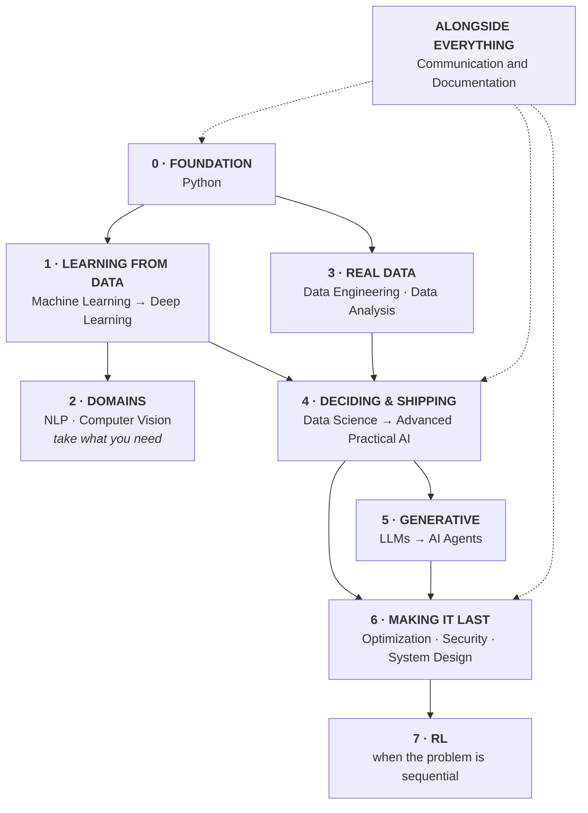

# The Curriculum — Everything, in Order

Nineteen courses, eighteen projects, 190 notebooks. This page is the single
ordering: what comes after what, where the later additions slot in, and what is
still missing.

- **New here?** [`LEVELS.md`](LEVELS.md) — where to start by experience level.
- **Just want the list?** The table in [`README.md`](README.md).
- **This page** is the definitive order, including the lessons that were added
  after their course was written.

---

## The eight blocks



---

## Block 0 — Foundation

| Order | Course | Lessons | Project |
|---|---|---|---|
| 1 | [`Python/Basic-Python`](Python/Basic-Python) | 10 + 5 libraries | Project 1 |
| 2 | [`Python/Advanced-Python`](Python/Advanced-Python) | 7 | Project 2 |

No shortcuts here. Everything later assumes it.

---

## Block 1 — Learning from data

| Order | Course | Lessons | Project |
|---|---|---|---|
| 3 | [`Machine-Learning`](Machine-Learning) | 13 | Project 3 |
| 4 | [`Deep-Learning`](Deep-Learning) | 13 | Project 4 |

Deep Learning is optional until a project needs it. Machine Learning is not.

---

## Block 2 — Domains (take what your work needs)

| Course | Lessons | Project | Take it when |
|---|---|---|---|
| [`NLP`](NLP) | 12 | Project 6 | The data is text |
| [`Computer-Vision`](Computer-Vision) | 12 | Project 7 | The data is images |

---

## Block 3 — Real data

| Order | Course | Lessons | Project |
|---|---|---|---|
| 5 | [`Data-Engineering`](Data-Engineering) | 12 | Project 8 |
| 6 | [`Data-Analysis`](Data-Analysis) | 8 Basic + 8 Advanced | Project 9 |

**The two most-skipped courses in the track**, and the reason most models never
leave a notebook.

---

## Block 4 — Deciding and shipping

| Order | Course | Lessons | Project |
|---|---|---|---|
| 7 | [`Data-Science`](Data-Science) | 12 | Project 10 |
| 8 | [`Advanced-Practical-AI`](Advanced-Practical-AI) | 5 sessions | the system |

### Data-Science reading order

Lessons 11 and 12 were added after the course was written. Numbering stayed
sequential so links keep working; **read them where they belong**:

```text
01 → 02 → 03 → 04 → 05 → 06 → [12 prototypes] → 07 → [11 tracking] → 08 → 09 → 10
                                    ▲                    ▲
                     show a stakeholder before      the tool version of
                     you build the API              lesson 07's run records
```

Before Advanced-Practical-AI, do **[`AI-System-Design`](AI-System-Design)
lessons 01-03** — that course builds a system other people integrate with, and
those three lessons are how you hand it over.

---

## Block 5 — Generative

| Order | Course | Lessons | Project |
|---|---|---|---|
| 9 | [`LLM-and-GenAI`](LLM-and-GenAI) | 10 | Project 12 |
| 10 | [`AI-Agents`](AI-Agents) | 10 | Project 13 |

**LLM evaluation and guardrails live here**, not in a separate course:

| Topic | Where |
|---|---|
| Evaluating LLM output, metric failure modes | [LLM lesson 07](LLM-and-GenAI/lessons/07-evaluation.md) |
| Hallucination control through grounding | [LLM lesson 06](LLM-and-GenAI/lessons/06-rag.md) |
| Structured output, schemas, retries | [LLM lesson 09](LLM-and-GenAI/lessons/09-structured-output.md) |
| Refusal paths and "not in context" | [LLM lessons 06, 07](LLM-and-GenAI/lessons/06-rag.md) |
| Prompt injection and permissions | [AI-Agents lesson 05](AI-Agents/lessons/05-security.md) |
| Business-rule guardrails beyond the schema | [AI-Agents lesson 02](AI-Agents/lessons/02-tools.md) |

---

## Block 6 — Making it last

| Course | Lessons | Project | For |
|---|---|---|---|
| [`Optimization`](Optimization) | 15 | Project 5 | Cost, latency, size, local and edge |
| [`Data-Security-for-AI`](Data-Security-for-AI) | 8 | Project 14 | Privacy, poisoning, extraction |
| [`AI-System-Design`](AI-System-Design) | 8 | Project 16 | The map, the contract, the budget |
| [`HPC-and-Cloud`](HPC-and-Cloud) | 8 | Project 17 | Fitting a model, renting a GPU, predicting the bill |
| [`Research-and-Review`](Research-and-Review) | 8 | Project 18 | Reading papers sceptically; reproducing; reviewing |

### Optimization reading order

```text
01-07  training side: what to optimise, optimisers, schedules, PEFT
08-12  inference side: quantisation, pruning, distillation, compile, serve
13     derivative-free search: PSO, DE, random search
14-15  somebody else's hardware: local models (Ollama), edge devices
```

Lessons **14-15** are the local-execution and edge track: run an 8B model on a
laptop, price it honestly, and fit a model inside a phone's budget.

---

## Block 7 — Deciding under uncertainty

| Course | Lessons | Project | Take it when |
|---|---|---|---|
| [`Reinforcement-Learning`](Reinforcement-Learning) | 10 | Project 11 | The action changes what happens next |

Most business problems are bandits or supervised problems with a decision
attached. RL lesson 01 has the flowchart that tells you which you have.

---

## Alongside everything

| Course | Lessons | Project |
|---|---|---|
| [`Communication-and-Documentation`](Communication-and-Documentation) | 8 | Project 15 |

Start lessons 01-04 in week one, at any level. Everything else in this track is
worth less without it.

---

## Project numbering

| # | Course | # | Course |
|---|---|---|---|
| 1 | Python Basic | 9 | Data Analysis |
| 2 | Python Advanced | 10 | Data Science |
| 3 | Machine Learning | 11 | Reinforcement Learning |
| 4 | Deep Learning | 12 | LLMs and Generative AI |
| 5 | Optimization | 13 | AI Agents |
| 6 | NLP | 14 | Data Security for AI |
| 7 | Computer Vision | 15 | Communication and Documentation |
| 8 | Data Engineering | 16 | AI System Design |
| | | 17 | HPC and Cloud |
| | | 18 | Research and Review |

Numbers follow the order the courses were written, not the order to do them in.
**This page is the order to do them in.**

---

## Where each recently-added topic lives

| Topic | Home | Why there |
|---|---|---|
| **System design, diagrams, API contracts** | [`AI-System-Design`](AI-System-Design) 01-03 | Its own course; do 01-03 before Advanced-Practical-AI |
| **Experiment tracking, model registry** | [Data-Science 11](Data-Science/lessons/11-experiment-tracking.md) | Extends lesson 07's run records to a tool |
| **Prototyping: Gradio, Streamlit, FastAPI** | [Data-Science 12](Data-Science/lessons/12-prototypes.md) + [08](Data-Science/lessons/08-shipping-the-model.md) | 12 is the demo; 08 is the service |
| **Local execution, Ollama** | [Optimization 14](Optimization/lessons/14-running-models-locally.md) | It is a cost and latency decision |
| **GPU memory, distributed training, spot, cloud cost** | [`HPC-and-Cloud`](HPC-and-Cloud) | Its own course; do it when a model outgrows one machine |
| **Reading papers, reproducing, reviewing** | [`Research-and-Review`](Research-and-Review) | Its own course; lesson 03 is the one everyone should read |
| **Edge and on-device** | [Optimization 15](Optimization/lessons/15-edge-and-on-device.md) | Same block: fitting a budget |
| **Swarm and derivative-free search** | [Optimization 13](Optimization/lessons/13-swarm-and-population.md) | Optimising what has no gradient |
| **LLM evaluation and guardrails** | LLM 06, 07, 09 + AI-Agents 02, 05 | Already covered — see the table in Block 5 |

---

## Still missing

Four gaps, stated honestly, with the interim workaround until each course exists:

| Gap | Matters to | Until then |
|---|---|---|
| **Maths foundations** — linear algebra, calculus, probability | Beginners | 3Blue1Brown's linear algebra series alongside Deep-Learning |
| **SQL and warehouse modelling** | Everyone, immediately | Data-Engineering 02-03, then any SQL exercise site |

Partially covered: **time-series forecasting** (Data-Analysis Advanced 04
analyses trends but does not forecast) and **MLOps tooling** (Docker, K8s and
CI/CD for models — Data-Science 08-09 and this repo's own CI cover the
principles).

---

## The standard every lesson is held to

1. Every code block **runs**, in order, top to bottom.
2. Every printed output is **pasted from a real run**, never written by hand.
3. When the run contradicted the draft, **the prose changed, not the number.**
4. Machine-dependent output is labelled as such.
5. Every lesson ends with a common-mistakes table and exercises.

Checked on every push by [`.github/workflows/check.yml`](.github/workflows/check.yml).
