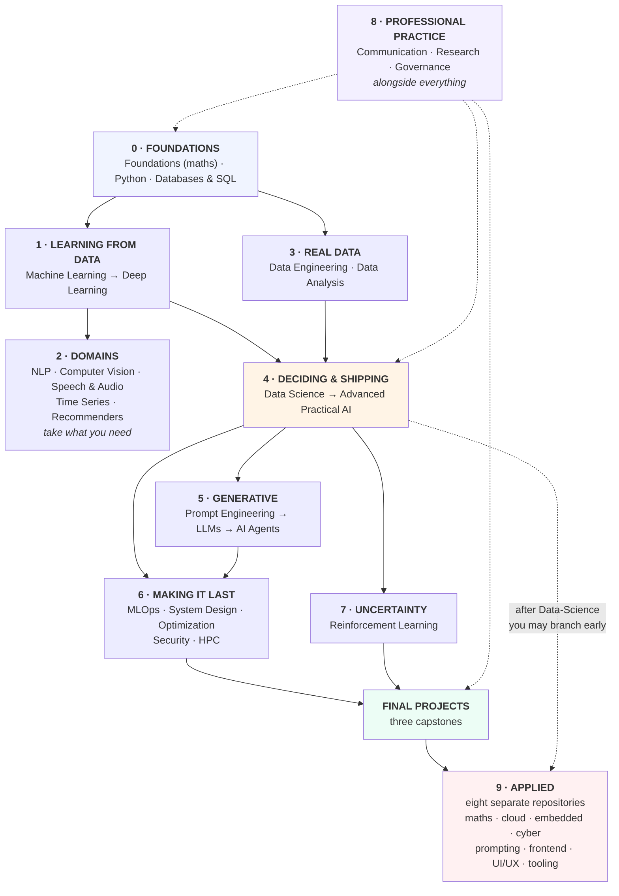

# The Curriculum — Everything, in Order

**Twenty-seven courses, twenty-six projects, three capstones, 280 notebooks.**

This page is the single ordering: what comes after what, where the later
additions slot in, where the applied repositories live, and what is still missing.
The one-diagram version is in [`README.md`](README.md#the-unified-roadmap).

- **New here?** [`README.md`](README.md) — the landing page
- **Which level am I?** [`LEVELS.md`](LEVELS.md)
- **Shared data?** [`DATASETS.md`](DATASETS.md)
- **This page** is the definitive order, including the lessons added after their
  course was written.

---

## The nine blocks



---

## Block 0 — Foundations

| Order | Course | Lessons | Project | Note |
|---|---|---|---|---|
| 1a | [`Foundations`](Foundations) | 8 | 19 | **Optional-but-recommended.** Four maths ideas. Can be done alongside later courses, one lesson per symptom |
| 1b | [`Python/Basic-Python`](Python/Basic-Python) | 10 + 5 libraries | 1 | No shortcuts. Everything assumes it |
| 1c | [`Python/Advanced-Python`](Python/Advanced-Python) | 7 | 2 | |
| 1d | [`Databases-and-SQL`](Databases-and-SQL) | 8 | 20 | **Before Data-Engineering.** Every dataset came out of a database |

**Two valid routes through Foundations:** all eight lessons first, or one lesson
at a time when a symptom appears. Its [lesson 01](Foundations/lessons/01-what-you-need.md)
has the symptom table; the second route is the honest recommendation.

---

## Block 1 — Learning from data

| Order | Course | Lessons | Project |
|---|---|---|---|
| 2 | [`Machine-Learning`](Machine-Learning) | 13 | 3 |
| 3 | [`Deep-Learning`](Deep-Learning) | 13 | 4 |

Deep Learning is optional until a project needs it. Machine Learning is not.

---

## Block 2 — Domains (take what your work needs)

| Course | Lessons | Project | Take it when |
|---|---|---|---|
| [`NLP`](NLP) | 12 | 6 | The data is text |
| [`Computer-Vision`](Computer-Vision) | 12 | 7 | The data is images |
| [`Time-Series-and-Forecasting`](Time-Series-and-Forecasting) | 8 | 21 | The rows are ordered and the future is the target |
| [`Recommender-Systems`](Recommender-Systems) | 8 | 24 | You must choose *which* items to show, out of many |
| [`Speech-and-Audio`](Speech-and-Audio) | 8 | 25 | The input is sound — speech, events, voice |

**Time-Series has a prerequisite the other two do not:** read
[lesson 02](Time-Series-and-Forecasting/lessons/02-evaluating.md) before you
trust any forecasting result you have ever produced. A shuffled split scores
MAE 85.3 where an honest one scores 107.7, and an 8-fold backtest turns a 9%
win into 0.5%.

**Recommender-Systems shares that lesson and adds a harder one.** Its
[lesson 05](Recommender-Systems/lessons/05-cold-start.md) shows that the
customers a collaborative model cannot serve were **49.1% of the orders** in
the test period — and that every standard evaluation silently drops them. Take
it when your product has to pick which items a user sees; it needs no
Deep-Learning, and its best model is four lines of linear algebra.

**Speech-and-Audio is the odd one in this block**: five of its eight lessons
are about everything *upstream* of the model, because that is where audio
projects fail. Its
[lesson 05](Speech-and-Audio/lessons/05-finding-the-speech.md) shows an energy
VAD dropping **66.2% of the speech** at -5 dB — before any recogniser runs.
It needs no Deep-Learning and no audio libraries; every sound is synthesised in
the lessons.

---

## Block 3 — Real data

| Order | Course | Lessons | Project |
|---|---|---|---|
| 4 | [`Data-Engineering`](Data-Engineering) | 12 | 8 |
| 5 | [`Data-Analysis`](Data-Analysis) | 8 Basic + 8 Advanced | 9 |

**The two most-skipped courses in the track**, and the reason most models never
leave a notebook. Do [`Databases-and-SQL`](Databases-and-SQL) first.

---

## Block 4 — Deciding and shipping

| Order | Course | Lessons | Project |
|---|---|---|---|
| 6 | [`Data-Science`](Data-Science) | 12 | 10 |
| 7 | [`Advanced-Practical-AI`](Advanced-Practical-AI) | 5 sessions | the system |

### Data-Science reading order

Lessons 11 and 12 were added after the course was written. Numbering stayed
sequential so links keep working; **read them where they belong**:

```text
01 → 02 → 03 → 04 → 05 → 06 → [12 prototypes] → 07 → [11 tracking] → 08 → 09 → 10
                                    ▲                    ▲
                     show a stakeholder before      the tool version of
                     you build the API              lesson 07's run records
```

Before Advanced-Practical-AI, do **[`AI-System-Design`](AI-System-Design)
lessons 01-03** — that course builds a system other people integrate with, and
those three lessons are how you hand it over.

---

## Block 5 — Generative

| Order | Course | Lessons | Project |
|---|---|---|---|
| 8 | [`Prompt-Engineering`](Prompt-Engineering) | 8 | 23 |
| 9 | [`LLM-and-GenAI`](LLM-and-GenAI) | 10 | 12 |
| 10 | [`AI-Agents`](AI-Agents) | 10 | 13 |

### Prompting appears three times, on purpose

| Depth | Where | What it answers |
|---|---|---|
| 1 | [`Prompt-Engineering`](Prompt-Engineering) | How do I **write** one? The prefix, the contract, the context, the cost |
| 2 | [LLM 04](LLM-and-GenAI/lessons/04-prompting.md) | How do I know one is **better**? Six formats scored, and how little survives |
| 3 | [`Advanced-Prompt-Engineering`](https://github.com/Tayel-Ai-Labs-Courses/Advanced-Prompt-Engineering) | The technique **catalogue** — a separate repository |

Do them in that order. The two courses here reach the same place from opposite
sides: Prompt-Engineering 02 shows free generation returning **0/12** usable
answers, while LLM 04 scores the label words directly and gets 0.90 accuracy
from the same kind of prompt. That is the argument for constraining the output,
made twice.

[`Prompt-Engineering`](Prompt-Engineering) is also the **gentler entry to this
block** — it needs only Python, not Deep-Learning — so a beginner who is going
to touch an LLM at work can take it early and out of order.

**LLM evaluation and guardrails live here**, not in a separate course:

| Topic | Where |
|---|---|
| Evaluating LLM output, metric failure modes | [LLM 07](LLM-and-GenAI/lessons/07-evaluation.md) |
| Hallucination control through grounding | [LLM 06](LLM-and-GenAI/lessons/06-rag.md) |
| Structured output, schemas, retries | [LLM 09](LLM-and-GenAI/lessons/09-structured-output.md) |
| Refusal paths and "not in context" | [LLM 06](LLM-and-GenAI/lessons/06-rag.md), [07](LLM-and-GenAI/lessons/07-evaluation.md) |
| Prompt injection and permissions | [AI-Agents 05](AI-Agents/lessons/05-security.md) |
| Business-rule guardrails beyond the schema | [AI-Agents 02](AI-Agents/lessons/02-tools.md) |

---

## Block 6 — Making it last

| Order | Course | Lessons | Project | For |
|---|---|---|---|---|
| 1 | [`MLOps`](MLOps) | 8 | 22 | Packaging, pipelines, the CI gate, deployment, serving, monitoring |
| 2 | [`AI-System-Design`](AI-System-Design) | 8 | 16 | The map, the contract, the budget |
| 3 | [`Optimization`](Optimization) | 15 | 5 | Cost, latency, size, local and edge |
| 4 | [`Data-Security-for-AI`](Data-Security-for-AI) | 8 | 14 | Privacy, poisoning, extraction, adversarial |
| 5 | [`HPC-and-Cloud`](HPC-and-Cloud) | 8 | 17 | Fitting a model, renting a GPU, predicting the bill |

**MLOps first in this block**, because it is the one that decides whether
anything else in it survives. It extends
[Data-Science 08-09](Data-Science/lessons/08-shipping-the-model.md) and
[11](Data-Science/lessons/11-experiment-tracking.md) from "here is how" to
"here is what each control costs and prevents" — and one of its findings is
that the most cautious option on the list is the most expensive.

### MLOps reading order

```text
01-02  what breaks, and pinning the environment
03     the pipeline as code: content addressing, parameters in one file
04     the CI gate, priced: no gate 90,120 EGP/month, eval gate 16,020
05     deployment: canary, blue-green, shadow — all five priced
06-07  serving (latency is queueing) and monitoring (skew, thresholds)
08     model cards, review by evidence, ownership, and what it all costs
```

### Optimization reading order

```text
01-07  training side: what to optimise, optimisers, schedules, PEFT
08-12  inference side: quantisation, pruning, distillation, compile, serve
13     derivative-free search: PSO, DE, random search
14-15  somebody else's hardware: local models (Ollama), edge devices
```

---

## Block 7 — Deciding under uncertainty

| Course | Lessons | Project | Take it when |
|---|---|---|---|
| [`Reinforcement-Learning`](Reinforcement-Learning) | 10 | 11 | The action changes what happens next |

Most business problems are bandits, or supervised problems with a decision
attached. [RL lesson 01](Reinforcement-Learning/lessons/01-what-rl-is.md) has
the flowchart that tells you which you have.

---

## Block 8 — Professional practice (alongside everything)

| Course | Lessons | Project | When |
|---|---|---|---|
| [`Communication-and-Documentation`](Communication-and-Documentation) | 8 | 15 | **Lessons 01-04 in week one**, at any level |
| [`Research-and-Review`](Research-and-Review) | 8 | 18 | When you start reading papers, or reviewing others' work |
| [`AI-Governance`](AI-Governance) | 8 | 26 | **Before** a system that decides about people ships |

Everything else in this track is worth less without Communication. Research
[lesson 03](Research-and-Review/lessons/03-what-the-numbers-hide.md) is the one
lesson every level should read, whatever else they skip.

**AI-Governance is here rather than in Block 6 on purpose.** It is not a
deployment stage you reach at the end; its
[lesson 02](AI-Governance/lessons/02-classifying-risk.md) classification has to
happen before you design, because the high tier is two weeks of design and not
a document. Four of its eight lessons measure the same uncomfortable shape —
**the standard test passes and the harm is still there**: a system clearing the
four-fifths rule at every threshold while wrongly rejecting 1,143 qualified
people, a reviewer catching 60% of errors who still makes things worse, an
explanation with 0.35 fidelity naming the wrong feature, and a table with no
identifiers in which 88.8% of people are unique.

It pairs with
[Data-Science 10](Data-Science/lessons/10-limits-and-fairness.md), which is how
to *measure* fairness; this is what you *owe*.

---

## After everything — the capstones

**[`Final-Projects/`](Final-Projects/)**. Three alternatives; do one.

| Capstone | Hard part | Pulls from |
|---|---|---|
| [A — The Decision System](Final-Projects/A-decision-system.md) | Deciding correctly on business data | 12 courses |
| [B — The Assistant](Final-Projects/B-the-assistant.md) | Reliable text generation and retrieval | 11 courses |
| [C — The Efficient Model](Final-Projects/C-efficient-model.md) | Cost, latency, devices | 10 courses |

---

## Block 9 — Applied repositories

Eight **separate repositories in the same organisation**
([all of them](https://github.com/Tayel-Ai-Labs-Courses)), not part of the
numbered progression. Each row says what to read here first and, where it
exists, the overlap — stated plainly, so you do not study the same thing twice.

| Repository | Read first, from here | Overlap with this track |
|---|---|---|
| [`Mathematics-for-AI`](https://github.com/Tayel-Ai-Labs-Courses/Mathematics-for-AI) | nothing | **Deliberate.** [`Foundations`](Foundations) is the compressed, decision-oriented 8 lessons; this is the fuller treatment. Take **either** |
| [`Cloud-Computing`](https://github.com/Tayel-Ai-Labs-Courses/Cloud-Computing) | [HPC-and-Cloud](HPC-and-Cloud) 05-08, [MLOps](MLOps) 02 | **Partial.** HPC covers *will it fit, what will it cost*; this is the infrastructure. MLOps stops before Kubernetes and Terraform on purpose — they are here |
| [`Embedded-AI`](https://github.com/Tayel-Ai-Labs-Courses/Embedded-AI) | [Optimization](Optimization) 10-15 | **Partial.** [Optimization 15](Optimization/lessons/15-edge-and-on-device.md) measures quantisation and on-device latency; this is the hardware and toolchains |
| [`Cyber-Ai`](https://github.com/Tayel-Ai-Labs-Courses/Cyber-Ai) | [Machine-Learning](Machine-Learning), [Data-Science](Data-Science) 06 | **None — the names mislead.** [`Data-Security-for-AI`](Data-Security-for-AI) is security **of** a model; `Cyber-Ai` is models **for** security |
| [`Advanced-Prompt-Engineering`](https://github.com/Tayel-Ai-Labs-Courses/Advanced-Prompt-Engineering) | [LLM-and-GenAI](LLM-and-GenAI) 01-04 | **Partial.** LLM 04 measures whether a prompt change is real given sampling noise; this is the technique catalogue. Do LLM 04 first or you cannot tell a win from noise |
| [`AI-in-Frontend`](https://github.com/Tayel-Ai-Labs-Courses/AI-in-Frontend) | [LLM-and-GenAI](LLM-and-GenAI) 09-10, [AI-System-Design](AI-System-Design) 03 | **None** |
| [`AI-in-UIUX`](https://github.com/Tayel-Ai-Labs-Courses/AI-in-UIUX) | [Communication](Communication-and-Documentation) 01-04 | **None** |
| [`Claude-Skills`](https://github.com/Tayel-Ai-Labs-Courses/Claude-Skills) | [AI-Agents](AI-Agents) 01-05 | **None.** Tooling; useful alongside anything |

**Why separate.** The core track makes a model correct, cheap and safe. An
applied repository is about the *surface* it meets — a design system, a browser,
a board, a security operations centre — with its own tools, failure modes and
audience. Merging them into one progression would make both worse.

**Where they meet:**
[AI-System-Design lesson 03](AI-System-Design/lessons/03-interfaces.md) is
written for the frontend and mobile teams — the ten-line contract, the response
fields (`band`, `degraded`, `model_version`), and every UI state a consumer must
build. That lesson is the handshake between the core track and every applied
repository.

**Branching early is allowed.** After [`Data-Science`](Data-Science) you have
enough to be useful in an applied repository; come back for Block 6 when you
ship something that has to survive.

---

## Project numbering

| # | Course | # | Course |
|---|---|---|---|
| 1 | Python Basic | 11 | Reinforcement Learning |
| 2 | Python Advanced | 12 | LLMs and Generative AI |
| 3 | Machine Learning | 13 | AI Agents |
| 4 | Deep Learning | 14 | Data Security for AI |
| 5 | Optimization | 15 | Communication and Documentation |
| 6 | NLP | 16 | AI System Design |
| 7 | Computer Vision | 17 | HPC and Cloud |
| 8 | Data Engineering | 18 | Research and Review |
| 9 | Data Analysis | 19 | **Foundations** |
| 10 | Data Science | 20 | **Databases and SQL** |
| | | 21 | **Time Series and Forecasting** |
| | | 22 | **MLOps** |
| | | 23 | **Prompt Engineering** |
| | | 24 | **Recommender Systems** |
| | | 25 | **Speech and Audio** |
| | | 26 | **AI Governance** |

Numbers follow the order the courses were written, **not** the order to do them
in. Projects 19 and 20 belong to Block 0 and can be done first despite their
numbers. **This page is the order to do them in.**

---

## Shared datasets

Six courses deliberately reuse the same two datasets — see
[`DATASETS.md`](DATASETS.md). The `subscribers` thread is the most useful:

```text
Data-Science 03    days_to_renewal leaks; AUC 0.667 → 0.946
Data-Science 06    the 0.5 threshold earns 1,083 EGP; 0.15 earns 47,313
Data-Science 10    a 10% holdout stays at 18.29% while the measured rate falls to 9.1%
Data-Security 03   the SAME model leaks membership at 0.805 AUC
Data-Security 05   10,000 random queries clone it to 91.3% agreement
AI-Agents 05       an injected note refunds four of its customers for 1,610 EGP
```

---

## Where each recently-added topic lives

| Topic | Home | Why there |
|---|---|---|
| **Maths foundations** | [`Foundations`](Foundations) | Its own course; do it first or per-symptom |
| **SQL, schema design, window functions** | [`Databases-and-SQL`](Databases-and-SQL) | Its own course; before Data-Engineering |
| **System design, diagrams, API contracts** | [`AI-System-Design`](AI-System-Design) 01-03 | Do 01-03 before Advanced-Practical-AI |
| **Experiment tracking, model registry** | [Data-Science 11](Data-Science/lessons/11-experiment-tracking.md) | Extends lesson 07's run records to a tool |
| **Prototyping: Gradio, Streamlit, FastAPI** | [Data-Science 12](Data-Science/lessons/12-prototypes.md) + [08](Data-Science/lessons/08-shipping-the-model.md) | 12 is the demo; 08 is the service |
| **Local execution, Ollama** | [Optimization 14](Optimization/lessons/14-running-models-locally.md) | It is a cost and latency decision |
| **Edge and on-device** | [Optimization 15](Optimization/lessons/15-edge-and-on-device.md) | Same block: fitting a budget |
| **Swarm and derivative-free search** | [Optimization 13](Optimization/lessons/13-swarm-and-population.md) | Optimising what has no gradient |
| **GPU memory, distributed, spot, cloud cost** | [`HPC-and-Cloud`](HPC-and-Cloud) | Do it when a model outgrows one machine |
| **Reading papers, reproducing, reviewing** | [`Research-and-Review`](Research-and-Review) | Lesson 03 is the one everyone should read |
| **LLM evaluation and guardrails** | LLM 06, 07, 09 + AI-Agents 02, 05 | Already covered — see Block 5 |
| **Writing a prompt: contracts, context, cost, injection** | [`Prompt-Engineering`](Prompt-Engineering) | Its own course; first in Block 5, before LLM |
| **Audio, spectrograms, VAD, ASR evaluation, TTS** | [`Speech-and-Audio`](Speech-and-Audio) | Its own course; Block 2 |
| **Risk tiers, records, oversight, consent, retention, audits** | [`AI-Governance`](AI-Governance) | Its own course; Block 8, before you design |
| **Ranking, collaborative filtering, cold start, exposure** | [`Recommender-Systems`](Recommender-Systems) | Its own course; Block 2 |
| **Forecasting, backtesting, horizons, intervals** | [`Time-Series-and-Forecasting`](Time-Series-and-Forecasting) | Its own course; Block 2, next to NLP and CV |
| **Docker, CI for models, canary and blue-green, serving, drift response** | [`MLOps`](MLOps) | Its own course; first in Block 6 |

---

## Still missing

Nothing in the gap list has an interim route any more — **time-series
forecasting and MLOps both became courses** (Block 2 and Block 6). The honest
remaining gaps are all *out of scope by choice*, and each has a home:

| Not here | Why | Where it is |
|---|---|---|
| Kubernetes, Terraform, cloud consoles | Tool-specific and fast-moving; the cost model is the transferable part | [`Cloud-Computing`](https://github.com/Tayel-Ai-Labs-Courses/Cloud-Computing), [HPC-and-Cloud](HPC-and-Cloud) 05-08 |
| Feature stores as products | [MLOps 07](MLOps/lessons/07-monitoring.md) covers the problem they solve; which to buy is procurement | — |
| Hardware, boards, toolchains | A different discipline | [`Embedded-AI`](https://github.com/Tayel-Ai-Labs-Courses/Embedded-AI) |
| Training an ASR or TTS model from scratch | Thousands of GPU-hours and labelled hours; using, evaluating and deploying one is the job | [`Speech-and-Audio`](Speech-and-Audio) covers that half |
| The statutes themselves | Jurisdiction-specific and changing | [`AI-Governance`](AI-Governance) covers the engineering half |
| Graph machine learning | Genuinely a gap, and a niche one | — |
| A catalogue of prompt techniques | Only useful once you can measure; two depths of it are here | [`Advanced-Prompt-Engineering`](https://github.com/Tayel-Ai-Labs-Courses/Advanced-Prompt-Engineering) |
| Deeper maths (proofs, measure theory) | [`Foundations`](Foundations) is deliberately decision-oriented | [`Mathematics-for-AI`](https://github.com/Tayel-Ai-Labs-Courses/Mathematics-for-AI) |
| Frontend craft | Not AI engineering | [`AI-in-Frontend`](https://github.com/Tayel-Ai-Labs-Courses/AI-in-Frontend) |

If you find a gap that is not on this list, it is a real one. Say so.

---

## The standard every lesson is held to

1. Every code block **runs**, in order, top to bottom.
2. Every printed output is **pasted from a real run**, never written by hand.
3. When the run contradicted the draft, **the prose changed, not the number.**
4. Machine-dependent output is labelled as such.
5. Every lesson ends with a common-mistakes table and exercises.
6. Every claim has a number, and every number has a source.

Checked on every push by [`.github/workflows/check.yml`](.github/workflows/check.yml).
