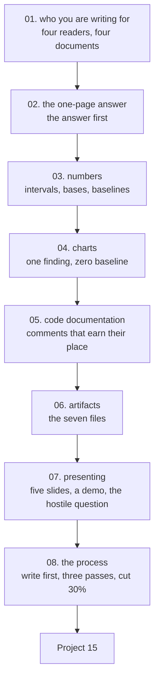

# Communication and Documentation — Tayel AI Labs

The fifteenth course, and the one that decides whether any of the other fourteen
reach anybody. Work that nobody can read, run, check or act on has not been
delivered — it has been performed.

This course is deliberately **example-heavy**: every lesson shows the bad version
and the good version of the same thing, and where a claim can be measured, it is.

**Prerequisites**

- Any one completed project from this track. You need something real to document
- [`../Data-Analysis`](../Data-Analysis) — the one-page answer originates there
- [`../Data-Science`](../Data-Science) — model cards and run records

---

## The path



## Lessons

| # | Lesson | The point |
|---|---|---|
| 01 | [Who You Are Writing For](lessons/01-who-you-are-writing-for.md) | One document for four readers reaches none of them |
| 02 | [The One-Page Answer](lessons/02-the-one-page-answer.md) | A full before/after: 400 words of nothing vs a decision in 90 seconds |
| 03 | [Writing About Numbers](lessons/03-writing-about-numbers.md) | "+50%" was one customer in a hundred; n=200 knows a rate to +/-6.4 points |
| 04 | [Charts That Carry the Finding](lessons/04-charts.md) | A truncated axis drew a 7% difference as **5x** |
| 05 | [Code Documentation](lessons/05-code-documentation.md) | The comment test; a README scoring 2/7 |
| 06 | [Artifacts](lessons/06-artifacts.md) | Seven files, and the handover test |
| 07 | [Presenting](lessons/07-presenting.md) | Five slides, the backup video, naming the disagreement |
| 08 | [The Writing Process](lessons/08-the-writing-process.md) | Write the outline before the work; cut 30% after pass 2 |

## Then

- **[`Project-15/`](Project-15/)** — take work you have already done and produce
  every artifact for it, then present it to a real person

---

## Setup

```bash
python3 -m venv .venv
source .venv/bin/activate
pip install -r requirements.txt
```

Only lessons 03, 04 and 05 run code, and they run in seconds.

---

## What this course argues

1. **The order the work happened in is never the order to write it in.** The
   answer goes first (lesson 02).
2. **Every Evidence sentence contains a number**, and every headline number
   carries its interval (lessons 02, 03).
3. **A chart's title is a finding, not a pair of column names** — and bar charts
   start at zero, because a truncated axis exaggerated a 1.07x difference to 5x
   (lesson 04).
4. **A comment is worth writing only if a competent reader could not derive it
   from the code.** Everything else is maintenance cost (lesson 05).
5. **"Self-documenting code" documents what, never why** — and why is the
   expensive thing to lose (lessons 05, 06).
6. **The handover test is the real measure of your documentation**: can a
   colleague run it, explain it, improve it and say who it fails, in one day
   (lesson 06)?
