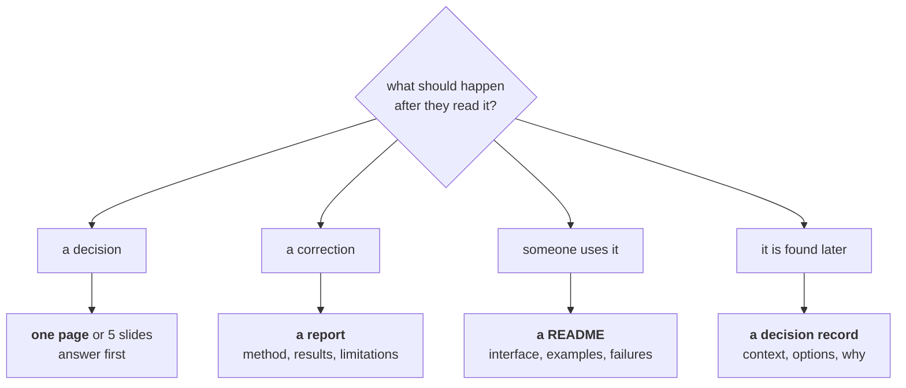

# Lesson 01 — Who You Are Writing For

**Goal:** stop writing one document for everybody, which reaches nobody.

## What you will learn

- Four readers, four different documents
- What each one does with your work
- The opening sentence test
- Choosing the format before writing a word

---

## The mistake

You finish three weeks of work and write **one** document. It contains the
approach, the data, the experiments, the results, the caveats and the
conclusion, in that order, because that is the order things happened.

Nobody reads it.

The manager wanted a decision, and it was on page four. The engineer wanted the
interface, and it was in a paragraph. The data scientist wanted the method, and
the caveats they needed were three sections apart. You in six months wanted to
know why you rejected the other approach, and it is not there at all.

**The order things happened in is never the order to write them in.**

---

## Four readers

| Reader | Wants | Gives you | Reads |
|---|---|---|---|
| **Decision-maker** | What to do, and what it costs | Approval, budget | The first 5 lines |
| **Peer / reviewer** | Whether it is sound | Corrections | The method and the caveats |
| **Implementer** | How to use it | A working system | The interface and the failure modes |
| **Future you** | Why, not what | A week of your life back | Whatever you wrote down |

They need different documents. Writing one document for all four produces a
document that is too long for the first, too shallow for the second, too vague
for the third and too tidy for the fourth.

### Decision-maker

```text
WANTS      a decision they can make in two minutes
FORMAT     one page, or 5 slides, answer first
OPENING    "We should X. It is worth Y. The risk is Z."
NEVER      method, architecture, "as you can see in figure 3"
```

### Peer

```text
WANTS      to find the flaw
FORMAT     a document with the method, the data and the limitations
OPENING    "We measured X and found Y, with these caveats."
NEVER      hidden caveats, unstated baselines, results without intervals
```

### Implementer

```text
WANTS      to use it without asking you questions
FORMAT     a README, an interface, examples, failure modes
OPENING    "Here is how to call it. Here is what it returns."
NEVER      motivation, history, the experiments that did not work
```

### Future you

```text
WANTS      to know why the decision was made, not what it was
FORMAT     a decision record, a commit message, a comment
OPENING    "We chose X over Y because Z. If Z changes, revisit."
NEVER      "obviously", "temporary", "TODO: clean this up"
```

---

## The opening sentence test

Write the first sentence. Then ask: **which reader is it for?**

| Opening | Reader | Verdict |
|---|---|---|
| "This document describes an investigation into customer churn." | Nobody | Says nothing. Delete it |
| "We should call the 1,000 highest-risk customers every Monday; it is worth about 41,700 EGP a month." | Decision-maker | Good |
| "Churn prediction reached 0.68 AUC using gradient boosting on 12,000 subscribers." | Peer | Good |
| "POST /score with a customer object returns a probability and an action." | Implementer | Good |
| "We rejected the rules engine because it could not express the tenure interaction." | Future you | Good |

If your first sentence could open any document about anything, it is a warm-up.
Delete it and start at the second paragraph, which is usually where you began
saying something.

---

## Choosing the format



Ask the question at the top before writing anything. Most bad documents are the
wrong format applied diligently.

And the corollary: **if the answer is "nothing should happen", do not write
it.** A weekly report nobody acts on is a weekly cost with no benefit; replace
it with a dashboard or delete it.

---

## The one thing all four share

Every reader, in every format, wants the same thing first: **the point**.

- The decision-maker wants the recommendation.
- The peer wants the finding.
- The implementer wants the call signature.
- Future you wants the decision.

None of them want the journey. The journey goes in the middle, for the ones who
need it, clearly labelled so the others can skip it.

This is the single highest-value habit in this course, and lesson 02 is entirely
about it.

---

## Common mistakes

| Mistake | Why it hurts |
|---|---|
| One document for four readers | Too long, too shallow, too vague and too tidy, all at once |
| Writing in the order the work happened | The point ends up on page four |
| A first sentence that could open anything | The reader has already decided it is not urgent |
| Method before conclusion, for a manager | They stop reading before the conclusion |
| Motivation before interface, for an engineer | They wanted the call signature |
| Writing a report nobody acts on | Cost with no benefit |
| No decision record | The reasoning is gone in three months, including from you |

---

## Exercises

1. Take a document you wrote recently. Name its reader. If you cannot, split it.
2. Rewrite its first sentence for each of the four readers. Which was hardest,
   and why?
3. Find a recurring report in your team that produces no decisions. Propose what
   replaces it.
4. Write the decision record for a choice you made this month: context, options,
   why, and what would make you revisit it.
5. For your last project, list who needed to read something and what they needed
   to do afterwards. How many got a document shaped for that?

---

**Next:** [Lesson 02 — The One-Page Answer](02-the-one-page-answer.md)
