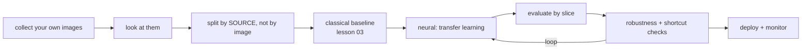

# Project 7 — A Vision System You Would Put on a Camera

**Do this after the twelve lessons.**

You build a working vision system on **your own images** — not a downloaded
benchmark — and you prove it survives the conditions it will actually meet.

Project 4 asked whether you can train a network. This one asks whether you can
be trusted with **pixels**: where the labels are expensive, the shortcuts are
invisible, and the preprocessing decides everything.

---

## Pick one track

| Track | Build | Core metric |
|---|---|---|
| **A — Classification** | Sort images into categories | Macro F1, per-slice accuracy |
| **B — Detection** | Find and count objects | mAP@0.5, with the IoU stated |
| **C — Segmentation** | Measure an area or region | mean IoU / Dice |
| **D — Similarity** | Find matching or duplicate images | Recall@k, with no labels |

Track D deserves a serious look: it needs **no labels at all** (lesson 10) and
answers more business questions than people expect.

---

## The pipeline



---

## Requirements

### 1. Your own images

- **At least 500 images you captured or collected yourself**, across at least
  three classes (or one class with varied conditions for tracks C/D).
- Captured under **at least two different conditions** — lighting, device,
  angle, background, or day.
- A data sheet: how many images, from where, when, with what device, and the
  class balance.

Downloaded benchmark datasets do not qualify. The acquisition variation is the
lesson.

### 2. Look at the data, and prove it

- A grid of **at least 24 images with their labels**, displayed in the notebook
- The `describe()` output from lesson 02 over a sample: shape, dtype, range,
  greyscale-as-RGB check
- The class balance, and the size distribution of your objects
- **At least three observations** you made by looking that the statistics did
  not show

### 3. Split by source, not by image

Split by camera, session, day or site — whatever groups your images. State the
grouping and why. A random split across near-duplicate frames from one session
inflates every number you will report.

Report: images per split, and the class balance in each.

### 4. The classical baseline (mandatory)

Lesson 03, applied to your problem:

- **A/D:** colour histograms or HOG features + `LinearSVC`, or template
  matching
- **B:** thresholding + contours with an area filter
- **C:** thresholding, Otsu, or classical segmentation

Report its metric. If it wins, that is your headline result and you say so.

### 5. The neural system

At least two of:

- A small CNN trained from scratch
- A **frozen** pretrained backbone + a head
- A **fine-tuned** backbone, with two learning rates
- CLIP zero-shot (track A/D), with at least three prompt wordings compared

For each: the metric, parameter count, training time, and **inference latency
at batch 1**.

### 6. Augmentation, measured one at a time

The table from lesson 07 — each transform alone, then your chosen combination:

| Transform | Metric | Kept? |
|---|---|---|
| none | | — |
| flip | | |
| crop | | |
| colour jitter | | |
| your combination | | |

Lesson 07 found every transform helping alone and three together costing 3.6
points. Justify your final pipeline from **your** table, and state which
production variation each transform imitates.

### 7. Evaluation — by slice, not just overall

- Per class: precision, recall, support; the worst class named
- **Per slice**: lighting, device, session, object size — the worst slice named
- Calibration: the confidence/accuracy table from lesson 11
- The operating threshold, chosen on validation, with the cost reasoning

### 8. Robustness and shortcuts (mandatory)

- Accuracy under **six perturbations** (lesson 11): brightness, noise, blur,
  JPEG 30, small rotation, slight crop
- **A shortcut check**: occlude the object and confirm the prediction
  collapses, or show a Grad-CAM/attention overlay on five images
- Test on images from a source held out entirely from training

A model that keeps its confidence when the object is occluded has learned the
background. Report it.

### 9. Error analysis

- The **20 most confident errors**, displayed
- Categorised: label error / ambiguous / out of distribution / preprocessing /
  shortcut
- **How many were label errors?** Report the count.
- One cause fixed, and re-measured

### 10. Ship it

- **One preprocessing function** used by training and inference — demonstrated
  by importing the same function in both notebooks
- A `VisionPredictor` class: load once, `convert("RGB")`, batch internally,
  return probabilities and an `"uncertain"` label below threshold
- A TorchScript or ONNX export, verified numerically against PyTorch
- A latency benchmark at batch 1, 4 and 16 — and the knee identified
- A model card naming the **conditions** it was validated under: devices,
  lighting, distances, backgrounds

---

## Deliverables

```text
project-7/
├── README.md              data sheet, results, slices, robustness, limits
├── MODEL_CARD.md
├── notebooks/
│   ├── 01-explore.ipynb   the image grid, describe(), balance, observations
│   └── 02-train.ipynb     baseline, neural, augmentation table, evaluation
├── src/
│   ├── preprocess.py      THE preprocessing function
│   ├── data.py            Dataset, splits by source
│   ├── train.py
│   └── predict.py         VisionPredictor
├── tests/                 at least 8 tests, including a preprocessing-parity test
├── models/
│   ├── best.pt
│   ├── model.torchscript
│   └── metadata.json      class order, input size, normalisation
└── data/
    ├── raw/               read-only, your own images
    └── processed/
```

---

## Marking

| Weight | Criterion |
|---|---|
| 15% | Your own images, varied conditions, documented; you looked at them |
| 10% | Split by source, justified |
| 15% | Classical baseline built and fairly compared |
| 15% | Two neural approaches, with cost as well as score |
| 10% | Augmentation measured one at a time |
| 15% | Evaluation by slice, with calibration and a chosen threshold |
| 10% | Robustness and shortcut checks |
| 10% | Shipping: one preprocessing function, export verified, model card |

Automatic deductions: a downloaded benchmark instead of your own images; a
random split across sessions; no classical baseline; augmentation stacked
without measurement; no robustness check; training and serving preprocessing
written twice.

---

## Milestones

| Day | Done by end of day |
|---|---|
| 1 | Images collected under two conditions; data sheet written |
| 2 | Looked at everything; split by source; classical baseline scored |
| 3 | Transfer learning, first results |
| 4 | Augmentation table |
| 5 | Evaluation by slice, calibration, threshold |
| 6 | Robustness, shortcut check, error analysis |
| 7 | Export, predictor, latency, model card, README |

---

## Before you submit

- [ ] The images are yours, and the conditions vary
- [ ] 24 images displayed with labels, and three observations from looking
- [ ] The split is by source, and the grouping is stated
- [ ] The classical baseline score is in the results table
- [ ] Every neural result has latency and parameter count beside it
- [ ] The augmentation table exists, one transform per row
- [ ] The worst slice is named, with its number
- [ ] Six perturbations measured
- [ ] A shortcut check was run, and its result reported
- [ ] Twenty errors displayed; label errors counted
- [ ] Training and serving import the same preprocessing function
- [ ] The export matches PyTorch numerically
- [ ] The model card names the conditions validated — and those not
