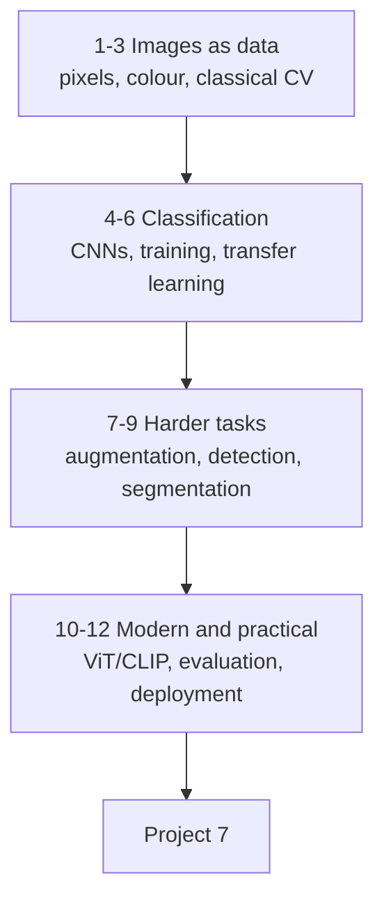

# Computer Vision — Tayel AI Labs

The sixth course. An image is a grid of numbers with structure, and this
course is about exploiting that structure: classifying, detecting,
segmenting, and shipping the result.

**Prerequisites**

- [`../Python`](../Python), [`../Machine-Learning`](../Machine-Learning)
- [`../Deep-Learning`](../Deep-Learning) — lessons 06–09 in particular

---

## The road



---

## Lessons

| # | Lesson | You will be able to |
|---|---|---|
| 01 | [What Computer Vision Is](lessons/01-what-is-computer-vision.md) | Frame a vision task and pick the output type |
| 02 | [Images as Data](lessons/02-images-as-data.md) | Handle pixels, channels, colour and resizing |
| 03 | [Classical Computer Vision](lessons/03-classical-cv.md) | Use filters, edges and thresholds — and know when they suffice |
| 04 | [CNNs for Vision](lessons/04-cnns-for-vision.md) | Read an architecture and count its cost |
| 05 | [Training an Image Classifier](lessons/05-training-a-classifier.md) | Train end to end, with the checks that matter |
| 06 | [Transfer Learning](lessons/06-transfer-learning.md) | Fine-tune a pretrained backbone properly |
| 07 | [Augmentation](lessons/07-augmentation.md) | Add invariances you actually need |
| 08 | [Object Detection](lessons/08-object-detection.md) | Boxes, IoU, NMS and mAP |
| 09 | [Segmentation](lessons/09-segmentation.md) | Masks, Dice and IoU |
| 10 | [Vision Transformers and CLIP](lessons/10-vit-and-clip.md) | Use modern backbones and zero-shot vision |
| 11 | [Evaluation and Error Analysis](lessons/11-evaluation-and-errors.md) | Find out why it fails, not just how often |
| 12 | [Deploying Vision](lessons/12-deploying-vision.md) | Ship it without preprocessing skew |

## Then

- [`Project-7/`](Project-7/) — a complete vision system, measured and shipped

---

## Setup

```bash
python3 -m venv .venv
source .venv/bin/activate
pip install -r requirements.txt
```

Every example runs on a laptop CPU. Where a GPU changes the picture, the
lesson says so.

---

## Two rules for this course

1. **Look at your images.** Not the metrics — the images. Half of all vision
   bugs (wrong channel order, upside-down masks, labels off by one class) are
   visible in thirty seconds of looking and invisible in an accuracy score.
2. **Preprocessing at serving must match training exactly.** Same resize, same
   interpolation, same normalisation, same channel order. This is the single
   most common production failure in vision, and it degrades quality silently.
