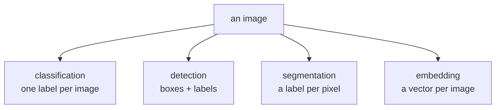
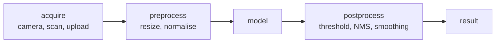

# Lesson 01 — What Computer Vision Is

**Goal:** name the task before choosing a model.

## What you will learn

- The four output types
- What each one costs to label
- The pipeline
- Choosing the cheapest task that solves the problem

---

## Four tasks, four outputs



| Task | Output | Labelling cost | Example |
|---|---|---|---|
| **Classification** | One label | Seconds per image | Is this product damaged? |
| **Detection** | Boxes + labels | Minutes per image | Count the cars |
| **Segmentation** | Pixel mask | 10–30 min per image | Measure the affected area |
| **Embedding** | A vector | **None** | Find visually similar items |

The labelling column is the one that decides projects. A segmentation dataset
of 5,000 images is roughly **1,500 hours** of human work; the same images
classified is about 20.

**Choose the weakest output that answers the question.** "Is there a defect?"
is classification. "How many defects?" is detection. "What area is affected?"
is segmentation. Do not label masks to answer a yes/no question.

```python
import numpy as np

images = 5_000
for task, seconds in [("classification", 4), ("detection", 90), ("segmentation", 900)]:
    hours = images * seconds / 3600
    print(f"{task:<16}{hours:>8.0f} hours   ≈ {hours / 8:>5.0f} working days")
```

```text
classification         6 hours   ≈     1 working days
detection            125 hours   ≈    16 working days
segmentation        1250 hours   ≈   156 working days
```

---

## The pipeline



Two boxes are where vision projects actually fail, and neither is the model:

- **Acquire.** Lighting, angle, focus, resolution and background vary more in
  production than in your training set. A model trained on studio photographs
  meets phone snapshots in a dark kitchen.
- **Preprocess.** If serving resizes differently from training — different
  interpolation, different normalisation, BGR instead of RGB — accuracy drops
  and nothing raises an error.

---

## Images are big

```python
import numpy as np

for name, shape in [("28x28 greyscale", (28, 28, 1)),
                    ("224x224 RGB", (224, 224, 3)),
                    ("1080p RGB", (1080, 1920, 3)),
                    ("4K RGB", (2160, 3840, 3))]:
    values = int(np.prod(shape))
    print(f"{name:<18}{values:>12,} numbers   "
          f"{values * 4 / 1024**2:>8.2f} MB as float32")
```

```text
28x28 greyscale            784 numbers       0.00 MB as float32
224x224 RGB            150,528 numbers       0.57 MB as float32
1080p RGB            6,220,800 numbers      23.73 MB as float32
4K RGB              24,883,200 numbers      94.92 MB as float32
```

A batch of 32 4K images is **3 GB** before a single layer runs. This is why
almost everything is resized to 224×224, why batch size is limited by image
size, and why data loading is so often the bottleneck (Deep Learning lesson
06).

---

## When you do not need deep learning

| Problem | Solution |
|---|---|
| Find a fixed logo or template | Template matching (lesson 03) |
| Read text | An OCR engine, not a new model |
| Read a barcode or QR code | A decoder library |
| Measure a well-lit object on a plain background | Thresholding + contours (lesson 03) |
| Detect motion in a fixed camera | Frame differencing |
| Colour-based sorting | Colour-space thresholds |

Classical computer vision is exact, fast, needs no labels and no GPU, and it
is unbeatable when the conditions are controlled. Lesson 03 shows how far it
goes — further than most people expect.

Deep learning earns its place when appearance varies: different lighting,
angles, backgrounds, shapes and occlusions.

---

## Framing, concretely

A coffee shop wants to know when a shelf needs restocking.

| Framing | Output | Labels needed | Verdict |
|---|---|---|---|
| Segment every product | Pixel masks | 900 s/image | Absurd for this question |
| Detect each product | Boxes | 90 s/image | Only if you need counts |
| **Classify shelf state** | full / low / empty | 4 s/image | **This** |
| Embed and compare to a reference | Vector | 0 | Worth trying first |

The last row deserves attention: for "has this changed?", an embedding plus a
distance threshold needs **no labels at all** and often works. Try it before
committing to a labelling budget.

---

## Common mistakes

| Mistake | What happens |
|---|---|
| Segmentation for a yes/no question | Months of labelling for nothing |
| Training data from one camera | Fails on the second camera |
| Not looking at the images | Channel, orientation and label bugs survive to production |
| Ignoring class imbalance | Defects are 2% of images; accuracy is meaningless |
| Deep learning for a template match | Slower, less accurate, needs labels |
| No plan for acquisition variation | Works in the lab, fails on site |

---

## Exercises

1. For a vision problem you know, write all four framings and their labelling
   costs.
2. Compute the memory of one batch at your real image size and batch size.
3. Find a vision problem in your work that classical CV would solve.
4. Photograph the same object ten times in different conditions. Which
   variations would break a model trained on studio images?
