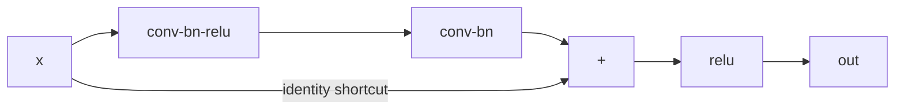

# Lesson 04 — CNNs for Vision

**Goal:** read an architecture, and know what it costs.

## What you will learn

- Receptive field
- Residual blocks, and why depth needed them
- Counting parameters and FLOPs
- Reading `torchvision`'s models

---

## Receptive field

One 3×3 convolution sees nine pixels. Stack two and each output sees 5×5 of
the input; stack three and it sees 7×7.

```python
def receptive_field(layers):
    """Receptive field of a stack of (kernel, stride) layers."""
    size, jump = 1, 1
    for kernel, stride in layers:
        size += (kernel - 1) * jump
        jump *= stride
    return size

stacks = {
    "one 3x3":              [(3, 1)],
    "two 3x3":              [(3, 1), (3, 1)],
    "three 3x3":            [(3, 1), (3, 1), (3, 1)],
    "one 7x7":              [(7, 1)],
    "3x3, pool, 3x3":       [(3, 1), (2, 2), (3, 1)],
    "3x3 x2, pool, 3x3 x2": [(3, 1), (3, 1), (2, 2), (3, 1), (3, 1)],
}
for name, layers in stacks.items():
    print(f"{name:<24} receptive field {receptive_field(layers)}x{receptive_field(layers)}")
```

```text
one 3x3                  receptive field 3x3
two 3x3                  receptive field 5x5
three 3x3                receptive field 7x7
one 7x7                  receptive field 7x7
3x3, pool, 3x3           receptive field 8x8
3x3 x2, pool, 3x3 x2     receptive field 14x14
```

Three stacked 3×3 layers see the same 7×7 area as one 7×7 layer. The
parameter counts are not the same:

```python
import torch.nn as nn

three_small = nn.Sequential(nn.Conv2d(64, 64, 3, padding=1), nn.ReLU(),
                            nn.Conv2d(64, 64, 3, padding=1), nn.ReLU(),
                            nn.Conv2d(64, 64, 3, padding=1))
one_large = nn.Conv2d(64, 64, 7, padding=3)

count = lambda m: sum(p.numel() for p in m.parameters())
print(f"three 3x3: {count(three_small):,} parameters")
print(f"one 7x7:   {count(one_large):,} parameters")
```

```text
three 3x3: 110,784 parameters
one 7x7:   200,768 parameters
```

Same receptive field, **45% fewer parameters**, and two extra non-linearities.
That is why modern architectures are stacks of 3×3 convolutions.

**Your receptive field must cover the object.** A network whose deepest layer
sees 30×30 pixels cannot recognise something that occupies 200×200 — pooling
and stride are what grow it.

---

## Residual blocks

Before 2015, deeper networks trained *worse* — not from overfitting, but
because gradients could not reach the early layers. Residual connections fixed
it.



```python
import torch
import torch.nn as nn

class ResidualBlock(nn.Module):
    def __init__(self, channels):
        super().__init__()
        self.body = nn.Sequential(
            nn.Conv2d(channels, channels, 3, padding=1, bias=False),
            nn.BatchNorm2d(channels), nn.ReLU(),
            nn.Conv2d(channels, channels, 3, padding=1, bias=False),
            nn.BatchNorm2d(channels),
        )
        self.activation = nn.ReLU()

    def forward(self, x):
        return self.activation(self.body(x) + x)      # the shortcut

block = ResidualBlock(64)
x = torch.randn(2, 64, 32, 32)
print("in:", tuple(x.shape), "-> out:", tuple(block(x).shape))

plain = nn.Sequential(*[nn.Sequential(nn.Conv2d(16, 16, 3, padding=1), nn.ReLU())
                        for _ in range(20)])
residual = nn.Sequential(*[ResidualBlock(16) for _ in range(10)])

sample = torch.randn(1, 16, 16, 16, requires_grad=True)
plain(sample).sum().backward()
plain_gradient = sample.grad.abs().mean().item()

sample = torch.randn(1, 16, 16, 16, requires_grad=True)
residual(sample).sum().backward()
residual_gradient = sample.grad.abs().mean().item()

print(f"gradient reaching the input, 20 plain layers:    {plain_gradient:.3e}")
print(f"gradient reaching the input, 10 residual blocks: {residual_gradient:.3e}")
```

```text
in: (2, 64, 32, 32) -> out: (2, 64, 32, 32)
gradient reaching the input, 20 plain layers:    1.953e-09
gradient reaching the input, 10 residual blocks: 2.760e+00
```

The gradient reaching the input is **a billion times larger** through the
residual network: 2.76 against 0.000000002.

In the plain stack the gradient is multiplied by twenty small numbers on the
way down, and the product underflows towards nothing — the early layers
receive no signal and never learn. The shortcut gives the gradient a path
where it is **added** rather than multiplied, so it arrives intact.

Both networks run. Both report a loss. Only one of them is training its first
layer, and that is the whole reason 50- and 100-layer networks became
possible.

---

## Counting the cost

```python
import torch
import torch.nn as nn

def conv_cost(in_channels, out_channels, kernel, height, width):
    """Parameters and multiply-accumulates for one conv layer."""
    parameters = in_channels * out_channels * kernel * kernel + out_channels
    macs = in_channels * out_channels * kernel * kernel * height * width
    return parameters, macs

layers = [
    ("conv1 3->64, 7x7, on 112x112", 3, 64, 7, 112, 112),
    ("conv 64->64, 3x3, on 56x56", 64, 64, 3, 56, 56),
    ("conv 256->256, 3x3, on 14x14", 256, 256, 3, 14, 14),
    ("conv 512->512, 3x3, on 7x7", 512, 512, 3, 7, 7),
]
print(f"{'layer':<32}{'params':>12}{'MACs (M)':>12}")
for name, ci, co, k, h, w in layers:
    parameters, macs = conv_cost(ci, co, k, h, w)
    print(f"{name:<32}{parameters:>12,}{macs / 1e6:>12.1f}")
```

```text
layer                                 params    MACs (M)
conv1 3->64, 7x7, on 112x112           9,472       118.0
conv 64->64, 3x3, on 56x56            36,928       115.6
conv 256->256, 3x3, on 14x14         590,080       115.6
conv 512->512, 3x3, on 7x7         2,359,808       115.6
```

Read the two columns against each other. The last layer has **250 times the
parameters** of the first and does **the same amount of work**.

That is the shape of every CNN: early layers are cheap in memory and expensive
in compute (large spatial size, few channels); late layers are the reverse.
It explains why pruning late layers saves memory but not time, and why
reducing the input resolution saves time everywhere.

---

## torchvision's models

```python
import torch
from torchvision import models

for name, constructor in [("resnet18", models.resnet18),
                          ("resnet50", models.resnet50),
                          ("mobilenet_v3_small", models.mobilenet_v3_small),
                          ("efficientnet_b0", models.efficientnet_b0)]:
    model = constructor(weights=None)
    parameters = sum(p.numel() for p in model.parameters())
    print(f"{name:<22}{parameters / 1e6:>7.1f}M parameters  "
          f"{parameters * 4 / 1024**2:>7.1f} MB fp32")
```

```text
resnet18                11.7M parameters     44.6 MB fp32
resnet50                25.6M parameters     97.5 MB fp32
mobilenet_v3_small       2.5M parameters      9.7 MB fp32
efficientnet_b0          5.3M parameters     20.2 MB fp32
```

| Model | Use when |
|---|---|
| `resnet18` | The default. Well understood, fast, strong |
| `resnet50` | More accuracy, 2× the parameters |
| `mobilenet_v3_small` | Phone or edge; 2.5M parameters |
| `efficientnet_b0` | Best accuracy per parameter in this range |
| `vit_b_16` | Large datasets, more compute — lesson 10 |

Inspecting one:

```python
from torchvision import models

model = models.resnet18(weights=None)
print("stem:  ", model.conv1)
print("layer1:", type(model.layer1[0]).__name__, "x", len(model.layer1))
print("head:  ", model.fc)
```

```text
stem:   Conv2d(3, 64, kernel_size=(7, 7), stride=(2, 2), padding=(3, 3), bias=False)
layer1: BasicBlock x 2
head:   Linear(in_features=512, out_features=1000, bias=True)
```

Every torchvision classifier has this shape: a **stem** that reduces
resolution, a **body** of blocks, and a **head** you replace for your classes.
Lesson 06 replaces that head.

---

## Common mistakes

| Mistake | What happens |
|---|---|
| Receptive field smaller than the object | The model cannot see what it must classify |
| A deep plain stack with no residuals | Gradients vanish; it will not train |
| Counting parameters and ignoring FLOPs | A "small" model that is slow |
| 5×5 and 7×7 convolutions everywhere | More parameters for the same receptive field |
| Forgetting `bias=False` before BatchNorm | Redundant parameters; the norm removes the bias |
| Training from scratch when weights exist | Lesson 06 |

---

## Exercises

1. Compute the receptive field of a stack you design; check it covers your
   objects.
2. Count parameters and MACs for three layers of a real model.
3. Reproduce the gradient comparison with 30 plain layers.
4. Print the stem, body and head of `efficientnet_b0`. What is the head
   called?
