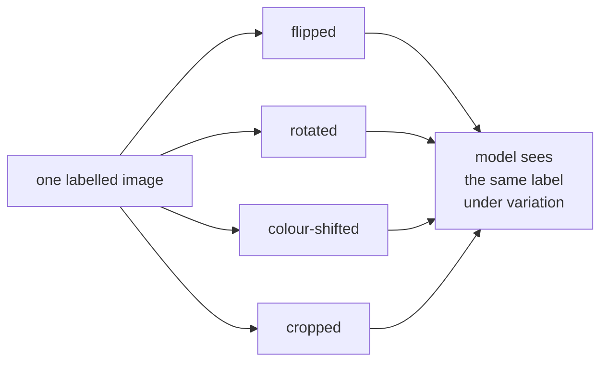

# Lesson 07 — Augmentation

**Goal:** add the invariances your data will actually need.

## What you will learn

- What augmentation does and does not do
- Choosing transforms from the deployment conditions
- Measuring each one
- MixUp, CutMix and the modern recipes

---

## The principle

Augmentation tells the model "this change does not alter the label".



It cannot add information the dataset never had. **Choose transforms that
imitate the variation your production images will contain** — nothing else.

```python
from torchvision import transforms

production_like = transforms.Compose([
    transforms.RandomResizedCrop(64, scale=(0.7, 1.0)),   # framing varies
    transforms.RandomHorizontalFlip(),                     # objects face either way
    transforms.ColorJitter(brightness=0.3, contrast=0.3),  # lighting varies
    transforms.ToTensor(),
    transforms.Normalize([0.485, 0.456, 0.406], [0.229, 0.224, 0.225]),
])
print(production_like)
```

```text
Compose(
    RandomResizedCrop(size=(64, 64), scale=(0.7, 1.0), ratio=(0.75, 1.3333), interpolation=bilinear, antialias=True)
    RandomHorizontalFlip(p=0.5)
    ColorJitter(brightness=(0.7, 1.3), contrast=(0.7, 1.3), saturation=None, hue=None)
    ToTensor()
    Normalize(mean=[0.485, 0.456, 0.406], std=[0.229, 0.224, 0.225])
)
```

Each line should answer a question about deployment: *do my images arrive
cropped differently? mirrored? under different light?* If the answer is no,
the transform is cost without benefit.

---

## Which transforms are label-safe

| Transform | Safe for | Breaks |
|---|---|---|
| Horizontal flip | Most objects, faces, animals | **Text, digits, left/right anatomy** |
| Vertical flip | Satellite, microscopy, textures | Almost everything photographed upright |
| Rotation ±15° | Most images | Digits (6↔9), documents |
| `RandomResizedCrop` | Objects filling the frame | Small objects — they get cropped out |
| Colour jitter | Natural photographs | **Any task where colour is the label** |
| Grayscale(p) | Shape-based tasks | Colour-based tasks |
| Gaussian blur | Robustness to focus | Already-blurry data |
| `RandomErasing` | Occlusion robustness | Small objects |

The single question to ask of any transform: **would a human still give this
image the same label?** If not, you are teaching the model wrong answers.

---

## Measure them, one at a time

```python
import torch
import torch.nn as nn
from torch.utils.data import DataLoader, Subset
from torchvision import datasets, transforms

device = ("cuda" if torch.cuda.is_available()
          else "mps" if torch.backends.mps.is_available() else "cpu")

base = [transforms.ToTensor(), transforms.Normalize((0.2860,), (0.3530,))]
eval_transform = transforms.Compose(base)

candidates = {
    "none": eval_transform,
    "flip": transforms.Compose([transforms.RandomHorizontalFlip()] + base),
    "crop": transforms.Compose([transforms.RandomCrop(28, padding=2)] + base),
    "rotate": transforms.Compose([transforms.RandomRotation(10)] + base),
    "erasing": transforms.Compose(base + [transforms.RandomErasing(p=0.25)]),
    "flip+crop+rotate": transforms.Compose(
        [transforms.RandomHorizontalFlip(), transforms.RandomCrop(28, padding=4),
         transforms.RandomRotation(10)] + base),
}

test_ds = Subset(datasets.FashionMNIST("./data", train=False, download=True,
                                       transform=eval_transform), range(2_000))
test_loader = DataLoader(test_ds, batch_size=512)

def build():
    torch.manual_seed(42)
    return nn.Sequential(
        nn.Conv2d(1, 32, 3, padding=1), nn.ReLU(), nn.MaxPool2d(2),
        nn.Conv2d(32, 64, 3, padding=1), nn.ReLU(), nn.MaxPool2d(2),
        nn.Flatten(), nn.Dropout(0.25), nn.Linear(64 * 7 * 7, 10)).to(device)

def run(transform, epochs=30, n_train=1_000):
    train_ds = Subset(datasets.FashionMNIST("./data", train=True, download=True,
                                            transform=transform), range(n_train))
    loader = DataLoader(train_ds, batch_size=64, shuffle=True)
    model = build()
    optimiser = torch.optim.AdamW(model.parameters(), lr=1e-3)
    loss_fn = nn.CrossEntropyLoss()
    for _ in range(epochs):
        model.train()
        for images, labels in loader:
            images, labels = images.to(device), labels.to(device)
            optimiser.zero_grad()
            loss_fn(model(images), labels).backward()
            optimiser.step()
    model.eval()
    correct = 0
    with torch.no_grad():
        for images, labels in test_loader:
            images, labels = images.to(device), labels.to(device)
            correct += (model(images).argmax(1) == labels).sum().item()
    return correct / len(test_ds)

for name, transform in candidates.items():
    print(f"{name:<18} {run(transform):.4f}")
```

```text
none               0.8215
flip               0.8320
crop               0.8360
rotate             0.8380
erasing            0.8445
flip+crop+rotate   0.7855
```

Read the last row against the ones above it.

**Individually, every single transform helps**: erasing +2.3, rotation +1.7,
crop +1.5, flip +1.1. **Stacked, three of them cost 3.6 points** — worse than
no augmentation at all.

Nothing is broken. On a 28×28 image where the garment fills the frame,
cropping with 4 pixels of padding *and* rotating *and* flipping pushes too
much of the object out of view. The model spends its capacity on distortions
it will never see at test time.

**Add transforms one at a time, measuring each**, exactly as above. A stacked
pipeline copied from a tutorial is how people quietly lose points.

---

## Augmented training needs more epochs

```python
for epochs in [8, 30]:
    print(f"epochs={epochs:<4} none {run(candidates['none'], epochs):.4f}   "
          f"flip+crop+rotate {run(candidates['flip+crop+rotate'], epochs):.4f}")
```

```text
epochs=8    none 0.8135   flip+crop+rotate 0.7360
epochs=30   none 0.8215   flip+crop+rotate 0.7855
```

Every epoch shows different images, so convergence is slower. Judging
augmentation after 8 epochs would tell you it costs 7.8 points; after 30 it
costs 3.6 and is still closing. **Give augmented runs more epochs before
comparing.**

---

## MixUp and CutMix

Blend two images *and* their labels.

```python
import torch

def mixup(images, labels, n_classes=10, alpha=0.4):
    """Blend pairs of images and their one-hot labels."""
    lam = float(torch.distributions.Beta(alpha, alpha).sample())
    index = torch.randperm(images.size(0))
    mixed_images = lam * images + (1 - lam) * images[index]
    one_hot = torch.nn.functional.one_hot(labels, n_classes).float()
    mixed_labels = lam * one_hot + (1 - lam) * one_hot[index]
    return mixed_images, mixed_labels, lam

torch.manual_seed(0)
images = torch.randn(4, 1, 28, 28)
labels = torch.tensor([0, 3, 5, 9])
mixed_images, mixed_labels, lam = mixup(images, labels)

print(f"lambda: {lam:.3f}")
print("first mixed label:", mixed_labels[0].round(decimals=2).tolist())
print("labels sum to 1:", bool(torch.allclose(mixed_labels.sum(1), torch.ones(4))))
```

```text
lambda: 0.757
first mixed label: [0.76, 0.0, 0.0, 0.24, 0.0, 0.0, 0.0, 0.0, 0.0, 0.0]
labels sum to 1: True
```

The label is now **76% class 0 and 24% class 3** — a soft target matching an
image that is 76% the first picture and 24% the second. Train with
`CrossEntropyLoss` on soft labels (it accepts them) and the model learns
calibrated, less over-confident predictions.

MixUp and CutMix reliably add 1–2 points on datasets of tens of thousands of
images and above. On 1,000 images they usually hurt, for the same reason the
stacked pipeline above did.

`torchvision.transforms.v2` provides both, batched:

```python
from torchvision.transforms import v2

cutmix = v2.CutMix(num_classes=10)
mixup_v2 = v2.MixUp(num_classes=10)
chooser = v2.RandomChoice([cutmix, mixup_v2])
```

---

## Test-time augmentation

```python
import torch

@torch.no_grad()
def predict_with_tta(model, images):
    """Average the predictions of the image and its mirror."""
    model.eval()
    normal = model(images).softmax(1)
    flipped = model(torch.flip(images, dims=[3])).softmax(1)
    return (normal + flipped) / 2
```

Two forward passes per prediction for a fraction of a point. Worth it in a
competition, rarely worth the latency in a service.

---

## Common mistakes

| Mistake | What happens |
|---|---|
| Augmenting the validation or test set | Noisy, pessimistic numbers |
| Horizontal flip on text or digits | You teach wrong labels |
| Colour jitter when colour is the label | Same |
| Stacking transforms without measuring | Points lost, as above |
| Judging augmentation after too few epochs | It looks much worse than it is |
| MixUp on a tiny dataset | Adds noise the model cannot absorb |

---

## Exercises

1. Show one image under five random augmentations; check each label still
   holds.
2. Reproduce the one-at-a-time table on your own data.
3. Train the same augmentation for 10 and 40 epochs; compare.
4. Implement MixUp and verify the soft labels sum to 1.
