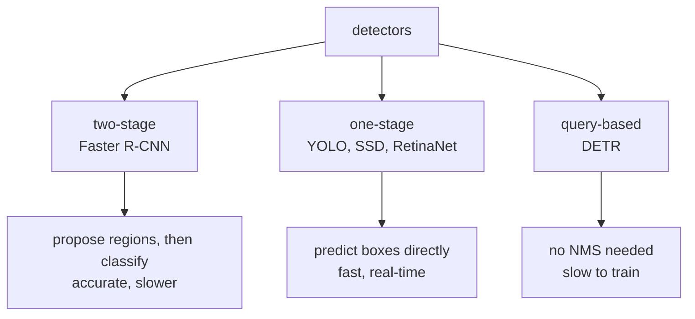

# Lesson 08 — Object Detection

**Goal:** find and label multiple objects, and score the result correctly.

## What you will learn

- Box formats, and the conversions that bite
- IoU, implemented
- Non-maximum suppression
- mAP, and why detection metrics look complicated

---

## The output

Classification returns one label. Detection returns a **variable-length list**
of boxes, each with a class and a confidence.

```python
detections = [
    {"box": [120, 40, 200, 160], "label": "cup", "score": 0.94},
    {"box": [210, 55, 260, 150], "label": "cup", "score": 0.81},
    {"box": [10, 100, 90, 190], "label": "plate", "score": 0.67},
]
for detection in detections:
    x1, y1, x2, y2 = detection["box"]
    print(f"{detection['label']:<7} score {detection['score']:.2f}  "
          f"{x2 - x1}x{y2 - y1} px at ({x1},{y1})")
```

```text
cup     score 0.94  80x120 px at (120,40)
cup     score 0.81  50x95 px at (210,55)
plate   score 0.67  80x90 px at (10,100)
```

That variable length is what makes detection harder than classification: the
loss must match predictions to ground truth before it can score anything.

---

## Box formats

```python
def xyxy_to_xywh(box):
    x1, y1, x2, y2 = box
    return [x1, y1, x2 - x1, y2 - y1]

def xywh_to_cxcywh(box):
    x, y, w, h = box
    return [x + w / 2, y + h / 2, w, h]

def cxcywh_to_normalised(box, width, height):
    cx, cy, w, h = box
    return [cx / width, cy / height, w / width, h / height]

box = [120, 40, 200, 160]                      # x1 y1 x2 y2
print("xyxy      ", box)
print("xywh      ", xyxy_to_xywh(box))
print("cxcywh    ", xywh_to_cxcywh(xyxy_to_xywh(box)))
print("normalised", [round(v, 3) for v in
                     cxcywh_to_normalised(xywh_to_cxcywh(xyxy_to_xywh(box)), 640, 480)])
```

```text
xyxy       [120, 40, 200, 160]
xywh       [120, 40, 80, 120]
cxcywh     [160.0, 100.0, 80, 120]
normalised [0.25, 0.208, 0.125, 0.25]
```

| Format | Used by |
|---|---|
| `xyxy` — corners | torchvision, COCO evaluation |
| `xywh` — corner + size | COCO annotations |
| `cxcywh` normalised | YOLO |

Four formats for the same rectangle. **Every detection bug you will meet
starts here**: boxes in the wrong format produce a model that trains, loses,
and predicts nonsense with no error.

---

## IoU

Intersection over union: the overlap of two boxes divided by their combined
area.

```python
def iou(box_a, box_b):
    """Intersection over union for two xyxy boxes."""
    ax1, ay1, ax2, ay2 = box_a
    bx1, by1, bx2, by2 = box_b

    ix1, iy1 = max(ax1, bx1), max(ay1, by1)
    ix2, iy2 = min(ax2, bx2), min(ay2, by2)
    intersection = max(0, ix2 - ix1) * max(0, iy2 - iy1)

    area_a = (ax2 - ax1) * (ay2 - ay1)
    area_b = (bx2 - bx1) * (by2 - by1)
    union = area_a + area_b - intersection
    return intersection / union if union else 0.0

truth = [100, 100, 200, 200]
cases = {
    "identical":        [100, 100, 200, 200],
    "shifted 10px":     [110, 110, 210, 210],
    "shifted 50px":     [150, 150, 250, 250],
    "half the size":    [100, 100, 150, 150],
    "no overlap":       [300, 300, 400, 400],
}
for name, box in cases.items():
    print(f"{name:<18} IoU {iou(truth, box):.3f}")
```

```text
identical          IoU 1.000
shifted 10px       IoU 0.681
shifted 50px       IoU 0.143
half the size      IoU 0.250
no overlap         IoU 0.000
```

Two numbers worth internalising. A box shifted by **10% of its width** already
drops to 0.681 — IoU is strict. And a box that is correctly positioned but half
the size scores 0.25, below every usual threshold.

Conventions: **IoU ≥ 0.5** is the standard "correct detection" threshold;
0.75 is strict; COCO reports the average over thresholds 0.5 to 0.95.

---

## Non-maximum suppression

A detector fires several times on the same object. NMS keeps the best and
removes its duplicates.

```python
def nms(boxes, scores, threshold=0.5):
    """Greedy non-maximum suppression. Returns the kept indices."""
    order = sorted(range(len(boxes)), key=lambda i: -scores[i])
    keep = []
    while order:
        best = order.pop(0)
        keep.append(best)
        order = [i for i in order if iou(boxes[best], boxes[i]) < threshold]
    return keep

boxes = [
    [100, 100, 200, 200],      # the object
    [105, 102, 203, 198],      # near-duplicate
    [98, 96, 197, 201],        # near-duplicate
    [300, 300, 400, 400],      # a different object
]
scores = [0.92, 0.88, 0.75, 0.81]

kept = nms(boxes, scores)
print("kept:", kept)
for index in kept:
    print(f"  box {boxes[index]} score {scores[index]}")
```

```text
kept: [0, 3]
  box [100, 100, 200, 200] score 0.92
  box [300, 300, 400, 400] score 0.81
```

Four detections became two: the highest-scoring box of each cluster.

The threshold is a real trade-off. Too low and overlapping distinct objects
(a crowd) get suppressed; too high and duplicates survive. **Run NMS per
class**, or a cup will suppress the plate behind it.

---

## Precision, recall and mAP

Detection has no "true negatives" — most of the image is background — so the
metric is built from matched pairs.

```python
def evaluate_detections(predictions, ground_truth, iou_threshold=0.5):
    """predictions: (box, score) sorted by score. Returns precision/recall/TP/FP/FN."""
    matched = set()
    true_positives = false_positives = 0

    for box, _ in sorted(predictions, key=lambda p: -p[1]):
        best_iou, best_index = 0.0, None
        for index, truth_box in enumerate(ground_truth):
            if index in matched:
                continue
            overlap = iou(box, truth_box)
            if overlap > best_iou:
                best_iou, best_index = overlap, index
        if best_iou >= iou_threshold:
            matched.add(best_index)
            true_positives += 1
        else:
            false_positives += 1

    false_negatives = len(ground_truth) - len(matched)
    precision = true_positives / (true_positives + false_positives) if predictions else 0
    recall = true_positives / len(ground_truth) if ground_truth else 0
    return {"precision": round(precision, 3), "recall": round(recall, 3),
            "TP": true_positives, "FP": false_positives, "FN": false_negatives}

ground_truth = [[100, 100, 200, 200], [300, 300, 400, 400], [50, 400, 120, 470]]
predictions = [
    ([102, 98, 198, 203], 0.95),      # good match
    ([305, 302, 398, 401], 0.88),     # good match
    ([500, 50, 560, 110], 0.60),      # false positive
]
print("IoU of the two good boxes:",
      round(iou(predictions[0][0], ground_truth[0]), 3),
      round(iou(predictions[1][0], ground_truth[1]), 3))
print("threshold 0.50:", evaluate_detections(predictions, ground_truth))
print("threshold 0.92:", evaluate_detections(predictions, ground_truth, 0.92))
```

```text
IoU of the two good boxes: 0.916 0.903
threshold 0.50: {'precision': 0.667, 'recall': 0.667, 'TP': 2, 'FP': 1, 'FN': 1}
threshold 0.92: {'precision': 0.0, 'recall': 0.0, 'TP': 0, 'FP': 3, 'FN': 3}
```

The same predictions, two thresholds, and the score goes from 0.667 to
**zero**.

Those two boxes are off by two or three pixels on a 100-pixel object — visibly
correct to any human. At the standard 0.5 they are detections; at 0.92 they
are failures, and the model scores nothing at all.

**Always state the IoU threshold with a detection score.** "mAP 0.62" means
nothing on its own; "mAP@0.5 = 0.62" is a result.

mAP itself is: average precision (the area under the precision-recall curve as
you sweep the confidence threshold), computed per class, then averaged over
classes — and for COCO, averaged again over ten IoU thresholds.

---

## Model families



| Family | Use when |
|---|---|
| **YOLO** (v8–v11) | Real time, video, edge. The default first try |
| **Faster R-CNN** | Accuracy matters more than latency |
| **RetinaNet** | One-stage with focal loss; strong on small objects |
| **DETR** | Research, or when NMS is causing problems |

In torchvision:

```python
from torchvision.models import detection

model = detection.fasterrcnn_resnet50_fpn(weights=None, num_classes=4)
print(type(model).__name__, "- expects a list of images and a list of target dicts")
```

```text
FasterRCNN - expects a list of images and a list of target dicts
```

Detection models take **lists**, not batched tensors, because images may
differ in size and each has a different number of boxes.

---

## Before you label a detection dataset

- [ ] Could classification answer the question instead? (lesson 01)
- [ ] Box format decided and documented — and converted once, at load time
- [ ] Annotation guidelines written: occlusion, truncation, minimum size,
      ambiguous objects
- [ ] Two annotators labelled 50 images; their IoU agreement measured
- [ ] A class-frequency count; rare classes will need more data
- [ ] The IoU threshold your application actually requires

That fourth point catches a surprising number of projects: if two humans only
agree at IoU 0.7, no model will score above that against either of them.

---

## Common mistakes

| Mistake | What happens |
|---|---|
| Mixed box formats | Trains, converges, predicts nonsense |
| NMS across classes | Objects of different classes suppress each other |
| Reporting mAP without the IoU threshold | The number is uninterpretable |
| IoU 0.5 when the application needs tight boxes | Ships a model that measures badly |
| Ignoring small objects | They are most of the errors — check per-size metrics |
| No annotation guidelines | Inconsistent labels cap the achievable score |

---

## Exercises

1. Implement `iou` and test it on identical, shifted and disjoint boxes.
2. Implement NMS and run it on a cluster of five overlapping boxes.
3. Compute precision and recall at IoU 0.5 and 0.75 for the same predictions.
4. Convert a YOLO-format label file to `xyxy` pixels and verify by drawing.
