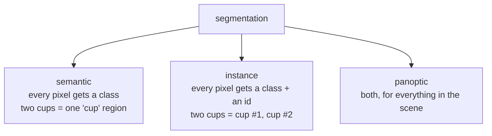
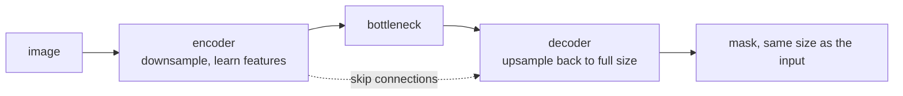

# Lesson 09 — Segmentation

**Goal:** label every pixel, and measure it with the right metric.

## What you will learn

- Semantic, instance and panoptic segmentation
- Dice and IoU, implemented
- Why pixel accuracy lies
- Loss functions for imbalanced masks

---

## Three kinds



| Kind | Output | Use for |
|---|---|---|
| Semantic | `(H, W)` of class ids | Area, coverage, "what is here?" |
| Instance | Per-object masks | Counting, per-object measurement |
| Panoptic | Both | Scene understanding |

If the question is "what percentage of this field is diseased?", semantic is
enough. If it is "how many diseased leaves?", you need instances.

---

## The mask

```python
import numpy as np

mask = np.zeros((8, 8), dtype=np.uint8)
mask[2:6, 2:6] = 1                         # class 1: object
mask[6:8, 0:3] = 2                         # class 2: something else

print(mask)
print("classes present:", np.unique(mask).tolist())
print("pixels per class:", {int(c): int((mask == c).sum()) for c in np.unique(mask)})
```

```text
[[0 0 0 0 0 0 0 0]
 [0 0 0 0 0 0 0 0]
 [0 0 1 1 1 1 0 0]
 [0 0 1 1 1 1 0 0]
 [0 0 1 1 1 1 0 0]
 [0 0 1 1 1 1 0 0]
 [2 2 2 0 0 0 0 0]
 [2 2 2 0 0 0 0 0]]
classes present: [0, 1, 2]
pixels per class: {0: 42, 1: 16, 2: 6}
```

A mask is an integer array the same size as the image, holding **class ids**,
not colours. Saving it as a JPEG destroys it — the compression invents
intermediate values that are not valid classes. **Save masks as PNG.**

The same reason forbids bilinear resizing: averaging classes 1 and 2 gives
1.5, which rounds to a class that may not exist. Use `INTER_NEAREST`
(lesson 02).

---

## Pixel accuracy lies

```python
import numpy as np

truth = np.zeros((100, 100), dtype=np.uint8)
truth[45:55, 45:55] = 1                    # a small object: 1% of the image

predicted_nothing = np.zeros_like(truth)

pixel_accuracy = (truth == predicted_nothing).mean()
print(f"pixel accuracy of a model that predicts nothing: {pixel_accuracy:.4f}")
print(f"object pixels: {truth.sum()} of {truth.size} ({100 * truth.mean():.1f}%)")
```

```text
pixel accuracy of a model that predicts nothing: 0.9900
object pixels: 100 of 10000 (1.0%)
```

Ninety-nine per cent accuracy, and the model has not found a single pixel of
the object. Background dominates every segmentation task, so **pixel accuracy
measures the background**.

---

## IoU and Dice

```python
import numpy as np

def iou(truth, prediction, class_id=1):
    t, p = truth == class_id, prediction == class_id
    union = np.logical_or(t, p).sum()
    return float(np.logical_and(t, p).sum() / union) if union else 1.0

def dice(truth, prediction, class_id=1):
    t, p = truth == class_id, prediction == class_id
    total = t.sum() + p.sum()
    return float(2 * np.logical_and(t, p).sum() / total) if total else 1.0

truth = np.zeros((100, 100), dtype=np.uint8)
truth[40:60, 40:60] = 1                    # a 20x20 object

cases = {
    "perfect":            truth.copy(),
    "predicts nothing":   np.zeros_like(truth),
    "shifted 5px":        np.roll(truth, 5, axis=0),
    "half the object":    np.where(np.arange(100)[:, None] < 50, truth, 0),
    "twice the size":     np.zeros_like(truth),
}
cases["twice the size"][30:70, 30:70] = 1

print(f"{'case':<20}{'IoU':>8}{'Dice':>8}{'pixel acc':>12}")
for name, prediction in cases.items():
    print(f"{name:<20}{iou(truth, prediction):>8.3f}{dice(truth, prediction):>8.3f}"
          f"{(truth == prediction).mean():>12.4f}")
```

```text
case                     IoU    Dice   pixel acc
perfect                1.000   1.000      1.0000
predicts nothing       0.000   0.000      0.9600
shifted 5px            0.600   0.750      0.9800
half the object        0.500   0.667      0.9800
twice the size         0.250   0.400      0.8800
```

Read the last column against the first two. **"Predicts nothing" scores 0.96
pixel accuracy and "half the object" scores 0.98** — so by pixel accuracy the
model that finds nothing is only two points behind one that finds half the
object correctly. By IoU they are 0.000 and 0.500.

Worse, "twice the size" has the *lowest* pixel accuracy (0.88) of any model
that predicted anything, while being a perfectly usable detection of the
object in the right place. Pixel accuracy ranks these models almost backwards;
only IoU and Dice rank them sensibly.

| | Formula | Behaviour |
|---|---|---|
| **IoU** (Jaccard) | `TP / (TP + FP + FN)` | Stricter; the standard for reporting |
| **Dice** (F1) | `2·TP / (2·TP + FP + FN)` | More forgiving; the standard in medical imaging |

Dice is always ≥ IoU, and they rank models identically — so report whichever
your field uses, and **state which one you used.** "0.75" is a different
achievement under each.

For multi-class problems, report **mean IoU**: the IoU per class, averaged, so
a rare class counts as much as the background.

---

## Loss functions

Cross entropy treats every pixel equally, which on a 1%-object image means it
is 99% about the background.

```python
import torch
import torch.nn as nn
import torch.nn.functional as F

def dice_loss(logits, targets, epsilon=1e-6):
    """1 - Dice, differentiable, for binary segmentation."""
    probabilities = torch.sigmoid(logits)
    intersection = (probabilities * targets).sum()
    total = probabilities.sum() + targets.sum()
    return 1 - (2 * intersection + epsilon) / (total + epsilon)

torch.manual_seed(0)
targets = torch.zeros(1, 1, 64, 64)
targets[..., 28:36, 28:36] = 1.0                  # 1.6% of pixels

predict_nothing = torch.full((1, 1, 64, 64), -5.0)     # confident background
predict_well = torch.where(targets > 0, 5.0, -5.0)

for name, logits in [("predicts nothing", predict_nothing),
                     ("predicts well", predict_well)]:
    bce = F.binary_cross_entropy_with_logits(logits, targets).item()
    dice = dice_loss(logits, targets).item()
    print(f"{name:<20} BCE {bce:.4f}   Dice loss {dice:.4f}")
```

```text
predicts nothing     BCE 0.0848   Dice loss 0.9906
predicts well        BCE 0.0067   Dice loss 0.1774
```

The model that finds **nothing** has a cross-entropy loss of 0.085 — already
near zero, so the gradient pushing it to improve is tiny. Its Dice loss is
0.99, the worst possible.

The ratio is the point: between a useless model and a good one, BCE moves from
0.085 to 0.007 (a factor of 13) while Dice moves from 0.99 to 0.18 (a factor
of 6 on a much larger absolute scale). BCE's gradient on the object pixels is
swamped by the 98% of pixels that are already correct.

That is why segmentation recipes combine them:

```python
def combined_loss(logits, targets, weight=0.5):
    return (weight * F.binary_cross_entropy_with_logits(logits, targets)
            + (1 - weight) * dice_loss(logits, targets))
```

| Loss | Use for |
|---|---|
| Cross entropy | Balanced classes |
| Weighted cross entropy | Mild imbalance |
| Dice loss | Small objects — optimises the metric directly |
| **BCE + Dice** | **The default for binary segmentation** |
| Focal loss | Extreme imbalance, many easy pixels |

---

## Architectures



| Model | Notes |
|---|---|
| **U-Net** | The default. Simple, strong, excellent with little data |
| DeepLabv3+ | Atrous convolutions for multi-scale context |
| Mask R-CNN | Instance segmentation — detection plus a mask head |
| SAM | Promptable, zero-shot; segment anything with a click |

The **skip connections** are U-Net's key idea: the decoder needs the encoder's
high-resolution detail to place boundaries precisely, and the bottleneck has
thrown it away.

---

## Common mistakes

| Mistake | What happens |
|---|---|
| Saving masks as JPEG | Compression invents invalid class ids |
| Bilinear resizing of masks | Class 1.5 appears |
| Reporting pixel accuracy | 99% for a model that finds nothing |
| Cross entropy alone on tiny objects | Weak gradient; the model predicts background |
| Not saying whether the score is IoU or Dice | The number is ambiguous |
| Augmenting the image but not the mask | Every label is now misaligned |

That last one deserves emphasis: **flip the image, flip the mask**. Use
`torchvision.transforms.v2`, which transforms both together, or apply the same
random seed to each.

---

## Exercises

1. Build a mask, compute IoU and Dice by hand, then check against the code.
2. Show that pixel accuracy fails on a 1%-object image.
3. Compare BCE, Dice and BCE+Dice loss on a synthetic small object.
4. Flip an image without flipping its mask, and visualise the damage.
