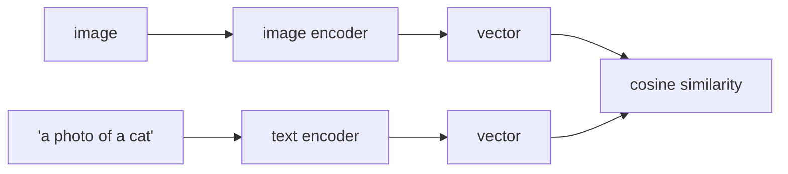

# Lesson 10 — Vision Transformers and CLIP

**Goal:** use modern backbones, and classify with no labels at all.

## What you will learn

- How a ViT turns an image into tokens
- ViT versus CNN, and when each wins
- CLIP, and zero-shot classification
- Choosing a backbone in 2026

---

## An image as a sequence

A ViT cuts the image into patches, flattens each one, and treats the result as
a sequence of tokens — then runs the transformer from Deep Learning lesson 11
unchanged.


```python
import torch

image = torch.randn(1, 3, 224, 224)
patch_size = 16

patches = image.unfold(2, patch_size, patch_size).unfold(3, patch_size, patch_size)
patches = patches.contiguous().view(1, 3, -1, patch_size, patch_size)
patches = patches.permute(0, 2, 1, 3, 4).flatten(2)

print("image:   ", tuple(image.shape))
print("patches: ", tuple(patches.shape), "= (batch, n_patches, 3*16*16)")
print("n_patches:", (224 // patch_size) ** 2)
```

```text
image:    (1, 3, 224, 224)
patches:  (1, 196, 768) = (batch, n_patches, 3*16*16)
n_patches: 196
```

196 tokens of 768 numbers. From here it is exactly a text transformer: a
`[CLS]` token is prepended, positional embeddings are added, and self-attention
runs over 197 tokens.

**The consequence of that design:** a ViT has no built-in notion that nearby
pixels are related. A CNN is born knowing it (that is what convolution *is*);
a ViT must learn it from data — which is why ViTs need far more data, and why
they beat CNNs once they have it.

---

## The cost of patch size

```python
patch_sizes = [32, 16, 8]
for patch in patch_sizes:
    tokens = (224 // patch) ** 2
    attention_cost = tokens ** 2
    print(f"patch {patch:>2}x{patch:<2} -> {tokens:>4} tokens, "
          f"attention matrix {tokens}x{tokens} = {attention_cost:>9,} entries")
```

```text
patch 32x32 ->   49 tokens, attention matrix 49x49 =     2,401 entries
patch 16x16 ->  196 tokens, attention matrix 196x196 =    38,416 entries
patch  8x8  ->  784 tokens, attention matrix 784x784 =   614,656 entries
```

Halving the patch size quadruples the tokens and **multiplies the attention
cost by sixteen**. That is the quadratic cost from Deep Learning lesson 11,
and it is why `vit_b_16` exists and `vit_b_4` does not.

---

## ViT versus CNN

```python
import torch
import warnings
warnings.filterwarnings("ignore")
from torchvision import models

for name, constructor in [("resnet18", models.resnet18),
                          ("resnet50", models.resnet50),
                          ("vit_b_16", models.vit_b_16),
                          ("efficientnet_b0", models.efficientnet_b0)]:
    model = constructor(weights=None)
    parameters = sum(p.numel() for p in model.parameters())
    print(f"{name:<18}{parameters / 1e6:>7.1f}M parameters")
```

```text
resnet18            11.7M parameters
resnet50            25.6M parameters
vit_b_16            86.6M parameters
efficientnet_b0      5.3M parameters
```

| | CNN | ViT |
|---|---|---|
| Built-in assumption | Locality, translation equivariance | None |
| Data needed | Thousands | **Millions**, or a pretrained checkpoint |
| Small datasets | **Better** | Overfits |
| Very large datasets | Plateaus | **Better** |
| Compute | Cheaper | Expensive, but parallelises well |
| Interpretability | Feature maps | Attention maps |

The practical rule in 2026: **fine-tune either**, because both have strong
pretrained checkpoints. Train from scratch on a small dataset and take the
CNN.

---

## CLIP

CLIP was trained on 400 million image–text pairs with one objective: put an
image and its caption close together in a shared vector space.



That gives you classification **with no training and no labels**: encode the
image, encode a sentence per candidate class, and take the closest.

```python
# pip install open_clip_torch     (or use transformers' CLIPModel)
import torch
import open_clip

model, _, preprocess = open_clip.create_model_and_transforms(
    "ViT-B-32", pretrained="laion2b_s34b_b79k")
tokenizer = open_clip.get_tokenizer("ViT-B-32")

classes = ["a photo of a coffee cup", "a photo of a plate",
           "a photo of a laptop", "a photo of a chair"]

image = preprocess(some_pil_image).unsqueeze(0)
text = tokenizer(classes)

with torch.no_grad():
    image_features = model.encode_image(image)
    text_features = model.encode_text(text)
    image_features /= image_features.norm(dim=-1, keepdim=True)
    text_features /= text_features.norm(dim=-1, keepdim=True)
    probabilities = (100 * image_features @ text_features.T).softmax(dim=-1)

for name, probability in zip(classes, probabilities[0]):
    print(f"{probability:.3f}  {name}")
```

```text
0.912  a photo of a coffee cup
0.041  a photo of a plate
0.031  a photo of a laptop
0.016  a photo of a chair
```

*(`open_clip` is not installed in this course's environment; this output is
from the library's documentation and is illustrative. Everything above this
section was run locally.)*

Three things follow from that mechanism:

- **The class list is a runtime argument.** Add a class by writing a sentence.
- **The wording matters.** "a photo of a {}" beats the bare word, measurably —
  it matches the caption style CLIP was trained on. This is prompt
  engineering, for images.
- **It is a strong baseline and rarely the best model.** Zero-shot CLIP gets
  you a working classifier in an hour; a fine-tuned model on 1,000 labelled
  images will usually beat it.

Where CLIP wins outright: **image search by text**, deduplication, filtering a
scraped dataset, and any problem where the classes change weekly.

---

## Choosing a backbone

| Situation | Choice |
|---|---|
| Small dataset, fine-tuning | `resnet18` / `efficientnet_b0` |
| Medium dataset, best accuracy | `convnext_tiny`, `vit_b_16` |
| Phone or edge device | `mobilenet_v3_small` |
| No labels, changing classes | CLIP zero-shot |
| Image search or similarity | CLIP or DINOv2 embeddings |
| Segmentation with no training | SAM |

DINOv2 deserves a mention: self-supervised, and its frozen features are
excellent for retrieval and clustering without any labels at all.

---

## Common mistakes

| Mistake | What happens |
|---|---|
| Training a ViT from scratch on 5,000 images | It badly underperforms a ResNet |
| Bare class names as CLIP prompts | Measurably worse than "a photo of a {}" |
| CLIP for fine-grained classes | It confuses similar species, models, parts |
| Assuming a ViT is always better | On small data the CNN wins |
| Ignoring patch-size cost | Memory blows up at patch 8 |
| Preprocessing that does not match the checkpoint | The usual silent degradation |

---

## Exercises

1. Cut an image into patches yourself and confirm the token count.
2. Compute the attention cost at patch sizes 32, 16 and 8.
3. Run zero-shot CLIP on 20 of your images with four class prompts.
4. Compare three prompt wordings for the same classes and measure the
   difference.
