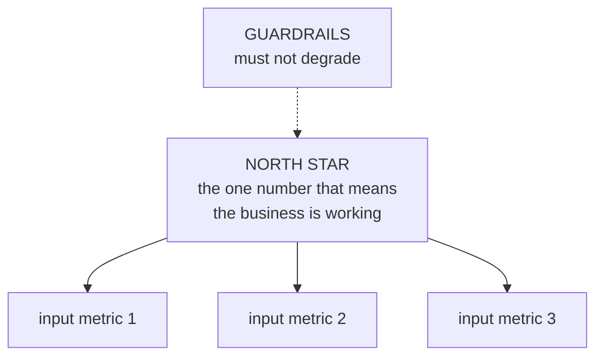

# Lesson 08 — Metrics and Dashboards

**Goal:** define metrics that are hard to game, and dashboards people use.

## What you will learn

- The anatomy of a metric definition
- North star, input and guardrail metrics
- Goodhart's law, made concrete
- What belongs on a dashboard

---

## A metric definition is a document

```python
metric = {
    "name": "weekly_active_customers",
    "definition": "Distinct customers with at least one completed order in the trailing 7 days",
    "grain": "one number per day (trailing window), and per branch",
    "includes": "completed and delivered orders",
    "excludes": "cancelled orders, refunded orders, staff accounts, test accounts",
    "timezone": "Africa/Cairo",
    "source": "mart_orders, filtered to is_cancelled = false",
    "owner": "analytics team",
    "known_gotchas": [
        "A customer ordering twice in a week counts once",
        "Guest checkouts without an account are excluded entirely",
        "Branch is the ordering branch, not the delivery address",
    ],
}
for key, value in metric.items():
    print(f"{key:<16}{value}")
```

```text
name            weekly_active_customers
definition      Distinct customers with at least one completed order in the trailing 7 days
grain           one number per day (trailing window), and per branch
includes        completed and delivered orders
excludes        cancelled orders, refunded orders, staff accounts, test accounts
timezone        Africa/Cairo
source          mart_orders, filtered to is_cancelled = false
owner           analytics team
known_gotchas   ['A customer ordering twice in a week counts once', 'Guest checkouts without an account are excluded entirely', 'Branch is the ordering branch, not the delivery address']
```

The `excludes` line is where most metric disputes are actually settled. Two
teams reporting "active customers" and disagreeing by 8% are almost always
differing on cancelled orders, staff accounts or the timezone — never on the
concept.

**Write the definition once, in a place both teams read, and link every chart
to it.**

---

## Three kinds of metric



| Kind | Purpose | Example |
|---|---|---|
| **North star** | Long-run value; hard to game | Weekly active customers |
| **Input** | What teams move directly | Orders per customer, activation rate |
| **Guardrail** | Must not get worse | Refund rate, complaint rate, latency |

```python
import pandas as pd

north_star = "weekly_active_customers"
inputs = {
    "new_customer_activation": "share of new customers ordering twice in 30 days",
    "order_frequency": "orders per active customer per week",
    "branch_coverage": "share of branches with orders every day",
}
guardrails = {
    "refund_rate": "refunded orders / completed orders  (alert above 3%)",
    "complaint_rate": "complaints per 100 orders  (alert above 2)",
    "delivery_time_p90": "90th percentile minutes  (alert above 45)",
}

print(f"NORTH STAR   {north_star}\n")
print("INPUTS")
for name, definition in inputs.items():
    print(f"  {name:<26}{definition}")
print("\nGUARDRAILS")
for name, definition in guardrails.items():
    print(f"  {name:<26}{definition}")
```

```text
NORTH STAR   weekly_active_customers

INPUTS
  new_customer_activation   share of new customers ordering twice in 30 days
  order_frequency           orders per active customer per week
  branch_coverage           share of branches with orders every day

GUARDRAILS
  refund_rate               refunded orders / completed orders  (alert above 3%)
  complaint_rate            complaints per 100 orders  (alert above 2)
  delivery_time_p90         90th percentile minutes  (alert above 45)
```

**A north star without guardrails is an instruction to cheat.** The guardrails
are what make the target safe to chase.

---

## Goodhart's law

> When a measure becomes a target, it ceases to be a good measure.

```python
import numpy as np
import pandas as pd

rng = np.random.default_rng(0)
weeks = 12

genuine_value = np.linspace(100, 110, weeks)
gaming = np.concatenate([np.zeros(6), np.linspace(0, 40, 6)])     # target set at week 6

metric = genuine_value + gaming + rng.normal(0, 2, weeks)
refunds = 0.02 + np.concatenate([np.zeros(6), np.linspace(0, 0.06, 6)])

frame = pd.DataFrame({
    "week": range(1, weeks + 1),
    "reported_metric": metric.round(1),
    "genuine_value": genuine_value.round(1),
    "refund_rate": (refunds * 100).round(1),
})
print(frame.to_string(index=False))

print(f"\nmetric growth, weeks 7-12:        "
      f"{metric[6:].mean() / metric[:6].mean() - 1:+.1%}")
print(f"genuine value growth, weeks 7-12: "
      f"{genuine_value[6:].mean() / genuine_value[:6].mean() - 1:+.1%}")
print(f"refund rate, weeks 7-12:          "
      f"{refunds[:6].mean():.1%} -> {refunds[6:].mean():.1%}")
```

```text
 week  reported_metric  genuine_value  refund_rate
    1            100.3          100.0          2.0
    2            100.6          100.9          2.0
    3            103.1          101.8          2.0
    4            102.9          102.7          2.0
    5            102.6          103.6          2.0
    6            105.3          104.5          2.0
    7            108.1          105.5          2.0
    8            116.3          106.4          3.2
    9            121.9          107.3          4.4
   10            129.7          108.2          5.6
   11            139.8          109.1          6.8
   12            150.1          110.0          8.0

metric growth, weeks 7-12:        +24.6%
genuine value growth, weeks 7-12: +5.3%
refund rate, weeks 7-12:          2.0% -> 5.0%
```

The reported metric grew **24.6%** after the target was set in week 6, ending
at 150.1 against a genuine value of 110.0. The underlying value grew **5.3%.**
Four fifths of the reported improvement is gaming.

The guardrail shows the cost: **refunds went from 2.0% to 8.0%, quadrupling**
over the same six weeks.

Without the refund rate on the same dashboard, week 12 looks like the best
week the team has ever had.

Metrics that resist gaming:

| Property | Why |
|---|---|
| Measures the **customer's** outcome, not the company's activity | Activity is easy to fake |
| **Counts people, not events** | "Orders" can be split; "customers" cannot |
| **Has a quality gate** — completed, retained, not refunded | Removes hollow volume |
| Paired with a guardrail | Makes the cost of gaming visible |
| Cannot be moved by one team alone | Reduces local optimisation |

---

## Dashboards

```python
dashboard_spec = {
    "audience": "branch managers, daily, on a phone",
    "decision": "should I change staffing or stock today?",
    "refresh": "hourly, 6am-10pm",
    "top_of_page": [
        "yesterday's orders vs the same weekday last week",
        "refund rate, 7-day, with the 3% threshold marked",
        "delivery p90, with the 45-minute threshold marked",
    ],
    "below": ["orders by hour (yesterday vs last week)", "top and bottom 5 products"],
    "not_included": [
        "revenue by year (not a daily decision)",
        "customer lifetime value (not actionable at branch level)",
        "17 further breakdowns (nobody scrolls)",
    ],
}
for key, value in dashboard_spec.items():
    if isinstance(value, list):
        print(f"{key}:")
        for item in value:
            print(f"  - {item}")
    else:
        print(f"{key}: {value}")
```

```text
audience: branch managers, daily, on a phone
decision: should I change staffing or stock today?
refresh: hourly, 6am-10pm
top_of_page:
  - yesterday's orders vs the same weekday last week
  - refund rate, 7-day, with the 3% threshold marked
  - delivery p90, with the 45-minute threshold marked
below:
  - orders by hour (yesterday vs last week)
  - top and bottom 5 products
not_included:
  - revenue by year (not a daily decision)
  - customer lifetime value (not actionable at branch level)
  - 17 further breakdowns (nobody scrolls)
```

Three questions before building any dashboard:

1. **Who looks at this, how often?**
2. **What decision changes based on it?**
3. **What is the threshold that triggers action?**

If question 2 has no answer, you are building a report nobody reads. Build it
anyway if someone insists — but do not let it own your maintenance time.

Rules that follow:

- **Comparisons, not bare numbers.** "412 orders" means nothing; "412 vs 385
  last Tuesday" is a fact.
- **Thresholds drawn on the chart**, so a glance is enough.
- **Five metrics at the top.** A dashboard with forty tiles is a data dump.
- **Every metric links to its definition.**
- **Kill the ones nobody opens.** Check the usage logs quarterly.

---

## The metric review

```python
review = [
    ("Is it defined in one place, with exclusions?", "yes/no"),
    ("Does it have an owner?", "name"),
    ("Can one team move it alone?", "if yes, expect local optimisation"),
    ("What is the guardrail?", "name the metric that must not degrade"),
    ("What action does a change trigger?", "if none, it is not a metric"),
    ("How would someone game it?", "write the answer down"),
    ("Has the definition changed in the last year?", "if yes, the history is broken"),
]
for question, note in review:
    print(f"  [ ] {question:<48}{note}")
```

```text
  [ ] Is it defined in one place, with exclusions?  yes/no
  [ ] Does it have an owner?                        name
  [ ] Can one team move it alone?                   if yes, expect local optimisation
  [ ] What is the guardrail?                        name the metric that must not degrade
  [ ] What action does a change trigger?            if none, it is not a metric
  [ ] How would someone game it?                    write the answer down
  [ ] Has the definition changed in the last year?  if yes, the history is broken
```

Question six is the useful one. **Write down how you would game the metric if
you were paid to**, and then add the guardrail that would catch you.

---

## Common mistakes

| Mistake | What happens |
|---|---|
| Metric without written exclusions | Two teams, two numbers, one argument |
| Target without a guardrail | Gaming, invisible until it is expensive |
| Counting events instead of people | The metric inflates without value |
| Dashboard with no decision attached | Maintenance forever, no use |
| Bare numbers, no comparison | Nobody knows whether it is good |
| Changing a definition silently | The whole history becomes unreadable |

---

## Exercises

1. Write the full definition document for your most-used metric.
2. Name one north star, three inputs and three guardrails for your team.
3. Describe how you would game your main metric, and what would catch it.
4. Open your busiest dashboard: which tiles have no decision attached?
