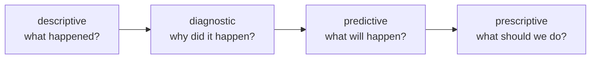

# Lesson 01 — The Question

**Goal:** turn a vague request into something you can answer with a number.

## What you will learn

- Why "analyse this data" fails
- Making a question specific
- Descriptive, diagnostic, predictive, prescriptive
- The one-page analysis plan

---

## Vague in, vague out

| What you are asked | What it becomes |
|---|---|
| "Analyse the sales data" | **Which three products should we stop stocking?** |
| "Look into churn" | **Which customers are most likely to leave in the next 30 days, and what do they have in common?** |
| "Is marketing working?" | **Did the October campaign increase orders per customer, compared with the same customers in September?** |
| "Make a dashboard" | **What decision will someone make from this weekly, and what number tells them?** |

The test: **could two analysts, given the question, produce the same number?**
If not, the question is not specific enough yet.

A specific question names:

1. **The metric** — revenue, orders, retention, and how it is calculated
2. **The population** — which customers, which branches, which period
3. **The comparison** — against what: last month, another group, a target
4. **The decision** — what someone will do differently once they know

---

## Four kinds of question



| Kind | Example | Tools |
|---|---|---|
| **Descriptive** | Revenue fell 12% in October | Aggregation, charts (this track) |
| **Diagnostic** | It fell because branch 3 closed for two weeks | Segmentation, decomposition |
| **Predictive** | November will be 5–9% below last year | Time series, models |
| **Prescriptive** | Reopen 3 or shift its staff to branch 5 | Optimisation, judgement |

Most requests are phrased as prescriptive and must be answered descriptively
first. **You cannot recommend an action until you can describe the situation
in numbers nobody disputes.**

---

## Write the plan before the code

```python
plan = {
    "question": ("Which products should we stop stocking, given they take "
                 "shelf space and rarely sell?"),
    "metric": "units sold per product per month, and revenue share",
    "population": "all branches, last 6 complete months",
    "comparison": "each product against the median product",
    "cut_off": "bottom 10% by units AND under 1% of revenue",
    "decision": "the stocking list for next quarter",
    "decision_maker": "operations manager",
    "deadline": "Thursday",
    "data_needed": ["order_lines", "products", "branches"],
    "known_risks": [
        "seasonal products look bad out of season",
        "new products have little history",
        "some low-sellers may be complements that drive other sales",
    ],
}
for key, value in plan.items():
    print(f"{key:<16}{value}")
```

```text
question        Which products should we stop stocking, given they take shelf space and rarely sell?
metric          units sold per product per month, and revenue share
population      all branches, last 6 complete months
comparison      each product against the median product
cut_off         bottom 10% by units AND under 1% of revenue
decision        the stocking list for next quarter
decision_maker  operations manager
deadline        Thursday
data_needed     ['order_lines', 'products', 'branches']
known_risks     ['seasonal products look bad out of season', 'new products have little history', 'some low-sellers may be complements that drive other sales']
```

Ten minutes, and it prevents the three most expensive analysis failures:
answering the wrong question, discovering on Thursday morning that you needed
a table you do not have, and presenting a conclusion that the stakeholder
immediately dismantles with a risk you had not considered.

**Send the plan to the requester before you start.** They will correct the
question, and that correction costs ten minutes now and three days later.

---

## Sizing the answer first

```python
def sanity_check(total_revenue, share_at_risk, effort_days, day_rate):
    value = total_revenue * share_at_risk
    cost = effort_days * day_rate
    return {"value_at_stake": round(value), "analysis_cost": round(cost),
            "ratio": round(value / cost, 1) if cost else None}

print("stocking decision:", sanity_check(2_000_000, 0.02, 3, 3_000))
print("tiny question:    ", sanity_check(2_000_000, 0.0005, 5, 3_000))
```

```text
stocking decision: {'value_at_stake': 40000, 'analysis_cost': 9000, 'ratio': 4.4}
tiny question:     {'value_at_stake': 1000, 'analysis_cost': 15000, 'ratio': 0.1}
```

The second analysis costs fifteen times what it could possibly save. **Do the
arithmetic before agreeing to the work**, and be willing to say "this question
is not worth a week — here is a two-hour version".

---

## Common mistakes

| Mistake | What happens |
|---|---|
| Starting with the data, not the question | Weeks of exploring, no conclusion |
| No named decision-maker | The work has no audience |
| Metric undefined | Two analysts, two answers |
| No comparison | "Revenue is 2 million" — good or bad? |
| Risks unlisted | The stakeholder finds them in the meeting |
| Not sizing the value | A week spent on a $1,000 question |

---

## Exercises

1. Take a request you have received and rewrite it as a specific question.
2. Write the one-page plan for it, including the risks.
3. Classify three of your recent analyses as descriptive, diagnostic,
   predictive or prescriptive.
4. Compute the value at stake and your cost for one open question.
