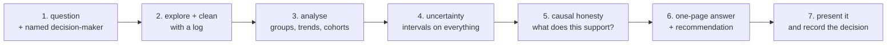

# Project 9 — An Analysis That Changes a Decision

**Do this after both tracks.**

You take a real question from real data, answer it, and put a recommendation in
front of someone who could act on it. The deliverable is not a notebook — it is
a **one-page answer** with the notebook behind it.

The earlier projects asked whether you can build things. This one asks whether
you can be trusted to **tell someone what to do** — where the number is easy
to get wrong, the comparison is easy to rig, and the recommendation is easy to
overstate.

---

## The shape



---

## Requirements

### 1. A real question, and a real reader

- **At least 5,000 rows** of real data — your work, a public dataset, an
  export from a tool you use. Not generated.
- **The one-page plan from Basic lesson 01**, written *before* you start:
  question, metric, population, comparison, decision, decision-maker,
  deadline, known risks.
- **A named person** who could act on the answer. If nobody could, pick a
  different question.
- The value at stake, estimated: what is this decision worth?

### 2. Exploration and cleaning, logged

- The `explore()` profile: rows, duplicates, nulls, constants, high
  cardinality, outliers
- Percentiles for every measure you report — **not just the mean**
- A **cleaning log table**: step, rows removed, percentage, reason
- The before/after effect on your headline number, stated
- At least three observations you made **by reading rows**, that no statistic
  showed you

Basic lesson 03 found 1.1% of rows carrying 58% of reported revenue. Your data
will have its own version of that; find it.

### 3. The analysis

At least four of:

- Aggregation with **a per-unit metric beside every total**
- A group comparison, **checked for Simpson's paradox** by breaking down on a
  confounder
- A time trend, **seasonally adjusted or compared like-for-like**
- A cohort table, read down the columns
- A segmentation, with the silhouette or a stability check reported
- A funnel or conversion analysis with denominators at every step

Every group comparison must show **the group sizes**.

### 4. Uncertainty on every claim

- A **confidence interval or bootstrap interval** for each headline number
- For any comparison: the interval on the *difference*, and an explicit
  statement of whether it excludes zero
- For any test: effect size beside the p-value, and the power or the interval
- **One claim you could not make** because the interval was too wide — state
  it

A report with no intervals is not finished.

### 5. Causal honesty

- For your main relationship, **name three plausible confounders**
- State which design your evidence comes from: observational, quasi-
  experimental, or randomised
- Use the matching verb: *associated with* / *appears to have caused* /
  *caused*
- If you recommend an action, say what experiment would actually test it

### 6. The one-page answer

Using Basic lesson 08's structure:

```text
1. The answer          one sentence, with the number and its interval
2. The decision        what to do, who does it, by when
3. Evidence            3-5 findings, each with a number and a chart
4. Method              six sentences; reproducible
5. Limitations         five, including one that could reverse the conclusion
6. Next                the experiment or the follow-up
```

**Every sentence in "Evidence" must contain a number.**

### 7. Charts that carry the finding

At least four charts, each with:

- A **title that states the finding**, not the columns
- Labelled axes with units
- A **zero baseline** on every bar chart
- No partial periods at the edges
- Group sizes or n shown where a rate is plotted

### 8. Present it, and record what happened

- Present to a real person — colleague, manager, client, or classmate
- Record: **what they asked, what they disagreed with, what they decided**
- One page of reflection: what you would do differently

This is the part that turns an exercise into practice. An analysis nobody
argued with has not been tested.

---

## Deliverables

```text
project-9/
├── ANSWER.md             the one page — the primary deliverable
├── README.md             how to reproduce, what is where
├── plan.md               the pre-analysis plan, unedited
├── notebooks/
│   ├── 01-explore.ipynb  profile, cleaning log, the rows you read
│   └── 02-analyse.ipynb  the analysis, intervals, charts
├── figures/              every chart used in ANSWER.md, at 150 dpi
├── src/
│   └── clean.py          cleaning as tested functions
├── data/
│   ├── raw/              read-only
│   └── processed/
└── presentation/
    ├── slides.pdf        or a link
    └── feedback.md       questions, objections, the decision
```

---

## Marking

| Weight | Criterion |
|---|---|
| 15% | A specific question, a named decision-maker, a written plan |
| 15% | Exploration and a cleaning log, with the effect on the headline number |
| 20% | The analysis: denominators, confounders checked, like-for-like |
| 20% | Uncertainty on every claim, including one you could not make |
| 10% | Causal language matching the design |
| 15% | The one-page answer: answer first, numbered evidence, real limitations |
| 5% | Presented, with feedback and the decision recorded |

Automatic deductions: a headline number with no interval; a comparison with no
group sizes; causal language from observational data; a bar chart with a
truncated axis; a "top 5" with no share; percentage changes with no base; a
plan written after the analysis.

---

## Milestones

| Day | Done by end of day |
|---|---|
| 1 | Plan written and sent to the decision-maker; data acquired |
| 2 | Explored, cleaned, logged; fifty rows read by hand |
| 3 | Core analysis: groups, trends, denominators |
| 4 | Intervals, tests, effect sizes |
| 5 | Confounders, causal framing, the claim you cannot make |
| 6 | Charts and the one-page answer |
| 7 | Present, record the feedback, write the reflection |

---

## Before you submit

- [ ] `plan.md` was written first and is unedited
- [ ] The cleaning log shows the effect on the headline number
- [ ] Every headline number has an interval
- [ ] Every comparison shows the group sizes
- [ ] One group comparison was broken down on a confounder
- [ ] One claim is explicitly labelled as unsupported by the data
- [ ] The verbs match the design — no causal language without a design
- [ ] Every chart title states a finding
- [ ] `ANSWER.md` fits on one page and opens with the answer
- [ ] A real person heard it, and their objections are written down
