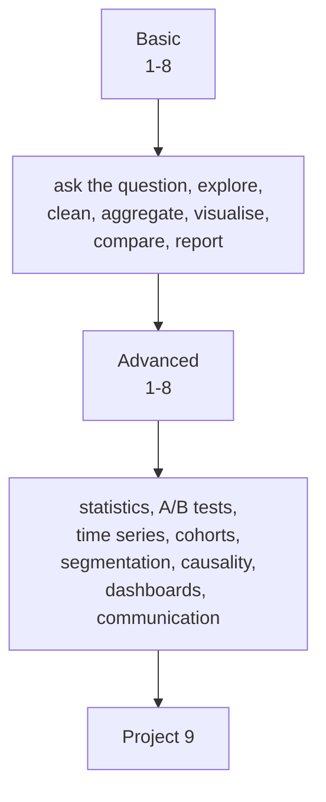

# Data Analysis — Tayel AI Labs

The eighth course, in two tracks. Analysis is the discipline of turning a
question into a defensible number — and of knowing when the number does not
support the decision someone wants to make.

**Prerequisites**

- [`../Python`](../Python) — Basic track, especially
  [pandas](../Python/Basic-Python/libraries/02-pandas.md) and
  [visualisation](../Python/Basic-Python/libraries/03-visualisation.md)

---

## Two tracks



| Track | For | Lessons |
|---|---|---|
| **[Basic](Basic/)** | Producing a correct, readable answer | 8 |
| **[Advanced](Advanced/)** | Defending it statistically, and deciding with it | 8 |

## Then

- **[`Project-9/`](Project-9/)** — a full analysis, with a decision attached

---

## Setup

```bash
python3 -m venv .venv
source .venv/bin/activate
pip install -r requirements.txt
```

---

## What separates an analyst from someone with a chart

1. **The question comes first.** "Analyse the sales data" is not a question.
   "Which three products should we stop stocking, and what would it cost us?"
   is.
2. **Every number has a denominator.** "Conversions went up 40%" means nothing
   without knowing 40% of what, over what period, against what baseline.
3. **The limitation section is the credibility.** An analysis that says what it
   cannot support is trusted; one that claims everything is not.
