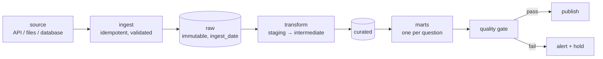

# Project 8 — A Pipeline That Survives Monday

**Do this after the twelve lessons.**

You build a pipeline that runs on a schedule, loads incrementally, validates
its own data, and can be re-run at any moment without damage. Then you break
it on purpose and show that it holds.

The other projects asked whether you can build something that works once. This
one asks whether you can build something that **keeps working when the data
misbehaves** — which is the entire job.

---

## The system



---

## Requirements

### 1. A real source

At least one of:

- A **public API** with pagination (GitHub, a weather service, a public
  transport feed, an exchange-rate API)
- **Files that arrive repeatedly** — daily CSV exports, uploads
- **A database** you can query incrementally

At least **10,000 rows total**, arriving in at least **three batches** (three
days, three files, or three API pages loaded separately). One static download
is not a pipeline.

### 2. Layers, with the raw layer immutable

```text
data/
  raw/<source>/ingest_date=YYYY-MM-DD/...     never modified
  curated/<table>/...                          typed, cleaned
  marts/<table>/...                            ready for a question
```

- Raw keeps the **original bytes and format**, with a manifest per batch:
  source, timestamp, row count, checksum
- A documented reason for every transformation between layers
- **Demonstrate reprocessing**: delete curated and marts, rebuild from raw,
  show the numbers match

### 3. Idempotent incremental loading

- A **watermark**, with an overlap window, and a written justification for the
  window size
- **Delete-insert or merge** on a key — never bare append
- **A test that runs the pipeline three times** and asserts identical output

Show the evidence: a table of row counts after run 1, run 2 and run 3.

### 4. Data quality, enforced

At least **eight checks** across the six dimensions of lesson 07:

| Dimension | At least one check |
|---|---|
| Completeness | Row count, null rate |
| Uniqueness | Primary key duplicates |
| Validity | Ranges, allowed values |
| Consistency | Totals reconcile across tables |
| Timeliness | Freshness against an SLA |
| Anomaly | Row count against a 30-day baseline |

For each: severity (fail / quarantine / warn), and what actually happens when
it fires. A quarantine table must exist and be counted.

### 5. Tests — the code kind

At least **ten pytest tests**:

- Transformations: happy path, **empty input**, nulls, edge values, no
  mutation
- Joins: row-count assertions, fan-out guards
- **Idempotency**: run twice, identical result
- Quality rules, against deliberately broken fixtures
- SQL logic against an in-memory SQLite fixture

### 6. Orchestration

- A DAG with **at least four tasks** and real dependencies
- Retries with exponential backoff **on transient failures only**
- Parameterised by execution date — **no `datetime.now()` inside a task**
- **A backfill demonstrated**: re-run three past dates and show the result is
  unchanged
- Airflow, Dagster, Prefect, or a documented `make`/cron setup with the DAG
  drawn

### 7. Break it on purpose

Inject each failure, show what happened, and show the defence:

| Injected failure | Expected behaviour |
|---|---|
| A renamed column at the source | Ingestion stops; alert; no bad data lands |
| An empty batch | Row-count check fires; publish held |
| Duplicate rows in a batch | Merge deduplicates; totals unchanged |
| A late-arriving record | Overlap window catches it; no double count |
| The job killed halfway | Re-run completes cleanly; no partial state |
| A null flood in one column | Null-rate check fires |

This section is the heart of the project. **Screenshots or logs for each.**

### 8. Operate it

- A monitoring report per run: rows, duration, null rates, freshness, with a
  30-day baseline
- The **cost or runtime** of each stage, and one optimisation made and measured
- Documentation per table: owner, grain, SLA, columns, known issues
- A lineage diagram — generated, or drawn and kept current

---

## Deliverables

```text
project-8/
├── README.md              architecture, decisions, failure drills, results
├── docs/
│   ├── tables/*.yml       per-table documentation
│   └── lineage.md
├── dags/ or flows/        the orchestration definition
├── src/
│   ├── ingest.py          idempotent landing, manifests
│   ├── transform.py       pure functions
│   ├── quality.py         the checks
│   └── load.py            merge / delete-insert
├── tests/                 at least 10 tests
├── data/
│   ├── raw/               immutable
│   ├── curated/
│   └── marts/
└── monitoring/
    └── run_history.csv    rows, duration, checks, per run
```

---

## Marking

| Weight | Criterion |
|---|---|
| 15% | Real source, three batches, raw layer immutable with manifests |
| 20% | Idempotent incremental loading, proven by running three times |
| 20% | Eight quality checks, with defined severities and a quarantine path |
| 15% | Ten tests, including empty input and idempotency |
| 15% | Orchestration: dependencies, retries, execution date, backfill |
| 10% | The six failure drills, with evidence |
| 5% | Documentation, lineage, monitoring |

Automatic deductions: bare `append` loading; `datetime.now()` inside a task;
raw data modified in place; quality checks that only log; a pipeline that
cannot be re-run; no empty-input test.

---

## Milestones

| Day | Done by end of day |
|---|---|
| 1 | Source chosen, raw landing with manifests, three batches ingested |
| 2 | Staging and curated transformations as pure functions |
| 3 | Incremental loading with watermark and merge; idempotency test |
| 4 | Quality checks, severities, quarantine |
| 5 | Orchestration, retries, backfill |
| 6 | The six failure drills |
| 7 | Monitoring, documentation, lineage, README |

---

## Before you submit

- [ ] Three separate batches are visible in `raw/`, with manifests
- [ ] Deleting curated and marts and rebuilding reproduces the same numbers
- [ ] Row counts after runs 1, 2 and 3 are identical, in a table
- [ ] Eight checks, each with a severity and a documented action
- [ ] The quarantine table exists and its size is reported
- [ ] `pytest` is green, including the empty-input and idempotency tests
- [ ] A backfill of three past dates changed nothing
- [ ] All six failure drills are documented with their evidence
- [ ] Every table has an owner, a grain and an SLA
- [ ] One optimisation is measured, before and after
