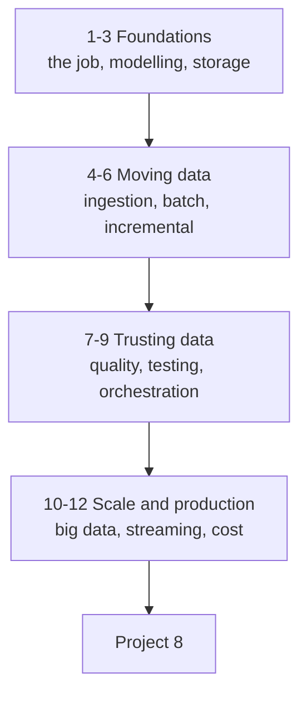

# Data Engineering — Tayel AI Labs

The seventh course. Models get the attention; pipelines decide whether anything
works. This course is about moving data reliably: ingesting it, storing it so
it can be read, transforming it correctly, and knowing the moment it breaks.

**Prerequisites**

- [`../Python`](../Python) — both tracks, especially
  [SQL and storage](../Python/Basic-Python/libraries/06-sql-and-storage.md)
  and [PySpark](../Python/Basic-Python/libraries/07-pyspark.md)

---

## The road



---

## Lessons

| # | Lesson | You will be able to |
|---|---|---|
| 01 | [What Data Engineering Is](lessons/01-what-is-data-engineering.md) | Describe the job and its failure modes |
| 02 | [Data Modelling](lessons/02-data-modelling.md) | Design tables people can query |
| 03 | [Storage and File Formats](lessons/03-storage-and-formats.md) | Choose formats and partitioning |
| 04 | [Ingestion](lessons/04-ingestion.md) | Pull from APIs, files and databases, reliably |
| 05 | [Transformation](lessons/05-transformation.md) | Build ETL/ELT that is reproducible |
| 06 | [Incremental Loading](lessons/06-incremental-loading.md) | Load only what changed, idempotently |
| 07 | [Data Quality](lessons/07-data-quality.md) | Catch bad data before it reaches a dashboard |
| 08 | [Testing Pipelines](lessons/08-testing-pipelines.md) | Test transformations like software |
| 09 | [Orchestration](lessons/09-orchestration.md) | Schedule, retry, backfill |
| 10 | [Scale](lessons/10-scale.md) | Know when you need Spark, and when you do not |
| 11 | [Streaming](lessons/11-streaming.md) | Handle events, late data and exactly-once |
| 12 | [Production and Cost](lessons/12-production-and-cost.md) | Monitor, document and pay less |

## Then

- [`Project-8/`](Project-8/) — a pipeline that runs daily and survives bad data

---

## Setup

```bash
python3 -m venv .venv
source .venv/bin/activate
pip install -r requirements.txt
```

Everything here runs locally — SQLite stands in for the warehouse, Parquet
files for the lake. The concepts transfer directly to BigQuery, Snowflake,
Postgres and S3.

---

## Three rules this course runs on

1. **Idempotent or it is broken.** Every pipeline gets re-run — after a
   failure, after a backfill, after a deploy. Running twice must not double
   your rows.
2. **Fail loudly, early.** A pipeline that silently writes bad data is worse
   than one that crashes. Validate at the boundary and stop.
3. **The consumer decides the schema.** You are not storing data for
   yourself. Model it for the person who will query it at 9am with a question.
