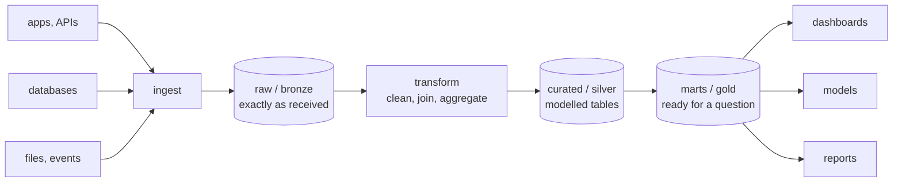

# Lesson 01 — What Data Engineering Is

**Goal:** know what the job is, and what breaks.

## What you will learn

- The shape of a data platform
- ETL and ELT
- Batch and streaming
- The failure modes that define the work

---

## The job



Everything between "the data exists somewhere" and "someone can trust it" is
data engineering. The three-layer shape — raw, curated, marts — is nearly
universal, whatever the vendor calls it.

**Keep the raw layer immutable.** When a transformation turns out to be wrong,
you reprocess from raw. If you cleaned in place, the original is gone and the
bug is permanent.

---

## ETL or ELT

```text
ETL:  extract -> transform -> load      transform before storing
ELT:  extract -> load -> transform      store raw, transform in the warehouse
```

| | ETL | ELT |
|---|---|---|
| Transform happens | In your code, before loading | In SQL, after loading |
| Storage cost | Lower | Higher — you keep everything |
| Reprocessing | Re-extract from the source | Re-run SQL over what you have |
| Suits | Expensive storage, heavy cleaning, PII removal | Cheap storage, analyst-owned logic |
| Typical tooling | Python, Spark | dbt on BigQuery / Snowflake / Postgres |

**ELT is the default in 2026** because storage is cheap and reprocessing from
raw is the single most valuable property a platform can have. Use ETL when you
must not store the raw data — personal data you are required to mask before it
lands.

---

## The numbers that decide the design

```python
rows_per_day = 5_000_000
bytes_per_row = 200

daily_gb = rows_per_day * bytes_per_row / 1024**3
print(f"per day:   {daily_gb:>8.2f} GB")
print(f"per month: {daily_gb * 30:>8.2f} GB")
print(f"per year:  {daily_gb * 365 / 1024:>8.2f} TB")

for name, factor in [("CSV", 1.0), ("JSON", 1.6), ("Parquet + snappy", 0.15)]:
    print(f"{name:<20}{daily_gb * 365 / 1024 * factor:>8.2f} TB per year")
```

```text
per day:       0.93 GB
per month:    27.94 GB
per year:      0.33 TB
CSV                     0.33 TB per year
JSON                    0.53 TB per year
Parquet + snappy        0.05 TB per year
```

Five million rows a day is **under a terabyte a year** — and a sixth of that
in Parquet. That number decides almost everything: this fits on one machine,
in DuckDB or Postgres, and does not need a cluster.

**Do this arithmetic before choosing tools.** Most "big data" projects are
gigabytes, and the cost of pretending otherwise is a distributed system nobody
can debug.

---

## Batch or streaming

| | Batch | Streaming |
|---|---|---|
| Latency | Minutes to a day | Seconds |
| Complexity | Low | High — ordering, late data, state |
| Reprocessing | Re-run the job | Replay the log, carefully |
| Cost | Low | Higher, always on |
| Use for | Reports, ML training, most analytics | Fraud, alerting, live dashboards |

The honest rule: **use batch until someone can state, in money, why a
five-minute delay is unacceptable.** Streaming multiplies the operational
surface, and most "real-time" requirements are satisfied by a job that runs
every fifteen minutes.

---

## What actually goes wrong

This is the part that defines the job, and it is rarely the code.

| Failure | Example | Defence |
|---|---|---|
| **Schema change** | A producer renames a column, silently | Schema validation at ingestion |
| **Late data** | Yesterday's rows arrive tomorrow | Reprocessing windows |
| **Duplicates** | A retry re-sends 10,000 rows | Idempotent writes, dedup keys |
| **Silent nulls** | A field stops being populated | Null-rate monitoring |
| **Timezones** | Half the rows are UTC, half are local | Store UTC, always |
| **Partial failure** | The job dies after writing 60% | Atomic writes, transactions |
| **Upstream outage** | The API returns 200 with an empty body | Row-count checks |

```python
import pandas as pd

yesterday = pd.DataFrame({"order_id": [1, 2, 3], "amount": [10.0, 20.0, 30.0]})
today = pd.DataFrame({"order_id": [3, 4, 5], "amount": [30.0, 40.0, 50.0]})

naive = pd.concat([yesterday, today])
idempotent = pd.concat([yesterday, today]).drop_duplicates(subset=["order_id"], keep="last")

print(f"naive append:     {len(naive)} rows, total {naive['amount'].sum():.0f}")
print(f"idempotent merge: {len(idempotent)} rows, total {idempotent['amount'].sum():.0f}")
print("order 3 counted twice in the naive version:",
      (naive["order_id"] == 3).sum() == 2)
```

```text
naive append:     6 rows, total 180
idempotent merge: 5 rows, total 150
order 3 counted twice in the naive version: True
```

An overlapping window — which every safe pipeline uses, to catch late data —
double-counts order 3 and reports revenue of 180 where the truth is 150. That
is a **20% overstatement** from one duplicated row out of five.

The fix is one line. Not having it is the most common data bug in the world,
and it is invisible: the job succeeds, the dashboard loads, and the number is
wrong.

---

## The roles around you

| Role | Cares about |
|---|---|
| **Data engineer** | Pipelines, storage, reliability, cost |
| Analytics engineer | Modelling, dbt, metric definitions |
| Data analyst | Answering questions, dashboards |
| Data scientist | Models, experiments |
| ML engineer | Serving models, feature pipelines |

The boundaries blur, and in a small company you are all five. What stays
constant is the contract: **the people downstream must be able to trust the
tables you produce**, and that trust is built from schema stability, freshness
and documented meaning — not from clever code.

---

## Common mistakes

| Mistake | What happens |
|---|---|
| Cleaning data in place, no raw layer | A transformation bug is unrecoverable |
| Spark for gigabytes | Weeks of complexity for a job DuckDB runs in a minute |
| Append-only loads with overlapping windows | Duplicated rows, inflated numbers |
| Local timestamps | Off-by-an-hour bugs, twice a year |
| No schema validation | A renamed column silently becomes nulls |
| Streaming because it sounds modern | Ten times the operational burden |

---

## Exercises

1. Draw the data flow at your work: sources, storage layers, consumers.
2. Compute your real daily volume and yearly storage in three formats.
3. Name three ways your current pipeline could double-count a row.
4. For one "real-time" requirement you have heard, ask what a 15-minute delay
   would cost.
