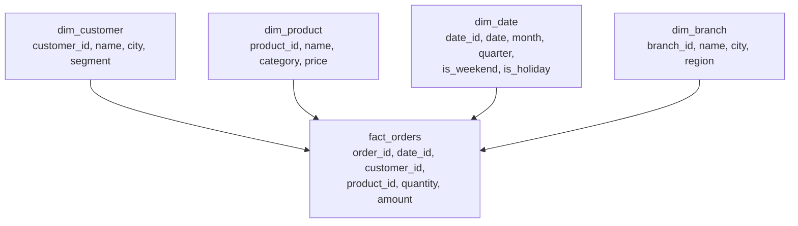

# Lesson 02 — Data Modelling

**Goal:** design tables an analyst can query without asking you anything.

## What you will learn

- Normalisation, and why analytics denormalises
- Star schemas: facts and dimensions
- Grain — the most important word in this course
- Slowly changing dimensions

---

## Grain

**The grain of a table is what one row means.** Decide it first, write it in a
comment, and never mix two grains in one table.

```python
import pandas as pd

order_lines = pd.DataFrame({
    "order_id": [1, 1, 2, 2, 2],
    "product":  ["latte", "cake", "latte", "tea", "cake"],
    "quantity": [2, 1, 1, 3, 2],
    "line_total": [120.0, 45.0, 60.0, 90.0, 90.0],
    "order_total": [165.0, 165.0, 240.0, 240.0, 240.0],
})

print("grain: one row per order LINE")
print(f"rows: {len(order_lines)}, orders: {order_lines['order_id'].nunique()}")
print()
print("naive revenue:", order_lines["order_total"].sum())
print("correct revenue:", order_lines["line_total"].sum())
```

```text
grain: one row per order LINE
rows: 5, orders: 2

naive revenue: 1050.0
correct revenue: 405.0
```

`order_total` is repeated on every line of the order, so summing it
multiplies revenue by the number of lines — **1,050 instead of 405**.

This single mistake, in this exact shape, is responsible for more wrong
numbers in more companies than any other. The defences:

- One grain per table, stated in a comment and in the table description
- Order-level facts live in an order-level table
- If a repeated column must exist, name it so summing it looks wrong:
  `order_total_repeated`

---

## Normalised or denormalised

```python
import pandas as pd

customers = pd.DataFrame({"customer_id": [1, 2],
                          "name": ["Adam", "Sara"],
                          "city": ["Cairo", "Giza"]})
orders = pd.DataFrame({"order_id": [10, 11, 12],
                       "customer_id": [1, 1, 2],
                       "amount": [100.0, 150.0, 200.0]})

denormalised = orders.merge(customers, on="customer_id")

print("normalised: 2 tables, no repetition")
print(f"  customers {customers.shape}, orders {orders.shape}")
print("denormalised: 1 table, city repeated")
print(denormalised.to_string(index=False))
```

```text
normalised: 2 tables, no repetition
  customers (2, 3), orders (3, 3)
denormalised: 1 table, city repeated
 order_id  customer_id  amount name  city
       10            1   100.0 Adam Cairo
       11            1   150.0 Adam Cairo
       12            2   200.0 Sara  Giza
```

| | Normalised (3NF) | Denormalised |
|---|---|---|
| Repetition | None | City stored per order |
| Update a city | One row | Every order row |
| Query | Joins every time | No joins |
| Suits | **Transactional systems** | **Analytics** |

Analytics denormalises deliberately. Storage is cheap, joins are slow, and an
analyst writing `WHERE city = 'Cairo'` without a join makes fewer mistakes.

---

## The star schema



**Facts** are events with numbers you aggregate: orders, clicks, payments.
They are long and narrow, and they grow forever.

**Dimensions** are the things you filter and group by: customers, products,
dates. They are short and wide, and they change slowly.

```python
import pandas as pd

fact_orders = pd.DataFrame({
    "order_id": [1, 2, 3, 4],
    "date_id": [20260101, 20260101, 20260102, 20260102],
    "customer_id": [1, 2, 1, 3],
    "branch_id": [1, 1, 2, 2],
    "amount": [120.0, 85.0, 200.0, 45.0],
})
dim_branch = pd.DataFrame({"branch_id": [1, 2],
                           "branch_name": ["Zamalek", "Maadi"],
                           "region": ["Cairo", "Cairo"]})

answer = (fact_orders
          .merge(dim_branch, on="branch_id")
          .groupby("branch_name")["amount"]
          .agg(["sum", "count", "mean"])
          .round(1))
print(answer)
```

```text
               sum  count   mean
branch_name                     
Maadi        245.0      2  122.5
Zamalek      205.0      2  102.5
```

One join, one group-by, and the question is answered. That is the whole point
of the shape: **every business question becomes a join to a dimension and an
aggregate over a fact.**

A `dim_date` table is worth building on day one. It lets an analyst write
`WHERE is_weekend` or `GROUP BY fiscal_quarter` without knowing your calendar
rules.

---

## Slowly changing dimensions

A customer moves from Cairo to Alexandria. What happens to last year's orders?

```python
import pandas as pd

scd_type_1 = pd.DataFrame({          # overwrite: history is lost
    "customer_id": [1],
    "city": ["Alexandria"],
})

scd_type_2 = pd.DataFrame({          # a new row per version
    "customer_key": [101, 102],
    "customer_id": [1, 1],
    "city": ["Cairo", "Alexandria"],
    "valid_from": ["2024-01-01", "2026-06-01"],
    "valid_to": ["2026-06-01", None],
    "is_current": [False, True],
})
print("type 1 — overwrite:")
print(scd_type_1.to_string(index=False))
print("\ntype 2 — versioned:")
print(scd_type_2.to_string(index=False))
```

```text
type 1 — overwrite:
 customer_id       city
           1 Alexandria

type 2 — versioned:
 customer_key  customer_id       city valid_from valid_to  is_current
          101            1      Cairo 2024-01-01 2026-06-01       False
          102            1 Alexandria 2026-06-01       None        True
```

| Type | Behaviour | Use when |
|---|---|---|
| **Type 1** | Overwrite | History does not matter — a corrected typo |
| **Type 2** | New row, validity dates | **History matters** — the default for anything reportable |
| Type 3 | A `previous_value` column | You need only the last change |

Type 2 is what lets you answer "revenue by customer city **at the time of the
order**" — which is usually the question, and is impossible once you have
overwritten.

The cost: facts must join on `customer_key` (the version), not `customer_id`.

---

## Naming and documentation

```text
fact_orders            not "orders_final_v2"
dim_customer           not "cust"
order_placed_at_utc    not "date"
amount_egp             not "amt"
is_cancelled           not "flag"
```

Conventions that pay for themselves:

- `fact_` / `dim_` prefixes, so the shape is visible in a list
- **Units and timezone in the column name**: `amount_egp`, `_at_utc`
- `is_` for booleans, `_id` for keys, `_at` for timestamps, `_date` for dates
- Never `data`, `value`, `info`, `temp`, `new`

And for every table, three lines of documentation that cost five minutes and
save a hundred questions:

```sql
-- fact_orders
-- grain: one row per order line
-- source: shop_db.orders joined to shop_db.order_lines, loaded hourly
-- note: cancelled orders are included; filter with is_cancelled = false
```

---

## Common mistakes

| Mistake | What happens |
|---|---|
| Mixing grains in one table | Sums multiply, silently |
| Order-level totals on a line-level table | The 1,050-vs-405 error above |
| No `dim_date` | Every analyst reimplements your fiscal calendar |
| Type 1 on a reportable attribute | History is gone, permanently |
| Facts joined on a business key with SCD2 | Duplicated rows on every join |
| Columns without units | Someone sums EGP and USD |

---

## Exercises

1. Write the grain of three tables you work with. Any mixed?
2. Design a star schema for a coffee shop: orders, products, branches, dates.
3. Show the line-level/order-level double-count on your own data.
4. Model one dimension as SCD2 and write the query for "at the time of the
   order".
