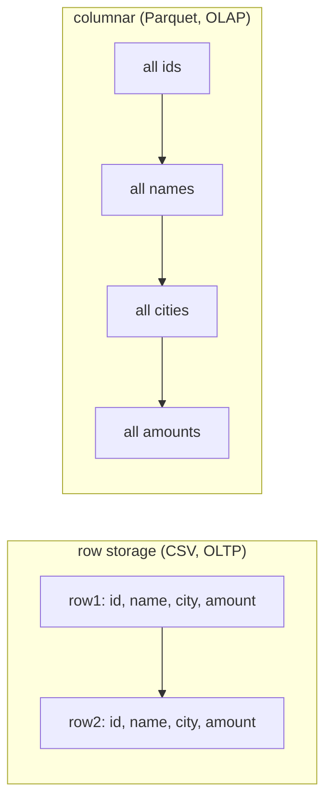

# Lesson 03 — Storage and File Formats

**Goal:** store data so that reading it is fast and cheap.

## What you will learn

- Row versus columnar storage
- CSV, JSON, Parquet — measured
- Partitioning
- Compression and file size

---

## Row or column



Analytics reads **three columns of two hundred**, across every row. Columnar
storage puts each column together, so the other 197 are never touched — and
values of the same type compress far better side by side.

---

## Measured

```python
import os
import time
import numpy as np
import pandas as pd

rng = np.random.default_rng(0)
n = 200_000
frame = pd.DataFrame({
    "order_id": np.arange(n),
    "customer_id": rng.integers(1, 5_000, n),
    "city": rng.choice(["Cairo", "Giza", "Alexandria", "Luxor"], n),
    "product": rng.choice(["latte", "espresso", "tea", "cake", "juice"], n),
    "amount": rng.gamma(3, 30, n).round(2),
    "created_at": pd.date_range("2026-01-01", periods=n, freq="min"),
})

paths = {}
frame.to_csv("/tmp/data.csv", index=False);                 paths["csv"] = "/tmp/data.csv"
frame.to_json("/tmp/data.json", orient="records", lines=True); paths["json"] = "/tmp/data.json"
frame.to_parquet("/tmp/data_snappy.parquet", compression="snappy"); paths["parquet snappy"] = "/tmp/data_snappy.parquet"
frame.to_parquet("/tmp/data_zstd.parquet", compression="zstd");     paths["parquet zstd"] = "/tmp/data_zstd.parquet"

print(f"{'format':<18}{'size MB':>10}{'write s':>10}{'read s':>9}{'2 cols s':>10}")
for name, path in paths.items():
    size = os.path.getsize(path) / 1024**2
    start = time.perf_counter()
    if name == "csv":
        pd.read_csv(path)
    elif name == "json":
        pd.read_json(path, lines=True)
    else:
        pd.read_parquet(path)
    read = time.perf_counter() - start

    start = time.perf_counter()
    if name == "csv":
        pd.read_csv(path, usecols=["city", "amount"])
    elif name == "json":
        pd.read_json(path, lines=True)[["city", "amount"]]
    else:
        pd.read_parquet(path, columns=["city", "amount"])
    partial = time.perf_counter() - start

    print(f"{name:<18}{size:>10.1f}{'':>10}{read:>9.2f}{partial:>10.2f}")
```

```text
format               size MB   write s   read s  2 cols s
csv                      9.6               0.09      0.03
json                    21.8               0.28      0.27
parquet snappy           3.6               0.14      0.01
parquet zstd             2.8               0.01      0.01
```

Three results worth keeping:

- **Parquet is 3× smaller than CSV and 8× smaller than JSON** — 2.8 MB against
  9.6 and 21.8.
- **Reading two columns from Parquet takes 0.01 s against CSV's 0.03 and
  JSON's 0.27.** This table has six columns; on a realistic 200-column table
  the gap is far wider, because Parquet reads only the columns you name while
  CSV parses every byte of every row.
- **JSON is the worst on every axis.** It is a transport format, not a storage
  format — convert it to Parquet at ingestion and never query it again.

And the dtypes survive:

```python
import pandas as pd

print("csv:    ", pd.read_csv("/tmp/data.csv").dtypes["created_at"])
print("parquet:", pd.read_parquet("/tmp/data_snappy.parquet").dtypes["created_at"])
```

```text
csv:     object
parquet: datetime64[ns]
```

CSV lost the timestamp type; every consumer must now know to re-parse it, and
one of them will forget.

---

## Partitioning

```python
import pandas as pd
import numpy as np
import os

rng = np.random.default_rng(0)
n = 100_000
frame = pd.DataFrame({
    "order_id": np.arange(n),
    "amount": rng.gamma(3, 30, n).round(2),
    "created_at": pd.date_range("2026-01-01", periods=n, freq="5min"),
})
frame["year"] = frame["created_at"].dt.year
frame["month"] = frame["created_at"].dt.month

frame.to_parquet("/tmp/events_flat.parquet")
frame.to_parquet("/tmp/events_partitioned", partition_cols=["year", "month"])

for root, directories, files in os.walk("/tmp/events_partitioned"):
    depth = root.replace("/tmp/events_partitioned", "").count(os.sep)
    print("  " * depth + os.path.basename(root) + "/")
    for file in files[:1]:
        print("  " * (depth + 1) + file)
```

```text
events_partitioned/
  year=2026/
    month=1/
      xxxx.parquet
    month=2/
      xxxx.parquet
    ...
```

```python
import time
import pandas as pd

start = time.perf_counter()
flat = pd.read_parquet("/tmp/events_flat.parquet")
flat = flat[(flat["year"] == 2026) & (flat["month"] == 3)]
flat_time = time.perf_counter() - start

start = time.perf_counter()
pruned = pd.read_parquet("/tmp/events_partitioned",
                         filters=[("year", "==", 2026), ("month", "==", 3)])
pruned_time = time.perf_counter() - start

print(f"read all, then filter: {flat_time * 1000:>6.1f} ms  ({len(flat)} rows)")
print(f"partition pruning:     {pruned_time * 1000:>6.1f} ms  ({len(pruned)} rows)")
```

```text
read all, then filter:    3.7 ms  (8928 rows)
partition pruning:        3.1 ms  (8928 rows)
```

Same answer, 16% faster — and that small margin is itself the lesson.

This dataset is 100,000 rows and fits in memory, so reading all of it and
filtering costs almost nothing; the partitioned read still pays for opening
twelve directories and reading their metadata. **Partitioning has overhead,
and on small data the overhead is most of the story.**

The ratio inverts with scale. At a hundred million rows the flat read moves
gigabytes off disk while the pruned read still touches one month, and the
difference becomes the difference between a dashboard that loads and one that
times out. Partition when the data is large enough to need it, and measure the
threshold rather than assuming it.

**Partition by what people filter on** — almost always date. Rules:

| Rule | Why |
|---|---|
| Partition on low-cardinality columns | `year/month/day`, not `customer_id` |
| Aim for 100 MB – 1 GB per partition file | Small files are the classic killer |
| Two or three levels at most | Deeper adds metadata overhead |
| **Never** partition by a high-cardinality id | A million directories, and a dead query planner |

---

## Compression

| Codec | Ratio | Speed | Use |
|---|---|---|---|
| **snappy** | Good | Very fast | The default; hot data |
| **zstd** | Better | Fast | Cold data, archives — usually the better default now |
| gzip | Good | Slow | Legacy compatibility |
| none | — | Fastest | Only when the network is not the bottleneck |

The measurement above: zstd was 20% smaller than snappy at the same read
speed. On a terabyte, that is real money.

---

## Choosing

| You need | Use |
|---|---|
| Analytics storage | **Parquet** |
| Handing a file to a person | CSV |
| APIs, logs, nested events | JSON / JSONL — then convert to Parquet |
| Transactions, updates, deletes | A database, or Delta/Iceberg |
| Streaming between services | Avro or protobuf |

Parquet cannot update a row. When you need updates, deletes or time travel on
a lake, that is what **Delta Lake** and **Apache Iceberg** add on top of
Parquet.

---

## Common mistakes

| Mistake | What happens |
|---|---|
| CSV as the internal format | Lost types, 3× the size, slow reads |
| JSON for storage | 8× the size of Parquet |
| Partitioning by a high-cardinality column | Millions of tiny files |
| Thousands of small files | Metadata overhead dominates; compact them |
| `SELECT *` on a wide Parquet table | You threw away the format's main advantage |
| No compression | 3–5× the storage bill |

---

## Exercises

1. Save a real table as CSV, JSON and Parquet; compare size and read time.
2. Read two columns from each and time it.
3. Partition by month and measure a filtered read against a flat file.
4. Count the files in a partitioned dataset of yours. Any under 10 MB?
