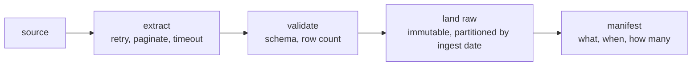

# Lesson 04 — Ingestion

**Goal:** get data in without losing it, duplicating it, or hanging forever.

## What you will learn

- The three sources: files, APIs, databases
- Retries, timeouts and pagination
- Schema validation at the boundary
- Landing raw data correctly

---

## The contract



Four properties every ingestion job must have:

1. **Idempotent** — running it twice produces the same result.
2. **Resumable** — a failure halfway does not corrupt what was written.
3. **Validated** — bad input is rejected loudly, not stored quietly.
4. **Observable** — you know how many rows arrived, and when.

---

## Files

```python
import hashlib
import json
from pathlib import Path
import pandas as pd

def land_file(source_path, raw_root, ingest_date, source_name):
    """Copy a source file into the raw layer with a manifest."""
    source_path = Path(source_path)
    target_directory = Path(raw_root) / source_name / f"ingest_date={ingest_date}"
    target_directory.mkdir(parents=True, exist_ok=True)

    content = source_path.read_bytes()
    checksum = hashlib.sha256(content).hexdigest()

    target = target_directory / source_path.name
    if target.exists() and hashlib.sha256(target.read_bytes()).hexdigest() == checksum:
        return {"status": "already_ingested", "checksum": checksum[:12]}

    target.write_bytes(content)
    frame = pd.read_csv(target)
    manifest = {
        "source": str(source_path),
        "target": str(target),
        "ingest_date": ingest_date,
        "rows": len(frame),
        "columns": list(frame.columns),
        "checksum": checksum,
    }
    (target_directory / f"{source_path.stem}.manifest.json").write_text(
        json.dumps(manifest, indent=2))
    return {"status": "ingested", "rows": len(frame), "checksum": checksum[:12]}

pd.DataFrame({"order_id": [1, 2, 3], "amount": [10.0, 20.0, 30.0]}).to_csv(
    "/tmp/orders_2026_01_15.csv", index=False)

print(land_file("/tmp/orders_2026_01_15.csv", "/tmp/raw", "2026-01-15", "shop"))
print(land_file("/tmp/orders_2026_01_15.csv", "/tmp/raw", "2026-01-15", "shop"))
```

```text
{'status': 'ingested', 'rows': 3, 'checksum': '1f548aa0a724'}
{'status': 'already_ingested', 'checksum': '1f548aa0a724'}
```

The second call did nothing — **that is idempotency**, and it is what lets you
re-run the job after any failure without thinking about it.

The manifest is not bureaucracy. When someone asks "why did Tuesday's numbers
change?", the manifest tells you what arrived, when, and how many rows.

---

## APIs

```python
import time
import requests

def fetch_all_pages(url, params=None, max_pages=50, page_size=100):
    """Paginate with backoff, a hard cap, and a timeout."""
    params = dict(params or {})
    results = []

    for page in range(1, max_pages + 1):
        params.update({"page": page, "per_page": page_size})

        for attempt in range(4):
            try:
                response = requests.get(url, params=params, timeout=15)
            except requests.Timeout:
                time.sleep(2 ** attempt)
                continue
            if response.status_code == 429 or response.status_code >= 500:
                time.sleep(2 ** attempt)
                continue
            response.raise_for_status()
            break
        else:
            raise RuntimeError(f"failed after 4 attempts at page {page}")

        batch = response.json()
        if not batch:
            break
        results.extend(batch)
        if len(batch) < page_size:
            break

    return results

contributors = fetch_all_pages(
    "https://api.github.com/repos/python/cpython/contributors", max_pages=3)
print(f"fetched {len(contributors)} records")
print("first:", contributors[0]["login"], contributors[0]["contributions"])
```

```text
fetched 300 records
first: gvanrossum 12250
```

*(Live API; your counts will differ.)*

Five things in that function, each corresponding to a production incident:

| Line | Prevents |
|---|---|
| `timeout=15` | A hung job that never finishes and never alerts |
| Backoff on 429/5xx | Getting rate-limited into a ban |
| `max_pages` cap | An infinite loop when the API changes |
| Empty-batch break | Fetching past the end forever |
| `raise_for_status()` | Parsing an error page as data |

**Land the raw JSON before parsing it.** When the parse turns out to be wrong
in three weeks, you reprocess from the raw payload instead of re-fetching data
the API may no longer serve.

---

## Databases

```python
import pandas as pd
from sqlalchemy import create_engine, text

engine = create_engine("sqlite:///:memory:")
with engine.begin() as connection:
    connection.execute(text(
        "CREATE TABLE orders (id INTEGER, amount REAL, updated_at TEXT)"))
    connection.execute(
        text("INSERT INTO orders VALUES (:id, :amount, :updated_at)"),
        [{"id": i, "amount": i * 10.0, "updated_at": f"2026-01-{i:02d}"}
         for i in range(1, 11)])

# Never SELECT *: name the columns, and filter at the source
query = text("""
    SELECT id, amount, updated_at
    FROM orders
    WHERE updated_at > :watermark
    ORDER BY updated_at
""")

watermark = "2026-01-07"
chunks = []
for chunk in pd.read_sql(query, engine, params={"watermark": watermark}, chunksize=2):
    chunks.append(chunk)

frame = pd.concat(chunks)
print(f"rows since {watermark}: {len(frame)}")
print("new watermark:", frame["updated_at"].max())
```

```text
rows since 2026-01-07: 3
new watermark: 2026-01-10
```

Three rules for database extraction:

- **Filter at the source.** Pulling a hundred million rows to filter in pandas
  wastes the network and the warehouse's time.
- **Use `chunksize`** so a large result streams instead of exhausting memory.
- **Bind parameters** (`:watermark`), never f-strings — injection, and broken
  quoting.

The watermark pattern is lesson 06.

---

## Validate at the boundary

```python
import pandas as pd

EXPECTED = {
    "order_id": "int64",
    "customer_id": "int64",
    "amount": "float64",
    "created_at": "object",
}

def validate(frame, expected=EXPECTED, min_rows=1):
    """Return a list of problems. Empty list means the batch is acceptable."""
    problems = []

    missing = set(expected) - set(frame.columns)
    if missing:
        problems.append(f"missing columns: {sorted(missing)}")

    extra = set(frame.columns) - set(expected)
    if extra:
        problems.append(f"unexpected columns: {sorted(extra)}")

    for column, dtype in expected.items():
        if column in frame.columns and str(frame[column].dtype) != dtype:
            problems.append(f"{column}: expected {dtype}, got {frame[column].dtype}")

    if len(frame) < min_rows:
        problems.append(f"only {len(frame)} rows, expected at least {min_rows}")

    return problems

good = pd.DataFrame({"order_id": [1], "customer_id": [2],
                     "amount": [10.0], "created_at": ["2026-01-01"]})
renamed = good.rename(columns={"amount": "total_amount"})
wrong_type = good.assign(amount=good["amount"].astype(str))

print("good:      ", validate(good))
print("renamed:   ", validate(renamed))
print("wrong type:", validate(wrong_type))
print("empty:     ", validate(good.iloc[0:0]))
```

```text
good:       []
renamed:    ["missing columns: ['amount']", "unexpected columns: ['total_amount']"]
wrong type: ['amount: expected float64, got object']
empty:      ['only 0 rows, expected at least 1']
```

Every one of those four cases is a real Tuesday morning. The renamed column is
the dangerous one: without this check it becomes a table full of nulls, the
job succeeds, and the dashboard shows zero revenue.

**Stop the pipeline on a schema problem.** Writing nulls into the warehouse is
worse than not running: the first is a silent wrong answer, the second is an
alert.

---

## Landing raw

```text
raw/
  shop_orders/
    ingest_date=2026-01-15/
      orders.csv
      orders.manifest.json
    ingest_date=2026-01-16/
      ...
  github_api/
    ingest_date=2026-01-15/
      contributors.json
```

| Rule | Why |
|---|---|
| Partition by **ingest date**, not event date | You know what arrived when |
| Keep the original format and bytes | Reprocessing needs the true original |
| Never modify a landed file | It is your audit trail |
| One manifest per batch | Row counts, checksums, timing |
| Set a retention policy | Raw data grows forever; decide deliberately |

Event date partitioning belongs in the curated layer. The raw layer answers
"what did we receive on the 15th?", which is the question you need during an
incident.

---

## Common mistakes

| Mistake | What happens |
|---|---|
| No timeout | A job hangs forever and never alerts |
| Retrying with no backoff | Rate-limited, then blocked |
| Parsing before landing | You cannot reprocess without re-fetching |
| No schema validation | Renamed columns become silent nulls |
| `SELECT *` | Breaks when the source adds a column; moves data you discard |
| No row-count check | An empty API response wipes a table |
| Mutating raw files | The audit trail is gone |

---

## Exercises

1. Write an idempotent file-landing function with a checksum and a manifest.
2. Add backoff and a page cap to an API fetch of your own.
3. Write a `validate()` for a source you use, and test it against four broken
   inputs.
4. Extract from a database with `chunksize` and a watermark.
