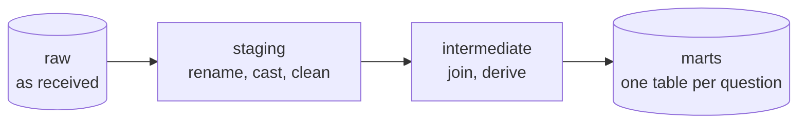

# Lesson 05 — Transformation

**Goal:** turn raw data into tables people can trust, reproducibly.

## What you will learn

- The layered transformation pattern
- Writing transformations as testable functions
- SQL or Python — when each
- dbt, and what it actually gives you

---

## Layers



| Layer | Does | Does not |
|---|---|---|
| **Raw** | Store exactly what arrived | Any logic |
| **Staging** | Rename, cast types, trim, standardise | Join, aggregate, filter rows |
| **Intermediate** | Join, derive columns, deduplicate | Business-specific slicing |
| **Marts** | Aggregate for a question | Anything another mart needs |

The rule that keeps this maintainable: **one transformation per layer, per
table, and no skipping.** A mart that reads raw is a mart nobody can debug.

---

## Transformations are functions

```python
import pandas as pd

def stage_orders(raw):
    """Staging: rename, cast, standardise. One row in, one row out."""
    frame = raw.rename(columns={
        "OrderID": "order_id",
        "CustID": "customer_id",
        "amt": "amount_egp",
        "ts": "ordered_at_utc",
    })
    frame["order_id"] = frame["order_id"].astype("int64")
    frame["amount_egp"] = pd.to_numeric(frame["amount_egp"], errors="coerce")
    frame["ordered_at_utc"] = pd.to_datetime(frame["ordered_at_utc"], utc=True,
                                             errors="coerce")
    frame["status"] = frame["status"].str.strip().str.lower()
    return frame[["order_id", "customer_id", "amount_egp",
                  "ordered_at_utc", "status"]]

raw = pd.DataFrame({
    "OrderID": ["1", "2", "3"],
    "CustID": [10, 11, 10],
    "amt": ["120.50", "85", "not a number"],
    "ts": ["2026-01-15 10:30:00", "2026-01-15 11:00:00", "2026-01-16 09:15:00"],
    "status": [" Completed ", "COMPLETED", "cancelled"],
})

staged = stage_orders(raw)
print(staged.to_string(index=False))
print("\ndtypes:", dict(staged.dtypes.astype(str)))
print("nulls introduced by coercion:", int(staged["amount_egp"].isna().sum()))
```

```text
 order_id  customer_id  amount_egp            ordered_at_utc    status
        1           10       120.5 2026-01-15 10:30:00+00:00 completed
        2           11        85.0 2026-01-15 11:00:00+00:00 completed
        3           10         NaN 2026-01-16 09:15:00+00:00 cancelled

dtypes: {'order_id': 'int64', 'customer_id': 'int64', 'amount_egp': 'float64', 'ordered_at_utc': 'datetime64[ns, UTC]', 'status': 'object'}
nulls introduced by coercion: 1
```

Three things the staging layer fixed: `" Completed "` and `"COMPLETED"` became
one value, the timestamp is now UTC-aware, and `"not a number"` became `NaN`
**loudly** — the count is printed, so a rising coercion rate is visible.

`errors="coerce"` is a deliberate choice: turn bad values into nulls and count
them, rather than crashing the whole batch for one row. **Always count them.**

---

## Derivations belong in one place

```python
import pandas as pd

def add_order_metrics(staged, vat_rate=0.14):
    """Intermediate: derived columns, defined once, used everywhere."""
    frame = staged.copy()
    frame["amount_with_vat"] = (frame["amount_egp"] * (1 + vat_rate)).round(2)
    frame["is_cancelled"] = frame["status"].eq("cancelled")
    frame["order_date"] = frame["ordered_at_utc"].dt.date
    frame["is_weekend"] = frame["ordered_at_utc"].dt.dayofweek.isin([4, 5])
    return frame

enriched = add_order_metrics(staged)
print(enriched[["order_id", "amount_egp", "amount_with_vat",
                "is_cancelled", "is_weekend"]].to_string(index=False))
```

```text
 order_id  amount_egp  amount_with_vat  is_cancelled  is_weekend
        1       120.5           137.37         False       False
        2        85.0            96.90         False       False
        3         NaN              NaN          True        True
```

`is_weekend` uses `dayofweek` 4 and 5 — **Friday and Saturday, the Egyptian
weekend**, not Saturday and Sunday. The 15th and 16th of January 2026 are a
Thursday and a Friday, which is why only the third order is flagged.

That is exactly the kind of definition that must live in one place. Written
inline in six dashboards, three of them will use the Western weekend and
nobody will notice until a report disagrees with itself.

That is the real argument for the intermediate layer: metric definitions live
in exactly one place, in code, under review.

---

## SQL or Python

```python
import pandas as pd
from sqlalchemy import create_engine, text

engine = create_engine("sqlite:///:memory:")
enriched.assign(ordered_at_utc=enriched["ordered_at_utc"].astype(str),
                order_date=enriched["order_date"].astype(str)) \
        .to_sql("stg_orders", engine, index=False)

mart_sql = text("""
    SELECT order_date,
           COUNT(*)                                        AS orders,
           SUM(CASE WHEN is_cancelled = 0 THEN 1 ELSE 0 END) AS completed,
           ROUND(SUM(COALESCE(amount_with_vat, 0)), 2)     AS revenue_with_vat
    FROM stg_orders
    GROUP BY order_date
    ORDER BY order_date
""")
print(pd.read_sql(mart_sql, engine).to_string(index=False))
```

```text
order_date  orders  completed  revenue_with_vat
2026-01-15       2          2            234.27
2026-01-16       1          0              0.00
```

| Use SQL for | Use Python for |
|---|---|
| Joins, aggregations, window functions | API calls, file parsing |
| Anything the warehouse can push down | Complex conditional logic |
| Work analysts will read and modify | Machine learning features |
| Set-based work on large tables | Row-by-row operations that cannot be vectorised |

The default is **SQL in the warehouse** — it is where the data already is, it
parallelises for free, and your analysts can read it. Drop to Python when SQL
becomes unreadable or the operation is genuinely procedural.

---

## Idempotent writes

```python
import pandas as pd
from sqlalchemy import create_engine, text

engine = create_engine("sqlite:///:memory:")
with engine.begin() as connection:
    connection.execute(text(
        "CREATE TABLE mart_daily (order_date TEXT PRIMARY KEY, revenue REAL)"))

def write_partition(frame, engine, partition_column, table):
    """Delete the partitions being written, then insert. Safe to re-run."""
    partitions = frame[partition_column].unique().tolist()
    with engine.begin() as connection:
        placeholders = ",".join(f":p{i}" for i in range(len(partitions)))
        connection.execute(
            text(f"DELETE FROM {table} WHERE {partition_column} IN ({placeholders})"),
            {f"p{i}": value for i, value in enumerate(partitions)})
        frame.to_sql(table, connection, if_exists="append", index=False)

batch = pd.DataFrame({"order_date": ["2026-01-15", "2026-01-16"],
                      "revenue": [234.27, 0.0]})

write_partition(batch, engine, "order_date", "mart_daily")
write_partition(batch, engine, "order_date", "mart_daily")      # run it again

print(pd.read_sql("SELECT * FROM mart_daily ORDER BY order_date", engine)
      .to_string(index=False))
print("rows after two runs:",
      pd.read_sql("SELECT COUNT(*) AS n FROM mart_daily", engine)["n"][0])
```

```text
order_date  revenue
2026-01-15   234.27
2026-01-16     0.00
rows after two runs: 2
```

Run twice, two rows. **Delete-then-insert on the partitions you are writing**
is the simplest idempotent pattern there is, and it covers most batch
pipelines. The alternatives are `MERGE`/upsert on a key, or writing to a new
partition directory and swapping it atomically.

The pattern that is *not* safe is `if_exists="append"` on a re-run — which is
the default thing to write, and the reason lesson 01 opened with a duplicated
order.

---

## dbt, in one paragraph

dbt runs SQL `SELECT` statements as models, works out the dependency graph
from your `ref()` calls, materialises each as a table or view, and runs tests
against the results. You write `select ... from {{ ref('stg_orders') }}`, and
it handles ordering, creation, documentation and lineage.

```sql
-- models/marts/mart_daily_revenue.sql
select
    order_date,
    count(*)                                  as orders,
    sum(case when not is_cancelled then 1 end) as completed,
    round(sum(coalesce(amount_with_vat, 0)), 2) as revenue_with_vat
from {{ ref('int_orders_enriched') }}
group by 1
```

What you get: a DAG you did not maintain by hand, tests beside the models,
generated documentation with lineage, and environments (dev/prod) for free. If
your transformations are SQL in a warehouse, dbt is the default tool in 2026.

---

## Common mistakes

| Mistake | What happens |
|---|---|
| Transformations as scripts, not functions | Untestable |
| Business logic duplicated per dashboard | Six definitions of "active customer" |
| `append` on re-run | Duplicated rows |
| Silent `errors="coerce"` | Nulls appear and nobody notices |
| Marts reading raw directly | No lineage, impossible to debug |
| Local timestamps | Off-by-an-hour bugs twice a year |

---

## Exercises

1. Write `stage_*` as a pure function and test it on three broken inputs.
2. Move a metric definition from two dashboards into one intermediate table.
3. Make a write idempotent and prove it by running it twice.
4. Rewrite one Python aggregation as SQL and compare the runtime.
