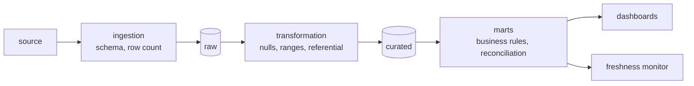

# Lesson 07 — Data Quality

**Goal:** catch bad data before someone makes a decision on it.

## What you will learn

- The six dimensions worth measuring
- Expectations as code
- Where to put checks, and what to do when they fail
- Anomaly detection on metrics

---

## Six dimensions

| Dimension | Question | Check |
|---|---|---|
| **Completeness** | Is anything missing? | Null rates, row counts |
| **Uniqueness** | Are keys unique? | Duplicate count on the key |
| **Validity** | Are values in range? | Min/max, allowed sets, regex |
| **Consistency** | Do related fields agree? | `total == sum(lines)` |
| **Timeliness** | Is it fresh? | Max timestamp against now |
| **Accuracy** | Does it match reality? | Reconcile against a source of truth |

Accuracy is the one you cannot check automatically — it needs a second source.
The other five are code, and they belong in the pipeline.

---

## Expectations as code

```python
import pandas as pd

class DataQualityError(Exception):
    pass

def check_table(frame, rules):
    """Run rules; return a list of (severity, message)."""
    problems = []

    for column in rules.get("not_null", []):
        nulls = int(frame[column].isna().sum())
        if nulls:
            problems.append(("error", f"{column}: {nulls} nulls"))

    for column in rules.get("unique", []):
        duplicates = int(frame[column].duplicated().sum())
        if duplicates:
            problems.append(("error", f"{column}: {duplicates} duplicate values"))

    for column, (low, high) in rules.get("between", {}).items():
        outside = int(((frame[column] < low) | (frame[column] > high)).sum())
        if outside:
            problems.append(("error", f"{column}: {outside} values outside [{low}, {high}]"))

    for column, allowed in rules.get("in_set", {}).items():
        unexpected = sorted(set(frame[column].dropna()) - set(allowed))
        if unexpected:
            problems.append(("error", f"{column}: unexpected values {unexpected}"))

    minimum = rules.get("min_rows")
    if minimum is not None and len(frame) < minimum:
        problems.append(("error", f"only {len(frame)} rows, expected >= {minimum}"))

    for column, threshold in rules.get("max_null_rate", {}).items():
        rate = float(frame[column].isna().mean())
        if rate > threshold:
            problems.append(("warning", f"{column}: null rate {rate:.1%} > {threshold:.0%}"))

    return problems

orders = pd.DataFrame({
    "order_id": [1, 2, 3, 3, 5],
    "customer_id": [10, 11, 12, 12, None],
    "amount": [120.0, 85.0, -30.0, 200.0, 45.0],
    "status": ["completed", "completed", "refunded", "pending", "unknown_state"],
})

rules = {
    "not_null": ["order_id", "amount"],
    "unique": ["order_id"],
    "between": {"amount": (0, 10_000)},
    "in_set": {"status": ["completed", "cancelled", "refunded", "pending"]},
    "min_rows": 1,
    "max_null_rate": {"customer_id": 0.1},
}

for severity, message in check_table(orders, rules):
    print(f"[{severity:<7}] {message}")
```

```text
[error  ] order_id: 1 duplicate values
[error  ] amount: 1 values outside [0, 10000]
[error  ] status: unexpected values ['unknown_state']
[warning] customer_id: null rate 20.0% > 10%
```

Four real problems found in five rows, in about forty lines of code. This is
`great_expectations` and `dbt test` in miniature — use those in production,
but understand that this is all they are doing.

---

## Where checks go



| Stage | Check for | On failure |
|---|---|---|
| Ingestion | Schema, row count, file arrival | **Stop.** Do not land bad data |
| Transformation | Nulls, ranges, referential integrity | **Stop**, or quarantine the bad rows |
| Marts | Business rules, totals reconciling | Alert, and hold the publish |
| Serving | Freshness, volume anomalies | Alert |

**The earlier the check, the cheaper the fix.** A schema problem caught at
ingestion costs a re-run; the same problem discovered in a board report costs
your credibility.

---

## Fail, warn, or quarantine

```python
import pandas as pd

def split_valid(frame, rules):
    """Route rows: valid ones onward, invalid ones to quarantine with a reason."""
    reasons = pd.Series([""] * len(frame), index=frame.index)

    for column in rules.get("not_null", []):
        mask = frame[column].isna()
        reasons[mask] += f"{column}_null;"

    for column, (low, high) in rules.get("between", {}).items():
        mask = (frame[column] < low) | (frame[column] > high)
        reasons[mask.fillna(False)] += f"{column}_out_of_range;"

    invalid = reasons != ""
    return frame[~invalid], frame[invalid].assign(quarantine_reason=reasons[invalid])

valid, quarantined = split_valid(orders, {
    "not_null": ["customer_id"],
    "between": {"amount": (0, 10_000)},
})

print(f"valid rows:       {len(valid)}")
print(f"quarantined rows: {len(quarantined)}")
print(quarantined[["order_id", "amount", "quarantine_reason"]].to_string(index=False))
```

```text
valid rows:       3
quarantined rows: 2
 order_id  amount    quarantine_reason
        3   -30.0 amount_out_of_range;
        5    45.0    customer_id_null;
```

Three strategies, and the choice is a business decision:

| Strategy | When |
|---|---|
| **Fail the job** | The data is critical; wrong is worse than late |
| **Quarantine bad rows** | Most rows are fine; you can fix the rest later |
| **Warn and continue** | Minor issues; but someone must read the warnings |

Quarantine is usually right for row-level problems, and it has a rule
attached: **the quarantine table must be monitored.** An unmonitored
quarantine is a bin, and the data in it is lost as surely as if you had
dropped it.

---

## Anomaly detection on metrics

Some problems are not rule violations — the data is valid and wrong.

```python
import numpy as np
import pandas as pd

rng = np.random.default_rng(0)
history = pd.Series(rng.normal(10_000, 500, 30).round(),
                    index=pd.date_range("2026-01-01", periods=30))

def is_anomalous(value, history, sigmas=3):
    mean, std = history.mean(), history.std()
    z = (value - mean) / std
    return abs(z) > sigmas, round(float(z), 2), round(float(mean)), round(float(std))

for label, today in [("normal day", 10_200), ("half volume", 5_000),
                     ("empty load", 0), ("double", 20_000)]:
    flagged, z, mean, std = is_anomalous(today, history)
    print(f"{label:<14}{today:>7}  z={z:>6}  "
          f"{'ANOMALY' if flagged else 'ok':<8}(baseline {mean} ± {std})")
```

```text
normal day      10200  z=  0.63  ok      (baseline 9939 ± 412)
half volume      5000  z= -12.0  ANOMALY (baseline 9939 ± 412)
empty load          0  z=-24.15  ANOMALY (baseline 9939 ± 412)
double          20000  z= 24.44  ANOMALY (baseline 9939 ± 412)
```

Metrics worth monitoring this way, every run:

- **Row count** per partition — the single most valuable check there is
- Null rate per important column
- Distinct count of key dimensions (did a category disappear?)
- Sum of the main measure — revenue, quantity, events
- Freshness: the lag between the latest event and now

A z-score against a 30-day baseline catches most of it. Seasonal data needs a
same-day-last-week comparison instead, or the Monday spike alerts every week.

---

## Freshness

```python
import pandas as pd

def freshness_check(latest_event, now, sla_hours=6):
    lag = (now - latest_event).total_seconds() / 3600
    return {"lag_hours": round(lag, 1), "sla_hours": sla_hours,
            "breached": lag > sla_hours}

now = pd.Timestamp("2026-01-15 12:00")
for label, latest in [("fresh", pd.Timestamp("2026-01-15 11:30")),
                      ("stale", pd.Timestamp("2026-01-15 04:00")),
                      ("very stale", pd.Timestamp("2026-01-14 12:00"))]:
    print(f"{label:<12}{freshness_check(latest, now)}")
```

```text
fresh       {'lag_hours': 0.5, 'sla_hours': 6, 'breached': False}
stale       {'lag_hours': 8.0, 'sla_hours': 6, 'breached': True}
very stale  {'lag_hours': 24.0, 'sla_hours': 6, 'breached': True}
```

**Freshness is the check consumers care about most**, and the one most often
missing. A pipeline that failed silently three days ago still serves a table —
it just serves a stale one, and every dashboard on it is quietly lying.

---

## The quality contract

Publish this per table, and hold yourself to it:

```yaml
table: mart_daily_revenue
owner: data-team
grain: one row per branch per day
freshness_sla: 6 hours
tests:
  - not_null: [order_date, branch_id, revenue_egp]
  - unique: [order_date, branch_id]
  - accepted_range: {revenue_egp: [0, 1000000]}
  - row_count_anomaly: {baseline_days: 30, sigmas: 3}
on_failure: hold publish, alert #data-alerts
```

---

## Common mistakes

| Mistake | What happens |
|---|---|
| Checks only at the end | Bad data has already been stored and joined |
| No row-count check | An empty source silently empties a table |
| Unmonitored quarantine | Rows are lost, quietly |
| Alerting on everything | Alert fatigue; real problems ignored |
| No freshness check | A dead pipeline serves stale data for days |
| Checks in a notebook, not the pipeline | They run when someone remembers |

---

## Exercises

1. Write five expectations for a table you own and run them.
2. Find a real quality issue in your data; which dimension is it?
3. Add quarantine routing to a pipeline and check the reason column.
4. Build a row-count anomaly check on 30 days of history.
