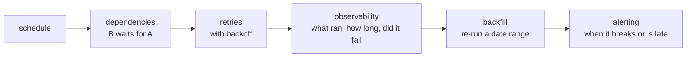

# Lesson 09 — Orchestration

**Goal:** run pipelines on a schedule, with retries, dependencies and
backfills.

## What you will learn

- What an orchestrator does that cron does not
- DAGs and dependencies
- Retries, alerting and SLAs
- Airflow, Dagster, Prefect — and when cron is fine

---

## What you actually need



Cron gives you the first box. Everything else you would write yourself — and
that is what an orchestrator is.

```python
tasks = {
    "extract_orders": [],
    "extract_customers": [],
    "stage_orders": ["extract_orders"],
    "stage_customers": ["extract_customers"],
    "join_enriched": ["stage_orders", "stage_customers"],
    "mart_daily": ["join_enriched"],
    "quality_checks": ["mart_daily"],
    "publish": ["quality_checks"],
}

def topological_order(graph):
    """Execution order respecting dependencies; None if there is a cycle."""
    remaining = {task: set(dependencies) for task, dependencies in graph.items()}
    order = []
    while remaining:
        ready = sorted(t for t, deps in remaining.items() if not deps)
        if not ready:
            return None
        order.append(ready)
        for task in ready:
            del remaining[task]
        for deps in remaining.values():
            deps.difference_update(ready)
    return order

for step, tasks_in_step in enumerate(topological_order(tasks), start=1):
    print(f"step {step}: {tasks_in_step}")
```

```text
step 1: ['extract_customers', 'extract_orders']
step 2: ['stage_customers', 'stage_orders']
step 3: ['join_enriched']
step 4: ['mart_daily']
step 5: ['quality_checks']
step 6: ['publish']
```

Steps 1 and 2 hold two tasks each — **those can run in parallel**, and the
orchestrator works that out from the dependency graph rather than from you
writing it down. That is the core service it provides.

---

## Retries

```python
import time
import random

def run_with_retry(task, attempts=3, base_delay=1.0, jitter=True):
    """Exponential backoff with jitter. Returns (result, attempts_used)."""
    for attempt in range(1, attempts + 1):
        try:
            return task(), attempt
        except Exception as error:
            if attempt == attempts:
                raise
            delay = base_delay * 2 ** (attempt - 1)
            if jitter:
                delay *= 0.5 + random.random()
            print(f"  attempt {attempt} failed ({error}); retrying in {delay:.1f}s")
            time.sleep(min(delay, 0.05))          # shortened for the lesson

calls = {"n": 0}
def flaky_task():
    calls["n"] += 1
    if calls["n"] < 3:
        raise ConnectionError("upstream timeout")
    return "ok"

result, used = run_with_retry(flaky_task)
print(f"succeeded on attempt {used}: {result}")
```

```text
  attempt 1 failed (upstream timeout); retrying in 1.3s
  attempt 2 failed (upstream timeout); retrying in 2.5s
succeeded on attempt 3: ok
```

**Jitter matters more than it looks.** Without it, fifty tasks that failed
together retry together, hit the same overloaded source at the same instant,
and fail together again.

Retry only what is **transient**: timeouts, 5xx, rate limits, deadlocks. Never
retry a schema error or a validation failure — the second attempt will fail
identically, and you have delayed the alert.

---

## Idempotency makes retries safe

```python
import pandas as pd

state = {"rows": []}

def unsafe_task(batch):
    state["rows"].extend(batch)                   # appends every attempt

def safe_task(batch, partition):
    state["rows"] = [r for r in state["rows"] if r["day"] != partition]
    state["rows"].extend(batch)                   # replaces the partition

batch = [{"day": "2026-01-01", "revenue": 100}]

state["rows"] = []
unsafe_task(batch); unsafe_task(batch); unsafe_task(batch)
print("unsafe after 3 attempts:", len(state["rows"]), "rows")

state["rows"] = []
safe_task(batch, "2026-01-01"); safe_task(batch, "2026-01-01"); safe_task(batch, "2026-01-01")
print("safe after 3 attempts:  ", len(state["rows"]), "rows")
```

```text
unsafe after 3 attempts: 3 rows
safe after 3 attempts:   1 rows
```

**Retries are only safe on idempotent tasks.** An orchestrator that retries a
non-idempotent task turns a transient network blip into triple-counted
revenue — the failure is now worse than no retry at all.

---

## Scheduling and the execution date

```python
import pandas as pd

def run_window(execution_date, schedule="daily"):
    """The data window a run covers — NOT 'now'."""
    start = pd.Timestamp(execution_date)
    end = start + (pd.Timedelta(days=1) if schedule == "daily"
                   else pd.Timedelta(hours=1))
    return start, end

for date in ["2026-01-15", "2026-01-16"]:
    start, end = run_window(date)
    print(f"run for {date}: processes [{start}, {end})")
```

```text
run for 2026-01-15: processes [2026-01-15 00:00:00, 2026-01-16 00:00:00)
run for 2026-01-16: processes [2026-01-16 00:00:00, 2026-01-17 00:00:00)
```

**Never use `datetime.now()` inside a task.** Parameterise by execution date
and the same code serves the scheduled run and the backfill; use `now()` and
a backfill of March silently processes today.

The daily run for the 15th executes on the 16th, once the day is complete.
That off-by-one is the single most confusing thing about every orchestrator,
and it is the same in all of them.

---

## SLAs and alerting

```python
import pandas as pd

def check_sla(task_runs, sla_minutes):
    """Report tasks that breached their SLA."""
    breaches = []
    for task, (started, finished, expected_by) in task_runs.items():
        duration = (finished - started).total_seconds() / 60
        late = finished > expected_by
        if late or duration > sla_minutes:
            breaches.append({
                "task": task,
                "duration_min": round(duration, 1),
                "late": late,
                "minutes_late": round((finished - expected_by).total_seconds() / 60, 1),
            })
    return breaches

runs = {
    "extract": (pd.Timestamp("2026-01-16 02:00"), pd.Timestamp("2026-01-16 02:05"),
                pd.Timestamp("2026-01-16 03:00")),
    "transform": (pd.Timestamp("2026-01-16 02:05"), pd.Timestamp("2026-01-16 04:30"),
                  pd.Timestamp("2026-01-16 04:00")),
}
for breach in check_sla(runs, sla_minutes=60):
    print(breach)
```

```text
{'task': 'transform', 'duration_min': 145.0, 'late': True, 'minutes_late': 30.0}
```

Alert on three things, and resist adding a fourth:

| Alert | Why |
|---|---|
| **Task failed after all retries** | Something is broken |
| **SLA breached** | The data is late; consumers must know |
| **Quality check failed** | The data is wrong (lesson 07) |

Alerting on every retry, every long-running task and every warning produces
alert fatigue, and a team that ignores alerts has no alerting.

---

## The tools

| Tool | Character |
|---|---|
| **cron** | Fine for one independent job. No dependencies, no backfill, no UI |
| **Airflow** | The industry standard. Heavy, mature, enormous ecosystem |
| **Dagster** | Asset-oriented — you declare tables, not tasks. Strong typing and lineage |
| **Prefect** | Python-native, light, dynamic workflows |
| **dbt Cloud / dbt + cron** | Enough if your pipeline is entirely SQL |
| Cloud-native (Composer, MWAA, Step Functions) | Managed, vendor-tied |

```python
# Airflow, in outline
from airflow.decorators import dag, task
from datetime import datetime

@dag(schedule="0 2 * * *", start_date=datetime(2026, 1, 1),
     catchup=True, max_active_runs=1,
     default_args={"retries": 3, "retry_exponential_backoff": True})
def daily_orders():

    @task
    def extract(execution_date=None):
        return f"extracted for {execution_date}"

    @task
    def transform(payload):
        return payload.upper()

    transform(extract())

daily_orders()
```

`catchup=True` is what makes Airflow backfill from `start_date` automatically;
`max_active_runs=1` stops twenty backfill runs hitting your warehouse at once.

**Start with cron.** Move to an orchestrator when you have dependencies
between jobs, need backfills, or cannot answer "did last night's run succeed?"
without reading logs.

---

## Common mistakes

| Mistake | What happens |
|---|---|
| Retrying non-idempotent tasks | Duplicated data, worse than the original failure |
| `datetime.now()` inside a task | Backfills process the wrong day |
| No jitter on retries | Synchronised retry storms |
| Alerting on everything | Alert fatigue; real failures missed |
| One giant task | A failure at 90% restarts from zero |
| Airflow for two cron jobs | Weeks of operational overhead for nothing |
| No `max_active_runs` | A backfill takes the warehouse down |

---

## Exercises

1. Draw your pipeline as a DAG; which tasks could run in parallel?
2. Add exponential backoff with jitter to one job.
3. Parameterise a job by execution date and run it for three past dates.
4. Define SLAs for three tables, and write the check.
