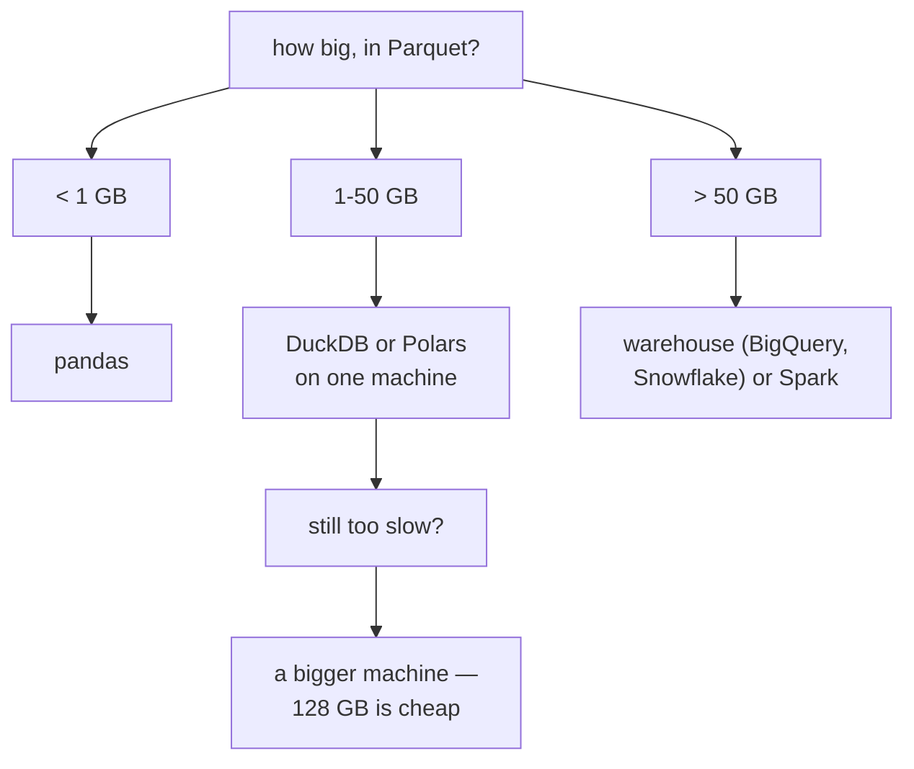

# Lesson 10 — Scale

**Goal:** know the size at which each tool stops being the right answer.

## What you will learn

- The real thresholds
- Single-machine tools that go further than people think
- When Spark earns its complexity
- Partitioning, shuffles and skew

---

## The thresholds

```python
for label, rows, bytes_per_row in [
    ("small", 1_000_000, 200),
    ("medium", 100_000_000, 200),
    ("large", 5_000_000_000, 200),
]:
    gigabytes = rows * bytes_per_row / 1024**3
    print(f"{label:<8}{rows:>15,} rows  {gigabytes:>9.1f} GB raw  "
          f"{gigabytes * 0.15:>8.1f} GB as Parquet")
```

```text
small         1,000,000 rows        0.2 GB raw       0.0 GB as Parquet
medium      100,000,000 rows       18.6 GB raw       2.8 GB as Parquet
large     5,000,000,000 rows      931.3 GB raw     139.7 GB as Parquet
```

| Data size | Tool | Note |
|---|---|---|
| < 1 GB | pandas | Anything else is overhead |
| 1–50 GB | **DuckDB, Polars** | On a laptop. This is most companies |
| 50–500 GB | DuckDB on a big machine, or a warehouse | A 128 GB VM costs less than a cluster |
| 500 GB – 10 TB | BigQuery / Snowflake / Spark | Now it is worth it |
| > 10 TB | Spark, or a serious warehouse | Distributed, with people to run it |

**A hundred million rows is 2.8 GB in Parquet.** DuckDB reads that on a laptop
in seconds. The instinct to reach for a cluster at that size costs weeks and
buys nothing.

---

## Single machine goes further than you think

```python
import time
import numpy as np
import pandas as pd

rng = np.random.default_rng(0)
n = 2_000_000
frame = pd.DataFrame({
    "customer_id": rng.integers(1, 100_000, n),
    "city": rng.choice(["Cairo", "Giza", "Alexandria", "Luxor", "Aswan"], n),
    "amount": rng.gamma(3, 30, n).round(2),
})
frame.to_parquet("/tmp/big.parquet")

start = time.perf_counter()
result = (pd.read_parquet("/tmp/big.parquet")
            .groupby("city", as_index=False)["amount"]
            .agg(["sum", "count", "mean"]))
pandas_time = time.perf_counter() - start

print(f"{n:,} rows grouped in {pandas_time:.2f}s with pandas")
print(result.round(1).to_string(index=False))
```

```text
2,000,000 rows grouped in 0.13s with pandas
      city        sum  count  mean
Alexandria 35979038.8 400171  89.9
     Aswan 35974483.8 400033  89.9
     Cairo 36027865.8 400319  90.0
      Giza 35925515.9 399535  89.9
     Luxor 36054577.0 399942  90.1
```

Two million rows read from Parquet and aggregated in **0.13 seconds**, in the
tool you already know. Ten times this size still works; a hundred times needs DuckDB or Polars,
which are drop-in and run on the same laptop:

```python
# pip install duckdb
import duckdb

duckdb.sql("""
    SELECT city, SUM(amount) AS total, COUNT(*) AS orders, AVG(amount) AS average
    FROM '/tmp/big.parquet'
    GROUP BY city
    ORDER BY total DESC
""").show()
```

DuckDB queries Parquet **without loading it**, uses every core, and spills to
disk when the data exceeds memory. It handles tens of gigabytes on a laptop —
which covers the "big data" of most companies entirely.

---

## Chunking, when memory is the limit

```python
import pandas as pd

def aggregate_in_chunks(path, chunk_size=250_000):
    """Aggregate a file larger than memory, one chunk at a time."""
    totals = {}
    counts = {}
    for chunk in pd.read_csv(path, chunksize=chunk_size):
        grouped = chunk.groupby("city")["amount"].agg(["sum", "count"])
        for city, row in grouped.iterrows():
            totals[city] = totals.get(city, 0) + row["sum"]
            counts[city] = counts.get(city, 0) + row["count"]
    return pd.DataFrame({
        "city": list(totals),
        "total": [round(totals[c], 1) for c in totals],
        "orders": [int(counts[c]) for c in totals],
    })

frame.head(500_000).to_csv("/tmp/big.csv", index=False)
print(aggregate_in_chunks("/tmp/big.csv").sort_values("city").to_string(index=False))
```

```text
      city     total  orders
Alexandria 8988100.2   99973
     Aswan 8984241.1  100198
     Cairo 9004659.5   99996
      Giza 8975365.8   99826
     Luxor 9029671.3  100007
```

Sums and counts chunk trivially. **Means, medians and distinct counts do
not** — a mean of means is wrong unless you weight it, which is why the code
above carries sums and counts and divides at the end.

---

## When Spark earns it

| Signal | Spark is justified |
|---|---|
| Data does not fit on one machine, even compressed | Yes |
| The job takes hours on the biggest single machine | Yes |
| Data is already in a cluster (HDFS, S3 + EMR) | Yes |
| You need fault tolerance over a multi-hour job | Yes |
| "It might grow later" | **No** |
| "The competitor uses it" | **No** |

The costs are real: cluster operation, slow start-up, a debugging experience
far worse than a laptop, and JVM memory tuning at 3am.

---

## Shuffles and skew

The two things that make distributed jobs slow are the same two every time.

```python
import numpy as np
import pandas as pd

rng = np.random.default_rng(0)
n = 1_000_000

balanced = rng.integers(0, 200, n)
skewed = np.where(rng.random(n) < 0.8, 0, rng.integers(0, 200, n))

for name, keys in [("balanced", balanced), ("skewed", skewed)]:
    sizes = pd.Series(keys).value_counts()
    print(f"{name:<10} largest partition {sizes.max():>8,}  "
          f"median {int(sizes.median()):>6,}  ratio {sizes.max() / sizes.median():>6.1f}x")
```

```text
balanced   largest partition    5,220  median  4,991  ratio    1.0x
skewed     largest partition  800,496  median  1,002  ratio  798.5x
```

With balanced keys every worker gets about the same amount — max and median
within 5% of each other. With skew, **one partition holds 798 times the
median**: 199 workers finish in seconds, one runs for an hour, and the job
takes an hour.

Adding workers does not help. The job is as slow as its largest partition, and
that is the single most important fact about distributed processing.

Fixes for skew:

- **Salt the key**: join on `(key, random 0..n)`, then aggregate twice
- **Broadcast the small side** of the join, so no shuffle happens at all
- **Filter early**, before the join
- Handle the hot keys separately

And for shuffles generally: `filter` and `select` are free (each worker acts
alone); `groupBy`, `join` and `distinct` move data across the network, and
that is where the time goes.

---

## Choosing, honestly



Two questions before adopting a distributed system:

1. **How large is the data, in Parquet, today?** Not the raw JSON, not the
   projection for 2030.
2. **Have you tried DuckDB on a large VM?** It is one afternoon, and it
   resolves most cases.

---

## Common mistakes

| Mistake | What happens |
|---|---|
| Spark for gigabytes | Weeks of complexity, slower than pandas |
| Measuring size as raw JSON | You over-provision by 8× |
| `collect()` on a large Spark DataFrame | The driver dies |
| Ignoring skew | 199 idle workers and one that never finishes |
| Chunked means without weighting | Wrong averages |
| Never trying DuckDB | A cluster for a laptop-sized problem |

---

## Exercises

1. Measure your largest table in Parquet. Which row of the table applies?
2. Aggregate a file bigger than memory with chunking.
3. Run the same query in pandas and DuckDB; compare.
4. Find a skewed key in your data and compute the max/median ratio.
