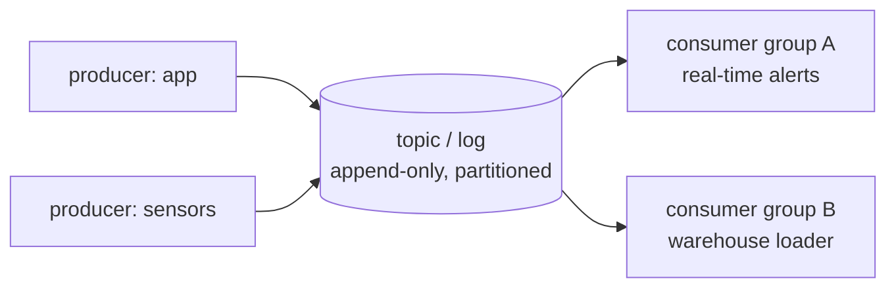

# Lesson 11 — Streaming

**Goal:** handle events as they arrive, and know what that costs.

## What you will learn

- Events, logs and consumer groups
- Event time versus processing time
- Windows and watermarks
- Delivery guarantees

---

## The model



A streaming platform is an **append-only log** with an offset per consumer.
Producers append; each consumer group reads independently and remembers its
position; the log retains messages for a configured period so a consumer can
replay.

```python
import zlib
from collections import defaultdict

class Log:
    """A partitioned append-only log, with per-group offsets."""

    def __init__(self, partitions=3):
        self.partitions = {i: [] for i in range(partitions)}
        self.offsets = defaultdict(lambda: defaultdict(int))

    def produce(self, key, value):
        # crc32, not hash(): Python's hash() is salted per process, so the
        # same key would land in a different partition after a restart.
        partition = zlib.crc32(key.encode()) % len(self.partitions)
        self.partitions[partition].append((key, value))
        return partition

    def consume(self, group, partition, limit=10):
        start = self.offsets[group][partition]
        messages = self.partitions[partition][start : start + limit]
        self.offsets[group][partition] = start + len(messages)
        return messages

log = Log(partitions=3)
for order_id, amount in [("A", 100), ("B", 200), ("A", 150), ("C", 300), ("A", 50)]:
    log.produce(order_id, amount)

print("partition sizes:", {p: len(m) for p, m in log.partitions.items()})
for partition in range(3):
    print(f"  p{partition}:", log.partitions[partition])
print("group1 reads p1:", log.consume("group1", 1))
print("group1 again:   ", log.consume("group1", 1), "(offset advanced)")
print("group2 reads p1:", log.consume("group2", 1), "(independent offset)")
```

```text
partition sizes: {0: 0, 1: 1, 2: 4}
  p0: []
  p1: [('B', 200)]
  p2: [('A', 100), ('A', 150), ('C', 300), ('A', 50)]
group1 reads p1: [('B', 200)]
group1 again:    [] (offset advanced)
group2 reads p1: [('B', 200)] (independent offset)
```

Three properties, all visible in that output:

- **Same key, same partition.** All three `A` events are in p2, in order.
  Ordering is guaranteed *within* a partition and nowhere else.
- **Partitions are uneven** — p0 is empty and p2 holds four of five events on
  three distinct keys. That is lesson 10's skew, in streaming form: with few
  keys, some consumers do all the work.
- **Independent offsets.** Group 2 sees everything group 1 already read.
  Adding a consumer disturbs nothing, and it can start from the beginning.

Note the comment on `produce`: **never use Python's `hash()` for
partitioning.** It is salted per process, so after a restart the same key
lands in a different partition and your ordering guarantee is gone.

---

## Event time and processing time

```python
import pandas as pd

events = pd.DataFrame({
    "order_id": [1, 2, 3, 4],
    "event_time": pd.to_datetime([
        "2026-01-15 09:58", "2026-01-15 09:59",
        "2026-01-15 09:57", "2026-01-15 10:01"]),
    "processing_time": pd.to_datetime([
        "2026-01-15 10:00", "2026-01-15 10:00",
        "2026-01-15 10:05", "2026-01-15 10:05"]),
})
events["lag_minutes"] = ((events["processing_time"] - events["event_time"])
                         .dt.total_seconds() / 60)
print(events.to_string(index=False))

window_start = pd.Timestamp("2026-01-15 09:55")
window_end = pd.Timestamp("2026-01-15 10:00")
by_event = events[(events["event_time"] >= window_start) & (events["event_time"] < window_end)]
by_processing = events[(events["processing_time"] >= window_start)
                       & (events["processing_time"] < window_end)]
print(f"\n09:55-10:00 by event time:      {sorted(by_event['order_id'])}")
print(f"09:55-10:00 by processing time: {sorted(by_processing['order_id'])}")
```

```text
 order_id          event_time     processing_time  lag_minutes
        1 2026-01-15 09:58:00 2026-01-15 10:00:00          2.0
        2 2026-01-15 09:59:00 2026-01-15 10:00:00          1.0
        3 2026-01-15 09:57:00 2026-01-15 10:05:00          8.0
        4 2026-01-15 10:01:00 2026-01-15 10:05:00          4.0

09:55-10:00 by event time:      [1, 2, 3]
09:55-10:00 by processing time: []
```

Order 3 **happened** at 09:57 and **arrived** at 10:05. Windowing by event
time puts it in the 09:55 window, which is correct; windowing by processing
time puts it in the 10:05 window, which is wrong — and if you have already
published the 09:55 result, order 3 is simply missing from it.

**Always window by event time**, and accept the consequence: you cannot close
a window immediately, because late events may still arrive.

---

## Watermarks

```python
import pandas as pd

def watermark(max_event_time, allowed_lateness_minutes=5):
    """Windows ending before this are considered complete."""
    return max_event_time - pd.Timedelta(minutes=allowed_lateness_minutes)

seen = [pd.Timestamp("2026-01-15 10:00"), pd.Timestamp("2026-01-15 10:03"),
        pd.Timestamp("2026-01-15 10:07")]
for i, event_time in enumerate(seen, start=1):
    maximum = max(seen[:i])
    print(f"after event {i} (max seen {maximum.time()}): "
          f"watermark {watermark(maximum).time()}")

late = pd.Timestamp("2026-01-15 09:58")
current = watermark(max(seen))
print(f"\nan event at {late.time()} arriving now: "
      f"{'DROPPED (before the watermark)' if late < current else 'accepted'}")
```

```text
after event 1 (max seen 10:00:00): watermark 09:55:00
after event 2 (max seen 10:03:00): watermark 09:58:00
after event 3 (max seen 10:07:00): watermark 10:02:00

an event at 09:58:00 arriving now: DROPPED (before the watermark)
```

The watermark is the system's statement that **it no longer expects events
older than this**. Windows below it can be closed and published; events below
it are dropped or sent to a side output.

The trade is explicit and unavoidable:

| Allowed lateness | Result |
|---|---|
| Short (seconds) | Fast results, more dropped events |
| Long (hours) | Complete results, delayed publication, more state held |

There is no setting that gives you both. Pick one, write it in the SLA, and
route dropped events somewhere visible.

---

## Windows

```python
import pandas as pd
import numpy as np

rng = np.random.default_rng(0)
times = pd.date_range("2026-01-15 10:00", periods=20, freq="30s")
stream = pd.DataFrame({"event_time": times, "amount": rng.integers(10, 100, 20)})

tumbling = (stream.set_index("event_time")
                  .resample("2min")["amount"]
                  .agg(["count", "sum"]))
print("tumbling (2 min, no overlap):")
print(tumbling.to_string())

sliding = (stream.set_index("event_time")["amount"]
                 .rolling("2min").sum().iloc[::4])
print("\nsliding (2 min window, every 2 min):")
print(sliding.to_string())
```

```text
tumbling (2 min, no overlap):
                     count  sum
event_time                     
2026-01-15 10:00:00      4  243
2026-01-15 10:02:00      4   77
2026-01-15 10:04:00      4  268
2026-01-15 10:06:00      4  291
2026-01-15 10:08:00      4  278

sliding (2 min window, every 2 min):
event_time
2026-01-15 10:00:00     86.0
2026-01-15 10:02:00    194.0
2026-01-15 10:04:00     65.0
2026-01-15 10:06:00    298.0
2026-01-15 10:08:00    302.0
```

The two columns disagree at every timestamp, and they are both right: the
tumbling window at 10:02 sums the four events *inside* that window (77), while
the sliding value at 10:02 sums the two minutes *ending* there (194). Stating
which one a dashboard shows is not pedantry — it is the difference between two
numbers that will otherwise be reported as a bug.

| Window | Shape | Use for |
|---|---|---|
| **Tumbling** | Fixed, non-overlapping | "Revenue per 5 minutes" |
| **Sliding** | Fixed, overlapping | "Rolling 1-hour average, updated every minute" |
| **Session** | Ends after a gap of inactivity | "One user's visit" |

---

## Delivery guarantees

| Guarantee | Means | Cost |
|---|---|---|
| **At most once** | May lose messages | Fastest; almost never acceptable |
| **At least once** | May duplicate | The common default |
| **Exactly once** | Neither | Transactions, or idempotency |

"Exactly once" in the marketing sense is usually **at-least-once delivery plus
idempotent processing**:

```python
processed_ids = set()
revenue = 0.0

incoming = [("evt-1", 100.0), ("evt-2", 50.0), ("evt-1", 100.0), ("evt-3", 75.0)]

for event_id, amount in incoming:
    if event_id in processed_ids:
        continue                       # a duplicate delivery; ignore it
    processed_ids.add(event_id)
    revenue += amount

print(f"events received: {len(incoming)}")
print(f"unique processed: {len(processed_ids)}")
print(f"revenue: {revenue}  (correct: 225.0)")
```

```text
events received: 4
unique processed: 3
revenue: 225.0  (correct: 225.0)
```

**A deduplication key on every event** is what makes this possible. Producers
must set one; a stream without event ids cannot be processed exactly once by
any framework.

---

## Do you need streaming?

| Requirement | Batch every 15 min | Streaming |
|---|---|---|
| Daily reports | **Yes** | No |
| Dashboards refreshed hourly | **Yes** | No |
| "Real-time" as a feeling | **Yes** | No |
| Fraud blocking at checkout | No | **Yes** |
| Alerting on sensor thresholds | No | **Yes** |
| Live inventory across stores | Maybe | **Yes** |

The honest test: **can someone state, in money, what a 15-minute delay
costs?** If not, run a batch job every 15 minutes. It uses the tools you
already test, backfills trivially, and fails in ways you can debug on a
Tuesday afternoon.

The tools, when you do need them: Kafka or Kinesis for the log; Flink, Spark
Structured Streaming or Kafka Streams for processing; ksqlDB or Materialize
for SQL over streams.

---

## Common mistakes

| Mistake | What happens |
|---|---|
| Windowing by processing time | Late events land in the wrong window |
| No watermark | State grows forever; windows never close |
| Watermark too aggressive | Real events silently dropped |
| No deduplication key | Exactly-once is impossible |
| Assuming global ordering | Ordering is per partition only |
| Streaming for a 15-minute requirement | Ten times the operational burden |

---

## Exercises

1. Implement the toy log; show that two consumer groups read independently.
2. Show a late event landing in the wrong window under processing time.
3. Choose an allowed-lateness value for a stream you know, and justify it.
4. Deduplicate an at-least-once stream and confirm the totals.
