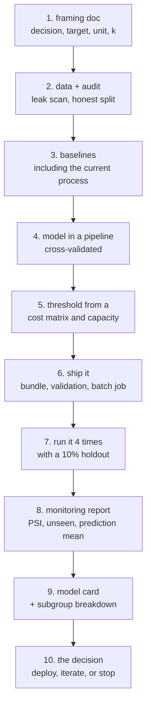

# Project 10 — One Problem, End to End

**The last project in the track. Do it after the ten lessons.**

Every earlier project asked you to build a thing. Project 9 asked whether you
could be trusted to tell someone what to do. This one asks whether you can put a
model into someone's Monday morning, keep it working for a month, and know when
to turn it off.

The deliverable is **a running system and a decision**, not a notebook and a
score.

---

## The shape



Step 10 has three legitimate answers, and **"stop"** is one of them. A project
that correctly concludes the model is not worth deploying is a pass. A project
that deploys a model worth nothing because stopping felt like failing is not.

---

## Requirements

### 1. The framing document

Written **before** you look at any model output, from lesson 02's template. It
must contain:

- The decision, the owner by name, the frequency
- **The capacity**: how many actions per period. A number
- The target in one sentence: event, window, source table, exclusions
- The unit of analysis, and the prediction timestamp
- The current process, described precisely enough to implement
- `MIN USEFUL`: the threshold below which you will recommend not deploying,
  agreed in advance and containing a number

Commit this file before the first model commit. Its git timestamp is part of the
submission.

### 2. Data, audited

- **At least 5,000 rows and at least 300 positives.** Positives are the budget
  (lesson 03); a project with 40 of them cannot be rescued by a better model
- The `audit()` report: rows, duplicates, base rate, positives, nulls,
  constants, time range
- **The single-feature leak scan**, with your written answer to *"when is this
  value written to the database?"* for every feature above 0.80 — and for every
  feature you kept
- A split that matches deployment: time-ordered, group-aware, or both. Justify
  it in two sentences
- If you find a leak, **keep the evidence in the report**. The before/after
  numbers are the most convincing thing you will produce

### 3. Three baselines

Reported in one table:

| Baseline | Required |
|---|---|
| Trivial (majority / random) | Yes |
| **The current process, implemented and measured** | **Yes** |
| Simplest real model (logistic regression or a depth-4 tree) | Yes |

Plus at least two more models, all through the **same pipeline object**, all
cross-validated, all with the fold standard deviation shown.

Then a **paired interval on the difference** between your best two models, and
one sentence saying whether the gap is real.

### 4. Everything fitted inside a pipeline

- One `Pipeline` containing imputation, scaling, encoding and the estimator
- `handle_unknown="ignore"`, and a written note on what that does silently
- No transformer fitted outside a fold anywhere in the repository
- Every feature-engineering step measured against the version without it, with
  the fold spread beside it. **Delete anything whose effect is smaller than the
  noise**, and say in the report that you did

### 5. A threshold you can defend

- A **cost matrix** with all four cells, and where each number came from. If a
  number is a guess, label it a guess and give a range
- The profit curve across at least six thresholds
- The threshold you will actually use, and whether it came from the cost matrix
  or from capacity
- **A calibration table** (predicted vs observed, in buckets) and the Brier
  score. If anything downstream multiplies your probability by money, calibration
  is a requirement, not a nicety
- A **gains table by decile**, with lift and cumulative capture

### 6. Shipped

- A **bundle** on disk: pipeline, `feature_order`, threshold, versions, training
  date, training rows, training base rate
- **Input validation at the boundary**, with a test that feeds it a malformed
  batch and asserts the specific messages. The validator must not raise
- A batch scoring entry point runnable from the command line, which:
  - exits non-zero on validation failure
  - writes one file per run, with the model version on **every row**
  - stores inputs as well as outputs
- Either a `/health` endpoint or a log line per run reporting the model version
  and training date

An HTTP service is optional. If you build one, it must reject an invalid payload
with a 422 naming the field, and must not return a traceback.

### 7. Run it four times, with a holdout

- Score four periods (real if you have them; simulated if you do not, stated
  clearly either way)
- **A 10% holdout that is never acted on**, chosen by a stable rule, not
  re-randomised per run
- After the runs: the base rate in the holdout beside the base rate among the
  acted-on group, and one sentence interpreting the difference
- If you simulate the action's effect, state the assumed effect size and show
  what the holdout column does across the four runs

The holdout is the requirement most people skip. It is also the only way your
final number is not an argument.

### 8. A monitoring report

One row per run, at minimum: rows scored, rows rejected, mean prediction,
training base rate, count above threshold, PSI per numeric feature, unseen
categories per categorical feature.

Then **inject three failures** into a copy of one batch and report which monitor
catches each:

1. A distribution shift in your most important feature
2. A new category in a categorical feature
3. An upstream bug that writes a legal sentinel value (a zero, an empty string,
   a default date) into 30% of one column

For each, report the PSI, the prediction-mean shift, the count above threshold,
and the change in your headline metric. **At least one of them must be invisible
to at least one monitor** — find it and say so. And for each, state which of the
three diagnoses it is: covariate shift, concept drift, or data quality, and
whether retraining is the right response.

### 9. The model card and the subgroups

Lesson 10's card, one page, with:

- Intended use, and an **out-of-scope list** with at least four entries
- Performance broken down by **at least three groupings**, with group sizes
- One fairness definition, **named before you measured it**, and the gap you
  found under it
- Five known limitations, one of which is a use someone has already asked you
  about
- What the model cannot answer, including at least one causal question it will
  be asked

### 10. The decision

One page, in business language, opening with the recommendation.

```text
RECOMMENDATION   Deploy / Iterate / Stop
AT WHAT k        The capacity this assumes
EXPECTED VALUE   Per period, with the range implied by your cost-matrix guesses
AGAINST BASELINE What the current process would have achieved on the same data
COST TO RUN      Engineering, call-centre time, the holdout you are giving up
WHAT WOULD CHANGE THIS   The number that would make you reverse the decision
OWNER AND DATE   Who acts, and when the next review is
```

Then present it to a real person and write down what they asked, what they
disagreed with, and what they decided.

---

## Deliverables

```text
project-10/
├── DECISION.md            the one page — the primary deliverable
├── MODEL_CARD.md
├── framing.md             committed before any modelling
├── README.md              how to reproduce, in order
├── notebooks/
│   ├── 01-audit.ipynb     audit, leak scan, split justification
│   ├── 02-models.ipynb    baselines, ladder, paired interval
│   └── 03-threshold.ipynb cost matrix, calibration, gains
├── src/
│   ├── features.py        every function takes a cutoff
│   ├── train.py           writes the bundle and a run record
│   ├── validate.py        the boundary contract
│   ├── score_batch.py     CLI entry point
│   ├── monitor.py         one row per run
│   └── serve.py           optional
├── tests/
│   ├── test_validate.py   malformed input, asserted messages
│   └── test_features.py   no feature sees past its cutoff
├── artifacts/
│   ├── model-v1.joblib
│   └── runs/*.json        one record per training run
├── predictions/           one file per scoring run, versioned rows
└── reports/
    ├── monitoring.md      the run table + the three injected failures
    └── feedback.md        what the reviewer asked and decided
```

---

## Marking

| Weight | Criterion |
|---|---|
| 10% | Framing document, committed first, with a capacity number and `MIN USEFUL` |
| 15% | Audit and leak scan; a split that matches deployment, justified |
| 15% | Three baselines including the current process; paired interval on the top two |
| 10% | Everything inside a pipeline; engineered features measured or deleted |
| 15% | Threshold from a cost matrix and capacity; calibration and gains reported |
| 15% | Shipped: bundle, validation with tests, batch CLI, versioned outputs |
| 10% | Four runs with a real holdout; monitoring report with three injected failures |
| 10% | Model card with subgroups, and a decision page presented to a person |

Automatic deductions: a metric with no baseline; a threshold of 0.5 with no
justification; any transformer fitted outside a fold; a leaderboard ranked on a
single split; an improvement reported inside the fold noise; no holdout; a
prediction file with no model version; a causal claim from observational data;
a model card with no out-of-scope list.

---

## Milestones

| Day | Done by end of day |
|---|---|
| 1 | Framing document committed. Data acquired and audited. Leak scan run |
| 2 | Split decided and justified. Three baselines measured, current process included |
| 3 | Pipeline, model ladder, paired interval. Feature experiments measured |
| 4 | Cost matrix agreed. Threshold, calibration, gains table |
| 5 | Bundle, validator with tests, batch CLI, run records |
| 6 | Four runs with the holdout. Monitoring report. Three failures injected |
| 7 | Subgroups, model card, decision page. Present it. Write the feedback |

---

## Before you submit

- [ ] `framing.md` is the oldest commit in the repository
- [ ] `MIN USEFUL` was written before any result and is unedited
- [ ] The current process is implemented and measured, not described
- [ ] The leak scan ran, and the answer to "when is this written?" exists for
      every feature
- [ ] The split matches how the model will be used
- [ ] No fold ever saw a transformer fitted on its own data
- [ ] Every claimed improvement is larger than the fold standard deviation
- [ ] The threshold has a written derivation
- [ ] There is a calibration table, and you know whether you need it
- [ ] The validator has a malformed-input test and does not raise
- [ ] Every prediction row carries the model version
- [ ] The holdout was never acted on, and its base rate is reported
- [ ] Three failures were injected, and you named the one a monitor missed
- [ ] The model card's out-of-scope list has at least four entries
- [ ] `DECISION.md` opens with Deploy, Iterate, or Stop — and Stop was available
- [ ] A real person heard it, and their objections are written down

---

## A note on finishing the track

Ten courses, ten projects: Python, machine learning, deep learning,
optimisation, NLP, computer vision, data engineering, data analysis, and this.

The through-line, if the track has one, is that **the measurement is the work**.
Almost every genuinely useful result in these lessons came from running the code
and finding that the tidy expectation was wrong: the accurate model that was
worthless, the leak that looked like genius, the engineered features that did
nothing, the random forest that lost to logistic regression, the drift alarm that
should not have triggered a retrain, the fairness constraint that cost nothing.

None of those were guessable. They were measured. Keep doing that.
