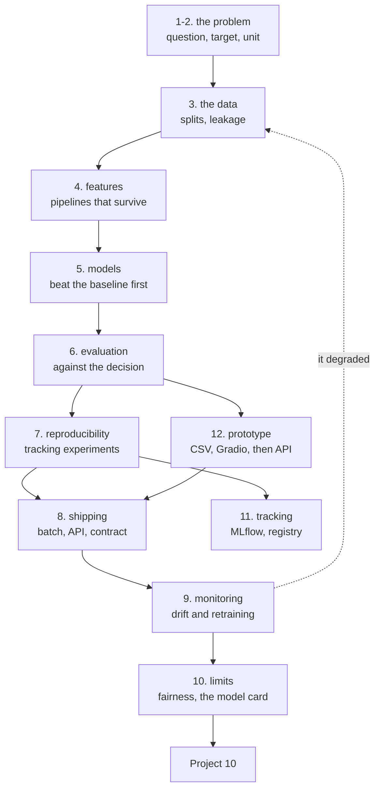

# Data Science — Tayel AI Labs

The ninth course, and the one that connects the others. Machine learning is
about making a model fit. Analysis is about answering a question. Data science
is the job of turning a business problem into a model, a model into a
decision, and a decision into something that still works three months later.

**Prerequisites**

- [`../Python`](../Python) — both tracks
- [`../Machine-Learning`](../Machine-Learning) — you should be able to train a
  model already; this course is about everything around that step
- [`../Data-Analysis`](../Data-Analysis) — Basic track at minimum

---

## The lifecycle this course follows



## Lessons

| # | Lesson | The question it answers |
|---|---|---|
| 01 | [What Data Science Actually Is](lessons/01-what-data-science-is.md) | Why the accurate model was worthless and the inaccurate one made money |
| 02 | [Framing a Problem as a Model](lessons/02-framing-the-problem.md) | What exactly are you predicting, for whom, and when? |
| 03 | [The Data You Actually Have](lessons/03-the-data-you-have.md) | Splits, time, and the leak that makes you look brilliant |
| 04 | [Features and Pipelines](lessons/04-features-and-pipelines.md) | How to transform data without lying to yourself |
| 05 | [Baselines and Model Selection](lessons/05-baselines-and-selection.md) | Is the model better than the rule you already had? |
| 06 | [Evaluating Against the Decision](lessons/06-evaluating-the-decision.md) | Thresholds, costs, and calibration |
| 07 | [Reproducibility and Experiment Tracking](lessons/07-reproducibility.md) | Can you get this number again next month? |
| 08 | [Shipping the Model](lessons/08-shipping-the-model.md) | Batch, API, and the contract at the boundary |
| 09 | [Monitoring and Drift](lessons/09-monitoring-and-drift.md) | How you find out it broke before the business does |
| 10 | [Limits, Fairness and the Model Card](lessons/10-limits-and-fairness.md) | Who does this model fail, and did you write it down? |
| 11 | [Experiment Tracking and the Registry](lessons/11-experiment-tracking.md) | *Read after 07.* MLflow, and the trap a tracking UI makes easier |
| 12 | [Prototypes That Get a Decision](lessons/12-prototypes.md) | *Read before 08.* A stakeholder-facing page in 18 lines |

## Then

- **[`Project-10/`](Project-10/)** — one problem, end to end, deployed and
  monitored, with the decision written down

---

## Setup

```bash
python3 -m venv .venv
source .venv/bin/activate
pip install -r requirements.txt
```

Lessons 01-07 need nothing beyond pandas, NumPy and scikit-learn. Lesson 08
adds FastAPI, lesson 11 adds MLflow and lesson 12 adds Gradio; those three are
the only ones that start a server.

**Reading order.** Lessons 01-10 are the spine, in order. Lessons 11 and 12 were
added later and slot in where their headers say: **11 after 07**, **12 before
08**. Numbering stayed sequential so existing links keep working.

---

## The dataset

Every lesson uses one synthetic dataset: 12,000 subscribers of a software
product, and whether each one cancelled in the following 30 days. Lesson 01
generates it to `/tmp/subscribers.parquet`; every later lesson reads it from
there. It carries deliberate traps — two columns that leak the answer, a
seasonal signup pattern, and subgroups the model treats differently — which
are the subject of lessons 03, 09 and 10.

---

## Three claims this course will prove to you with numbers

1. **A model can beat the baseline on accuracy by nothing at all and still be
   worth 41,699 EGP.** Accuracy is not the decision (lesson 01).
2. **A 0.95 ROC-AUC is usually a bug.** Two columns in the dataset are
   recorded *after* the outcome; one of them moves ROC-AUC from 0.667 to
   0.946 (lesson 03).
3. **The model that wins offline can lose in production** because the data it
   sees stopped looking like the data it was trained on, and nobody was
   watching (lesson 09).
