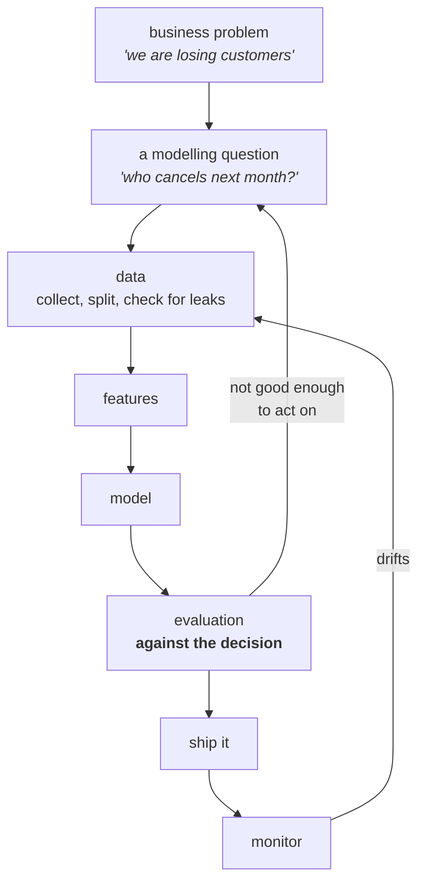
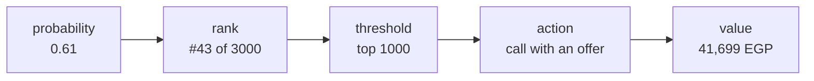

# Lesson 01 — What Data Science Actually Is

**Goal:** understand what the job is, by watching a good model fail and a
"worse" model make money.

## What you will learn

- The lifecycle, and where the modelling sits inside it
- Why accuracy answers a question nobody asked
- How a prediction becomes a decision
- The dataset used by every lesson in this course

---

## The lifecycle



Notice two things about that diagram.

**The modelling box is one box out of eight.** In a real project it is also
the smallest one by time. The work is in the boxes on either side of it.

**There are two arrows going backwards.** Data science is not a pipeline you
run once. It is a loop, and both of the loops start from *evaluation* — either
because the model is not good enough to act on, or because it stopped being
good enough three months after you shipped it.

| Discipline | Delivers | Succeeds when |
|---|---|---|
| Data analysis | An answer to a question a human asked | A person makes a better decision once |
| Machine learning | A model that generalises | The test metric is good |
| **Data science** | **A decision process that runs repeatedly** | **The business outcome changes, and keeps changing** |

---

## The dataset

Every lesson in this course uses the same 12,000 subscribers of a software
product. Run this once; the rest of the course reads the file.

```python
import numpy as np
import pandas as pd

rng = np.random.default_rng(11)
n = 12_000

signup = pd.to_datetime("2025-01-01") + pd.to_timedelta(
    rng.integers(0, 540, n), unit="D")
plan = rng.choice(["basic", "plus", "pro"], n, p=[0.55, 0.30, 0.15])
monthly_fee = pd.Series(plan).map(
    {"basic": 99.0, "plus": 199.0, "pro": 399.0}).to_numpy()
tenure_days = rng.integers(30, 540, n)
logins_last_30d = rng.poisson(
    np.where(plan == "pro", 18, np.where(plan == "plus", 11, 6)))
support_tickets = rng.poisson(0.6, n)
payment_failures = rng.binomial(2, 0.07, n)
country = rng.choice(["EG", "SA", "AE", "MA"], n, p=[0.5, 0.25, 0.15, 0.10])
age_band = rng.choice(["18-29", "30-44", "45-59", "60+"], n,
                      p=[0.3, 0.4, 0.2, 0.1])

# the real process behind a cancellation
logit = (-1.1
         - 0.085 * logins_last_30d
         + 0.55 * payment_failures
         + 0.22 * support_tickets
         - 0.0016 * tenure_days
         + np.where(plan == "basic", 0.45, 0.0)
         + rng.normal(0, 0.5, n))
churned = rng.random(n) < 1 / (1 + np.exp(-logit))

# two columns that only make sense AFTER the customer left — lesson 03
days_to_renewal = np.where(churned, rng.integers(0, 5, n),
                           rng.integers(0, 31, n))
cancellation_reason = np.where(
    churned, rng.choice(["price", "unused", "bug", "competitor"], n), "")

subscribers = pd.DataFrame({
    "customer_id": np.arange(100_000, 100_000 + n),
    "signup_date": signup,
    "plan": plan,
    "monthly_fee": monthly_fee,
    "tenure_days": tenure_days,
    "logins_last_30d": logins_last_30d,
    "support_tickets_last_30d": support_tickets,
    "payment_failures_last_90d": payment_failures,
    "country": country,
    "age_band": age_band,
    "days_to_renewal": days_to_renewal,
    "cancellation_reason": cancellation_reason,
    "churned_next_30d": churned.astype(int),
})
subscribers.to_parquet("/tmp/subscribers.parquet")

print(subscribers.shape)
print("churn rate:", round(subscribers["churned_next_30d"].mean(), 4))
print(subscribers.groupby("plan")["churned_next_30d"]
      .agg(["size", "mean"]).round(3).to_string())
```

```text
(12000, 13)
churn rate: 0.1608
       size   mean
plan
basic  6657  0.215
plus   3558  0.107
pro    1785  0.064
```

16% of subscribers cancel in a given month. That number — the **base rate** —
is the single most important number in the project, and it is the reason the
next section works the way it does.

---

## The model that beat nothing

```python
import pandas as pd
from sklearn.dummy import DummyClassifier
from sklearn.ensemble import HistGradientBoostingClassifier
from sklearn.model_selection import train_test_split
from sklearn.metrics import accuracy_score

df = pd.read_parquet("/tmp/subscribers.parquet")
features = ["tenure_days", "logins_last_30d",
            "support_tickets_last_30d", "payment_failures_last_90d"]
X, y = df[features], df["churned_next_30d"]
X_train, X_test, y_train, y_test = train_test_split(
    X, y, test_size=0.25, random_state=0, stratify=y)

baseline = DummyClassifier(strategy="most_frequent").fit(X_train, y_train)
model = HistGradientBoostingClassifier(random_state=0).fit(X_train, y_train)

print(f"everyone-stays baseline : {accuracy_score(y_test, baseline.predict(X_test)):.3f}")
print(f"gradient boosting       : {accuracy_score(y_test, model.predict(X_test)):.3f}")
```

```text
everyone-stays baseline : 0.839
gradient boosting       : 0.838
```

Read that again. The baseline is a single line of code that predicts **"nobody
ever churns"** for every customer, forever. It scores 83.9%. The gradient
boosting model scores 83.8% — it is *worse*.

If accuracy were the goal, the correct engineering decision would be to delete
the model.

---

## Why that happened

```python
from sklearn.metrics import classification_report

print(classification_report(y_test, model.predict(X_test),
                            target_names=["stayed", "churned"], digits=3))
```

```text
              precision    recall  f1-score   support

      stayed      0.843     0.992     0.911      2518
     churned      0.441     0.031     0.058       482

    accuracy                          0.838      3000
   macro avg      0.642     0.512     0.485      3000
weighted avg      0.778     0.838     0.774      3000
```

The model predicts "churned" almost never: recall on the churned class is
**0.031**. Of 482 customers who actually left, it flagged fifteen.

This is what an imbalanced problem does to a default classifier. The decision
rule `predict the class with probability > 0.5` almost never fires, because
almost nothing has a churn probability above 0.5 — the base rate is 16%. The
model is not broken. **The question asked of it is wrong.**

---

## Ask it the right question

Nobody in the business wants a yes/no label. They want to know *who to call
first* with a retention offer, and they have budget for a fixed number of
calls. That is a **ranking** problem, and the model's probabilities rank fine
even when its labels are useless.

```python
import numpy as np

proba = model.predict_proba(X_test)[:, 1]
value_per_save = 199.0 * 6 * 0.30   # 6 months of an average plan, 30% of offers work
cost_per_offer = 50.0

for k in [100, 250, 500, 1000]:
    top = np.argsort(proba)[::-1][:k]
    caught = y_test.to_numpy()[top].sum()
    profit = caught * value_per_save - k * cost_per_offer
    print(f"contact top {k:>5}: {caught:>4} real churners "
          f"({caught / k:>5.1%} hit rate)  profit {profit:>10,.0f} EGP")
```

```text
contact top   100:   39 real churners (39.0% hit rate)  profit      8,970 EGP
contact top   250:   85 real churners (34.0% hit rate)  profit     17,947 EGP
contact top   500:  143 real churners (28.6% hit rate)  profit     26,223 EGP
contact top  1000:  256 real churners (25.6% hit rate)  profit     41,699 EGP
```

The same model, with the same parameters, on the same test set, is worth
**41,699 EGP per month** — and the number that told you it was useless never
changed.

Three things to take from that table:

1. **The hit rate at the top is 39%**, against a base rate of 16%. The model
   more than doubles the density of churners in the group you call. That is
   the entire value of the model, and accuracy cannot see it.
2. **Profit rises with k but the hit rate falls.** Where to stop is a business
   question about call-centre capacity, not a modelling question. Lesson 06 is
   about finding that point properly.
3. **Every number in that table is a guess about the world** — the 30% offer
   acceptance, the six months of retained revenue, the 50 EGP cost. Those come
   from the business, and getting them approximately right matters more than
   getting the model exactly right.

---

## So what is the job?



A data scientist owns that whole chain. A model that stops at the first box is
a science project.

| You are asked for | What they actually need |
|---|---|
| "A churn model" | A ranked call list every Monday morning |
| "Predict demand" | How many to order, and by when |
| "Detect fraud" | A queue an analyst can work through in a day |
| "95% accuracy" | To know whether the 5% costs 100 EGP or 100,000 |

---

## Common mistakes

| Mistake | Why it hurts |
|---|---|
| Reporting accuracy on an imbalanced problem | 83.9% is available for free, from a model with no inputs |
| Optimising the metric before agreeing the decision | You tune for six weeks in the wrong direction |
| Treating 0.5 as a law of nature | It is a default, and almost always the wrong threshold |
| Starting from the data you have | The right question may need data you have to go and collect |
| Delivering a notebook | Nobody makes a decision from your notebook |

---

## Exercises

1. Change `value_per_save` to `99.0 * 3 * 0.15` — a pessimistic estimate of
   the offer working. At which `k` does the profit become negative?
2. Compute the profit of contacting **everyone** in the test set. Compare it
   to the top-1000 number and explain the difference in one sentence.
3. `DummyClassifier(strategy="stratified")` guesses randomly at the base rate.
   Fit it, and report both its accuracy and its top-1000 hit rate. What does
   the gap between those two numbers tell you?
4. Write down, for a problem at your own work: the decision, who makes it, how
   often, and what one wrong prediction costs in each direction.

---

**Next:** [Lesson 02 — Framing a Problem as a Model](02-framing-the-problem.md)
