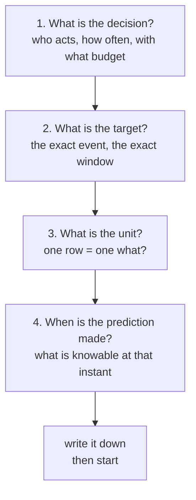
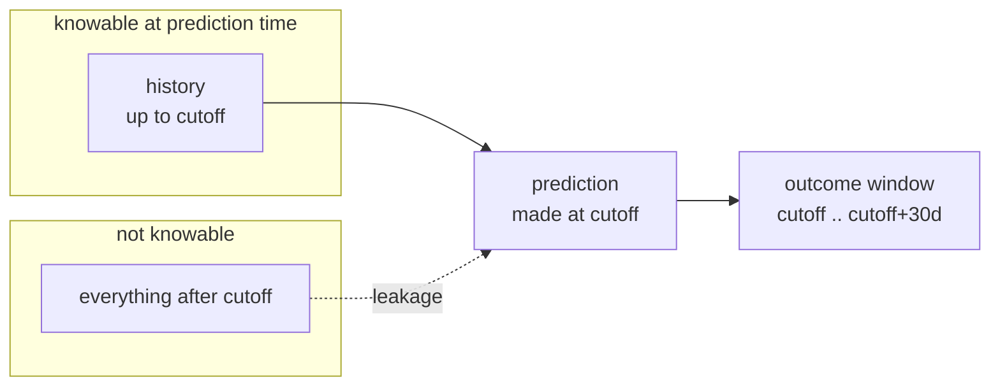

# Lesson 02 — Framing a Problem as a Model

**Goal:** turn "we are losing customers" into something a model can be trained
on — and notice how many different models that sentence allows.

## What you will learn

- Defining the target, and why the definition *is* the project
- Choosing the unit of analysis
- Prediction time: what you are allowed to know
- The framing document you write before any code

---

## Four questions before any code



Every failed data science project I have seen skipped one of these and found
out three weeks later.

---

## 1. "Churn" is not a definition

Here are three reasonable definitions of the same English word.

```python
import numpy as np
import pandas as pd

rng = np.random.default_rng(3)
m = 4_000
asof = pd.Timestamp("2026-07-01")

customers = pd.DataFrame({
    "customer_id": np.arange(1, m + 1),
    "last_login": asof - pd.to_timedelta(rng.exponential(18, m).astype(int), unit="D"),
    "subscription_end": asof + pd.to_timedelta(rng.integers(-20, 60, m), unit="D"),
    "auto_renew": rng.random(m) > 0.18,
    "plan_changed_to_lower": rng.random(m) < 0.06,
})

cancelled = (~customers["auto_renew"]) & (
    customers["subscription_end"] <= asof + pd.Timedelta(days=30))
inactive = customers["last_login"] < asof - pd.Timedelta(days=30)
downgraded_or_gone = cancelled | customers["plan_changed_to_lower"]

defs = {
    "A: cancels in next 30d": cancelled,
    "B: no login for 30d": inactive,
    "C: cancels or downgrades": downgraded_or_gone,
}
for name, label in defs.items():
    print(f"{name:<26} base rate {label.mean():>6.1%}  positives {label.sum():>5}")
```

```text
A: cancels in next 30d     base rate  11.7%  positives   469
B: no login for 30d        base rate  17.8%  positives   711
C: cancels or downgrades   base rate  16.8%  positives   671
```

Different base rates — which already means different models, different
thresholds and different economics. But the worse problem is *which customers*
each definition picks.

```python
names = list(defs)
print(f"{'':<26}" + "".join(f"{n[0]:>8}" for n in names))
for a in names:
    row = f"{a:<26}"
    for b in names:
        inter = (defs[a] & defs[b]).sum()
        union = (defs[a] | defs[b]).sum()
        row += f"{inter / union:>8.2f}"
    print(row)
```

```text
                                 A       B       C
A: cancels in next 30d        1.00    0.06    0.70
B: no login for 30d           0.06    1.00    0.08
C: cancels or downgrades      0.70    0.08    1.00
```

Those are Jaccard overlaps — shared customers over total customers.

**A and B overlap by 0.06.** The people who cancel and the people who stop
logging in are, in this data, almost entirely different groups. A model
trained on B and evaluated by a stakeholder who meant A will look broken, and
nobody will be able to say why.

So the target definition is written down in one sentence with no adjectives:

> `churned_next_30d = 1` if the customer's subscription is cancelled or
> expires without renewal within 30 days of the prediction date, measured on
> the billing table, excluding cancellations that are reversed within 7 days.

If the business cannot agree on that sentence, **the modelling has not started
yet**, and starting it anyway is the expensive mistake.

| Decision in the target | Consequence |
|---|---|
| The window (30d vs 90d) | Longer window = higher base rate, easier model, later action |
| Involuntary churn included? | Failed cards are a payments problem, not a retention one |
| Reversals | A customer who cancels and returns in 3 days is noise |
| Downgrades | Changes the metric from "count of customers" to "revenue" |

---

## 2. One row equals one what?

```python
months = pd.date_range("2026-01-01", "2026-06-01", freq="MS")
panel = pd.DataFrame(
    [(c, month) for c in customers["customer_id"] for month in months],
    columns=["customer_id", "month"])
panel["churned"] = rng.random(len(panel)) < 0.03

print(f"rows per customer : {len(panel) / m:.0f}")
print(f"customer rows     : {m:>7,}   base rate {cancelled.mean():.3f}")
print(f"customer-month rows: {len(panel):>7,}   base rate {panel['churned'].mean():.3f}")

leak = panel.sample(frac=1.0, random_state=0)
split = int(0.75 * len(leak))
train_ids = set(leak.iloc[:split]["customer_id"])
test_ids = set(leak.iloc[split:]["customer_id"])
print(f"customers in BOTH train and test after a random row split: "
      f"{len(train_ids & test_ids):,} of {m:,}")
```

```text
rows per customer : 6
customer rows     :   4,000   base rate 0.117
customer-month rows:  24,000   base rate 0.031
customers in BOTH train and test after a random row split: 3,291 of 4,000
```

Two units, two different base rates for the same phenomenon: 11.7% per
customer, 3.1% per customer-month. Neither is wrong; quoting one and meaning
the other is.

The last line is the trap. A customer-month panel has six rows per customer,
so a random split puts **3,291 of 4,000 customers on both sides of it**. The
model sees the same person in training and in testing, and your test score
measures memory, not generalisation. The fix is to split on the *entity*:

```python
ids = customers["customer_id"].to_numpy()
rng_split = np.random.default_rng(0)
rng_split.shuffle(ids)
train_ids = set(ids[:3_000])
train = panel[panel["customer_id"].isin(train_ids)]
test = panel[~panel["customer_id"].isin(train_ids)]
print(f"train rows {len(train):,}  test rows {len(test):,}")
print("shared customers:",
      len(set(train['customer_id']) & set(test['customer_id'])))
```

```text
train rows 18,000  test rows 6,000
shared customers: 0
```

| Unit | Use when | Watch out for |
|---|---|---|
| Customer | One decision per customer, ever | Ignores that risk changes over time |
| Customer-month | Recurring monthly decision | Group-aware splitting is mandatory |
| Session / event | Real-time decisions | Heavily correlated rows, huge tables |
| Transaction | Fraud, pricing | Extreme imbalance |

---

## 3. When is the prediction made?

This is the question that kills projects quietly. A feature is only legal if
its value was knowable **before** the prediction timestamp.

```python
events = pd.DataFrame({
    "customer_id": rng.integers(1, 51, 900),
    "event_at": pd.Timestamp("2026-05-01") + pd.to_timedelta(
        rng.integers(0, 90 * 24, 900), unit="h"),
})

def logins_before(events, cutoff, window_days=30):
    window = events[(events["event_at"] < cutoff)
                    & (events["event_at"] >= cutoff - pd.Timedelta(days=window_days))]
    return window.groupby("customer_id").size()

naive = events.groupby("customer_id").size()
correct = logins_before(events, pd.Timestamp("2026-06-01"))
compare = pd.DataFrame({"all_time": naive,
                        "as_of_2026-06-01": correct}).fillna(0).astype(int)
print(compare.head(5).to_string())
print(f"\nmean all-time count : {compare['all_time'].mean():.1f}")
print(f"mean as-of count    : {compare['as_of_2026-06-01'].mean():.1f}")
```

```text
             all_time  as_of_2026-06-01
customer_id
1                  26                14
2                  22                 7
3                  23                 4
4                  16                 6
5                  20                11

mean all-time count : 18.0
mean as-of count    : 6.0
```

`all_time` counts every event in the table, including events that happen
*after* the prediction date. It is three times larger — and completely
unavailable at the moment the model actually runs. Training on it produces a
model that scores beautifully offline and collapses in production, because in
production the future column is empty.

This is leakage, and lesson 03 is entirely about it. The habit that prevents
it is simple: **every feature function takes a `cutoff` argument, and no query
is allowed to run without one.**



---

## 4. The framing document

Before writing model code, fill this in. It is one page, and it is the thing
you send to the stakeholder for approval.

```text
DECISION      Which 1,000 customers the retention team calls each Monday
OWNER         Head of Retention
FREQUENCY     Weekly, Monday 06:00
BUDGET        1,000 calls/week, 50 EGP each

TARGET        churned_next_30d — cancelled or expired without renewal within
              30 days of the prediction date, per the billing table,
              excluding reversals inside 7 days
UNIT          One row per customer per week
PREDICT AT    Sunday 23:59; features use data strictly before that instant
POPULATION    Active paying subscribers with tenure >= 30 days

BASELINE      Current rule: everyone with a failed payment last month
METRIC        Precision@1000, and expected profit at the chosen k
MIN USEFUL    Must beat the current rule's hit rate by 5 points to be worth
              the deployment cost

RISKS         Offer cannibalisation (people who would have stayed anyway);
              the target is recorded 30 days late, so retraining lags
NOT IN SCOPE  Involuntary churn from card failures — payments team owns it
```

Two lines there do most of the work.

**`BASELINE`** — there is always a current process, even if it is a person's
intuition. If you do not measure it, you cannot claim to have improved on it,
and lesson 05 is about this.

**`MIN USEFUL`** — agreed *before* you see any results, so the goalposts
cannot move in either direction.

---

## Common mistakes

| Mistake | Why it hurts |
|---|---|
| "Predict churn" as the whole spec | Three people imagine three different models |
| Choosing the window to make the base rate look good | You optimised the definition, not the business |
| Random row splits on a panel | Test score measures memory; 3,291 of 4,000 customers leaked |
| Feature code with no `cutoff` parameter | Leakage is now the default, not the exception |
| Population defined after seeing results | "It works well on customers with tenure > 90d" is a discovery only if it was declared first |

---

## Exercises

1. Change the window in definition A from 30 days to 90. Report the new base
   rate and the new Jaccard overlap with B. Does a longer window make A more
   or less like "stopped using it"?
2. Write the one-sentence target definition for: *"predict which orders will
   be returned"*. Name the table, the window and one exclusion.
3. Using `logins_before`, compute the feature at three cutoffs one month
   apart for customer 1. Why is the sequence, not the single number, the more
   honest feature?
4. Take a problem from your own work and fill in the framing document. The
   `MIN USEFUL` line must contain a number.

---

**Next:** [Lesson 03 — The Data You Actually Have](03-the-data-you-have.md)
