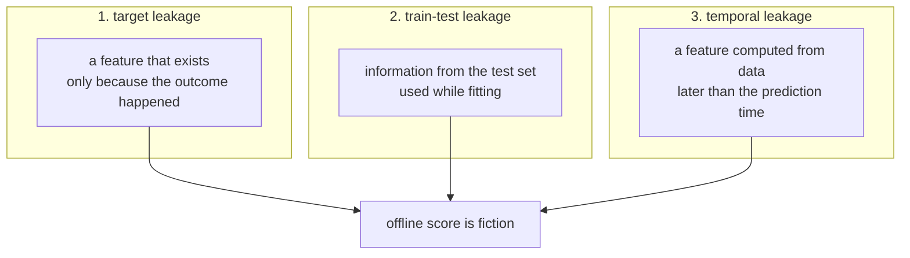
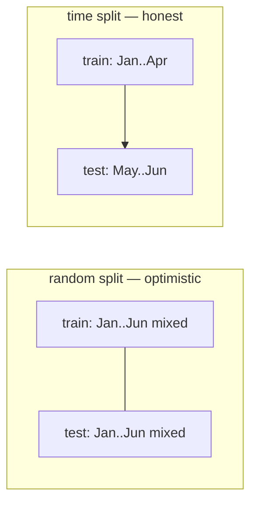

# Lesson 03 — The Data You Actually Have

**Goal:** get an honest number out of your data, which mostly means finding
the reasons the first number was dishonest.

## What you will learn

- Leakage, and the three shapes it comes in
- A scan that finds most leaks in ten lines
- Why the split has to match how the model will be used
- The data audit you run before modelling

---

## The leak

Two columns in the dataset were recorded *because* the customer left:
`days_to_renewal` (a cancelling customer is near the end of their term) and
`cancellation_reason` (empty for everyone who stayed). Here is what including
one of them does.

```python
import pandas as pd
from sklearn.ensemble import HistGradientBoostingClassifier
from sklearn.model_selection import train_test_split
from sklearn.metrics import roc_auc_score

df = pd.read_parquet("/tmp/subscribers.parquet")
y = df["churned_next_30d"]

honest = ["tenure_days", "logins_last_30d", "support_tickets_last_30d",
          "payment_failures_last_90d", "monthly_fee"]
leaky = honest + ["days_to_renewal"]

def auc(features):
    X = df[features]
    X_tr, X_te, y_tr, y_te = train_test_split(
        X, y, test_size=0.25, random_state=0, stratify=y)
    model = HistGradientBoostingClassifier(random_state=0).fit(X_tr, y_tr)
    return roc_auc_score(y_te, model.predict_proba(X_te)[:, 1])

print(f"honest features : ROC-AUC {auc(honest):.3f}")
print(f"+ days_to_renewal: ROC-AUC {auc(leaky):.3f}")
```

```text
honest features : ROC-AUC 0.667
+ days_to_renewal: ROC-AUC 0.946
```

One extra column moved the model from **0.667 to 0.946**. In a real project
that is the moment you email your manager. It is also the moment you should be
most suspicious: a jump of 0.28 from one feature is not a modelling
breakthrough, it is a bug, and the cost of believing it is a deployed model
that scores 0.667 on Monday morning with a promise of 0.946 attached to it.

The rule: **a suspiciously good result is a bug report until proven
otherwise.** Improvements from honest work are boring and small.

---

## Three shapes of leakage



| Shape | Typical example in this dataset | How you catch it |
|---|---|---|
| Target | `cancellation_reason`, filled in at cancellation | Single-feature scan; ask "when was this written?" |
| Train-test | Scaling or feature selection fit before splitting | Do everything inside a `Pipeline` (lesson 04) |
| Temporal | `logins_last_30d` recomputed today, not as of the cutoff | Every feature query takes a `cutoff` |

---

## The ten-line scan

Fit a depth-3 tree on **one feature at a time**. Any single column that alone
separates the classes well is either the answer in disguise or your most
important discovery — and it is almost always the first one.

```python
from sklearn.tree import DecisionTreeClassifier

df2 = df.copy()
df2["has_cancellation_reason"] = (df2["cancellation_reason"] != "").astype(int)
candidates = honest + ["days_to_renewal", "has_cancellation_reason"]

print(f"{'feature':<28}{'single-feature AUC':>20}")
for col in candidates:
    X_tr, X_te, y_tr, y_te = train_test_split(
        df2[[col]], y, test_size=0.25, random_state=0, stratify=y)
    tree = DecisionTreeClassifier(max_depth=3, random_state=0).fit(X_tr, y_tr)
    a = roc_auc_score(y_te, tree.predict_proba(X_te)[:, 1])
    flag = "  <-- SUSPECT" if a > 0.80 else ""
    print(f"{col:<28}{a:>20.3f}{flag}")
```

```text
feature                       single-feature AUC
tenure_days                                0.575
logins_last_30d                            0.646
support_tickets_last_30d                   0.513
payment_failures_last_90d                  0.539
monthly_fee                                0.624
days_to_renewal                            0.920  <-- SUSPECT
has_cancellation_reason                    1.000  <-- SUSPECT
```

`has_cancellation_reason` scores **1.000** — a perfect classifier from one
binary column, because that column *is* the label with a different name. Real
features score 0.51 to 0.65, which is what genuine signal looks like.

Run this scan on every new dataset, before any modelling. Then, for every
column above 0.80, answer one question in writing: **at what moment is this
value written to the database?** If the answer is "when the outcome happens",
drop it.

---

## Leakage you cannot see in the columns

This one is subtler, and it is the reason lesson 04 exists. Here the target is
pure random noise — no model should beat 0.500.

```python
import numpy as np
from sklearn.linear_model import LogisticRegression
from sklearn.model_selection import cross_val_score

rng = np.random.default_rng(0)
n = 500
noise = pd.DataFrame(rng.normal(size=(n, 2_000)))
target = pd.Series(rng.integers(0, 2, n))

# WRONG: pick the best columns using all the data, then cross-validate
corr = noise.apply(lambda c: abs(np.corrcoef(c, target)[0, 1]))
top = corr.nlargest(20).index
wrong = cross_val_score(LogisticRegression(max_iter=1000),
                        noise[top], target, cv=5, scoring="roc_auc").mean()
print(f"select-then-CV (wrong): ROC-AUC {wrong:.3f}")
```

```text
select-then-CV (wrong): ROC-AUC 0.720
```

**0.720 out of pure noise.** The selection step looked at the whole target,
including the rows later used for validation, and picked the twenty columns
that happened to correlate with them. The cross-validation that followed was
measuring a decision that had already seen the answer.

```python
from sklearn.pipeline import make_pipeline
from sklearn.feature_selection import SelectKBest, f_classif

right = cross_val_score(
    make_pipeline(SelectKBest(f_classif, k=20), LogisticRegression(max_iter=1000)),
    noise, target, cv=5, scoring="roc_auc").mean()
print(f"select inside CV (right): ROC-AUC {right:.3f}")
print("the target is random noise; the true answer is 0.500")
```

```text
select inside CV (right): ROC-AUC 0.457
the target is random noise; the true answer is 0.500
```

Put the same selection *inside* the pipeline and the score collapses to
**0.457** — noise, correctly identified as noise. (It lands slightly below
0.500 rather than exactly on it; with 500 rows and five folds, that is
ordinary sampling variation, and pretending it should be 0.500 exactly is its
own kind of dishonesty.)

Anything fitted on data — a scaler, an imputer, a selector, an encoder, a
target encoding — must be fitted inside the loop, on the training fold only.

---

## Split the way the model will be used

The model will be trained on the customers you have and applied to customers
who arrive later. So test it that way.

```python
df_sorted = df.sort_values("signup_date")
cut = df_sorted["signup_date"].quantile(0.75)
train = df_sorted[df_sorted["signup_date"] <= cut]
test = df_sorted[df_sorted["signup_date"] > cut]

print(f"train: {len(train):,} rows, signups "
      f"{train['signup_date'].min().date()} to {train['signup_date'].max().date()}")
print(f"test : {len(test):,} rows, signups "
      f"{test['signup_date'].min().date()} to {test['signup_date'].max().date()}")

m = HistGradientBoostingClassifier(random_state=0).fit(
    train[honest], train["churned_next_30d"])
time_auc = roc_auc_score(test["churned_next_30d"],
                         m.predict_proba(test[honest])[:, 1])
print(f"\nrandom split AUC : {auc(honest):.3f}")
print(f"time   split AUC : {time_auc:.3f}")
print(f"train churn rate {train['churned_next_30d'].mean():.3f}  "
      f"test churn rate {test['churned_next_30d'].mean():.3f}")
```

```text
train: 9,018 rows, signups 2025-01-01 to 2026-02-08
test : 2,982 rows, signups 2026-02-09 to 2026-06-24

random split AUC : 0.667
time   split AUC : 0.650
train churn rate 0.158  test churn rate 0.169
```

0.667 random, **0.650** in time order. Small here, because this dataset has no
real trend built into it. In production data the gap is routinely 0.05 or
more, and it is always in the same direction: the random split is the
optimistic one, because it lets the model learn from the future.



| Split | Use when |
|---|---|
| Random | Rows are independent and there is no time order — rare |
| Stratified | Random, plus the target is imbalanced |
| Group (`GroupKFold`) | Multiple rows per entity — the panel from lesson 02 |
| Time (`TimeSeriesSplit`) | The model will predict the future, which is nearly always |
| Group **and** time | A panel that will predict the future — the honest default |

---

## The audit, before any modelling

```python
def audit(df, target, time_col=None):
    report = {
        "rows": len(df),
        "duplicate_rows": int(df.duplicated().sum()),
        "base_rate": round(df[target].mean(), 4),
        "positives": int(df[target].sum()),
        "columns_all_null": [c for c in df if df[c].isna().all()],
        "constant_columns": [c for c in df if df[c].nunique(dropna=False) <= 1],
        "high_null": {c: round(df[c].isna().mean(), 3)
                      for c in df if df[c].isna().mean() > 0.2},
    }
    if time_col:
        report["time_range"] = (str(df[time_col].min().date()),
                                str(df[time_col].max().date()))
    return report

for key, value in audit(df, "churned_next_30d", "signup_date").items():
    print(f"{key:<20} {value}")
```

```text
rows                 12000
duplicate_rows       0
base_rate            0.1608
positives            1929
columns_all_null     []
constant_columns     []
high_null            {}
time_range           ('2025-01-01', '2026-06-24')
```

1,929 positives. That number sets the ceiling on what you can learn: with
under 2,000 examples of the thing you care about, a model with 200 features is
not going to work, no matter which algorithm you pick.

---

## Common mistakes

| Mistake | Why it hurts |
|---|---|
| Celebrating a big jump in score | 0.946 here was a leak, not a result |
| Fitting a scaler or selector before splitting | 0.720 AUC on pure noise |
| Random splitting time-ordered data | The model learns from the future and you never find out until production |
| Random splitting a panel | The same customer in train and test |
| Keeping a column because it helps | "It helps" is what leakage looks like from the inside |
| Counting rows instead of positives | 12,000 rows sounds like plenty; 1,929 positives is the real budget |

---

## Exercises

1. Add `has_cancellation_reason` to the `honest` list and report the AUC. Then
   write the one sentence you would send to a manager who asks why the model
   got worse after you "fixed" it.
2. Lower the scan's threshold from 0.80 to 0.70. Which honest feature is now
   flagged, and why is a scan that flags real features still useful?
3. Replace the 0.75 quantile time cut with 0.50. Does the time-split AUC get
   better or worse, and what are the two competing effects?
4. Write the "when is this value written?" answer for all five honest
   features. One of them is more fragile than the others — which, and why?

---

**Next:** [Lesson 04 — Features and Pipelines](04-features-and-pipelines.md)
