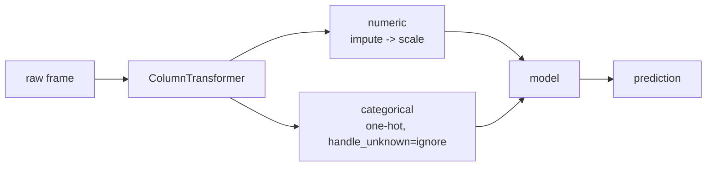

# Lesson 04 — Features and Pipelines

**Goal:** build the transformation once, in an object that cannot cheat and
cannot drift away from what production does.

## What you will learn

- Why manual preprocessing breaks the first Monday after launch
- `ColumnTransformer` and `Pipeline` as the unit of work
- Feature engineering, and measuring whether it helped
- Reading importance without over-reading it

---

## The manual way, and the Monday it breaks

```python
import pandas as pd
df = pd.read_parquet("/tmp/subscribers.parquet")

train = df.iloc[:9_000]
live = df.iloc[9_000:].copy()
live.loc[live.index[:5], "plan"] = "enterprise"   # a new plan launched on Monday

train_encoded = pd.get_dummies(train[["plan", "country"]])
live_encoded = pd.get_dummies(live[["plan", "country"]])
print("train columns:", list(train_encoded.columns))
print("live  columns:", list(live_encoded.columns))
print("same shape?", train_encoded.shape[1] == live_encoded.shape[1])
```

```text
train columns: ['plan_basic', 'plan_plus', 'plan_pro', 'country_AE', 'country_EG', 'country_MA', 'country_SA']
live  columns: ['plan_basic', 'plan_enterprise', 'plan_plus', 'plan_pro', 'country_AE', 'country_EG', 'country_MA', 'country_SA']
same shape? False
```

Sales launched an `enterprise` plan. `get_dummies` invented a column that the
model has never seen, the widths no longer match, and the prediction job
crashes — or worse, if you wrote the columns positionally, it does not crash
and every prediction after column two is computed from the wrong feature.

`get_dummies` is a **function of the data it is given**. Production is a
different dataset. What you need is an object that learned the categories
during training and refuses to change its mind.

---

## The pipeline



```python
from sklearn.compose import ColumnTransformer
from sklearn.pipeline import Pipeline
from sklearn.preprocessing import OneHotEncoder, StandardScaler
from sklearn.impute import SimpleImputer
from sklearn.linear_model import LogisticRegression
from sklearn.model_selection import cross_val_score, StratifiedKFold

numeric = ["tenure_days", "logins_last_30d", "support_tickets_last_30d",
           "payment_failures_last_90d", "monthly_fee"]
categorical = ["plan", "country", "age_band"]

pre = ColumnTransformer([
    ("num", Pipeline([("impute", SimpleImputer(strategy="median")),
                      ("scale", StandardScaler())]), numeric),
    ("cat", OneHotEncoder(handle_unknown="ignore", sparse_output=False), categorical),
])
pipe = Pipeline([("pre", pre), ("model", LogisticRegression(max_iter=1000))])

X, y = df[numeric + categorical], df["churned_next_30d"]
cv = StratifiedKFold(5, shuffle=True, random_state=0)
scores = cross_val_score(pipe, X, y, cv=cv, scoring="roc_auc")
print("fold AUCs:", " ".join(f"{s:.3f}" for s in scores))
print(f"mean {scores.mean():.3f} +/- {scores.std():.3f}")
```

```text
fold AUCs: 0.682 0.699 0.665 0.686 0.676
mean 0.682 +/- 0.011
```

Three properties you got for free here, and each one is a class of bug you can
no longer write:

1. **Nothing is fitted outside the fold.** `cross_val_score` refits the whole
   pipeline — imputer, scaler, encoder — on each training fold. The leak from
   lesson 03 is now structurally impossible.
2. **The transformation travels with the model.** One `joblib.dump` and the
   prediction service has the identical preprocessing.
3. **The fold spread is visible.** 0.665 to 0.699 across folds, standard
   deviation 0.011. Any "improvement" smaller than that is noise, and knowing
   this number stops you chasing four weeks of it.

---

## The new plan arrives and nothing breaks

```python
pipe.fit(X.iloc[:9_000], y.iloc[:9_000])
live_X = X.iloc[9_000:].copy()
live_X.loc[live_X.index[:5], "plan"] = "enterprise"
print("predicted without error, first 5 probabilities:",
      " ".join(f"{p:.3f}" for p in pipe.predict_proba(live_X)[:5, 1]))
print("encoded width:", pipe.named_steps["pre"].transform(live_X).shape[1])
```

```text
predicted without error, first 5 probabilities: 0.123 0.203 0.268 0.047 0.367
encoded width: 16
```

`handle_unknown="ignore"` encodes `enterprise` as all-zeros across the plan
columns, the width stays at 16, and the job completes.

Note what it did **not** do: it did not warn you. The model is now scoring
enterprise customers as if they had no plan at all, which is a silent quality
problem rather than a crash. Not crashing is the right behaviour for a batch
job at 6 a.m.; noticing is lesson 09's job, and this is exactly the kind of
thing it watches for.

---

## Why the scaler must only see training data

```python
import numpy as np
from sklearn.model_selection import train_test_split

X_tr, X_te = train_test_split(df[numeric], test_size=0.25, random_state=0)
all_mean = StandardScaler().fit(df[numeric]).mean_
train_mean = StandardScaler().fit(X_tr).mean_

print(f"{'feature':<28}{'fit on all':>12}{'fit on train':>14}{'diff':>9}")
for name, a, b in zip(numeric, all_mean, train_mean):
    print(f"{name:<28}{a:>12.3f}{b:>14.3f}{a - b:>9.3f}")
```

```text
feature                       fit on all  fit on train     diff
tenure_days                      286.332       285.261    1.070
logins_last_30d                    9.285         9.322   -0.037
support_tickets_last_30d           0.598         0.597    0.001
payment_failures_last_90d          0.142         0.145   -0.003
monthly_fee                      173.275       174.278   -1.003
```

The differences are tiny — 1.07 days of tenure, 1 EGP of fee. On this dataset
scaling on everything would barely change the score, and it would be easy to
conclude the rule is pedantry.

It is not, for two reasons. The difference is small here because the split is
random and the dataset is large and homogeneous; with 300 rows, a rare
category, or a time-ordered split it is not small. And the *mechanism* is
identical to the one that produced 0.720 AUC on pure noise in lesson 03 — the
only thing that varied was how much information the fitted step carried.
Correctness you can only verify by measuring is not a rule you can follow; the
rule is "fit inside the pipeline", always, and then you never have to check.

---

## Engineering features, and honestly reporting the result

```python
from sklearn.ensemble import HistGradientBoostingClassifier
from sklearn.preprocessing import FunctionTransformer

def add_rates(frame):
    out = frame.copy()
    out["logins_per_week"] = out["logins_last_30d"] / (30 / 7)
    out["tickets_per_100d"] = (out["support_tickets_last_30d"]
                               / out["tenure_days"] * 100)
    out["fee_per_login"] = out["monthly_fee"] / (out["logins_last_30d"] + 1)
    out["months_active"] = out["tenure_days"] / 30.0
    return out

derived = ["logins_per_week", "tickets_per_100d", "fee_per_login", "months_active"]
base = Pipeline([("pre", pre),
                 ("model", HistGradientBoostingClassifier(random_state=0))])
rich_pre = ColumnTransformer([
    ("num", Pipeline([("impute", SimpleImputer(strategy="median")),
                      ("scale", StandardScaler())]), numeric + derived),
    ("cat", OneHotEncoder(handle_unknown="ignore", sparse_output=False), categorical),
])
rich = Pipeline([("derive", FunctionTransformer(add_rates)),
                 ("pre", rich_pre),
                 ("model", HistGradientBoostingClassifier(random_state=0))])

for name, model in [("raw features", base), ("+ 4 engineered", rich)]:
    s = cross_val_score(model, X, y, cv=cv, scoring="roc_auc")
    print(f"{name:<16} AUC {s.mean():.4f} +/- {s.std():.4f}")
```

```text
raw features     AUC 0.6617 +/- 0.0186
+ 4 engineered   AUC 0.6580 +/- 0.0142
```

Four carefully reasoned features made the model **slightly worse**: 0.6617 to
0.6580, a drop of 0.0037 against a fold standard deviation of 0.018. The
honest conclusion is not "engineering hurt" — the change is a fifth of the
noise. The honest conclusion is **"no measurable effect"**, and the right
action is to delete the four features, because unmeasurable benefit is not
worth four more things that can break in production.

Two reasons this was predictable, worth knowing before you spend a week on
feature ideas:

- **Ratios of features a tree already has are usually redundant.** A tree can
  split on `logins` and on `tenure` separately and approximate their ratio.
  Ratios help *linear* models, which cannot.
- **`months_active` is `tenure_days / 30`** — a monotone rescaling. A tree is
  invariant to it. It adds exactly nothing, and writing it down was a mistake
  a measurement caught.

Also notice the comparison across the last two sections: the logistic
regression scored **0.682** and gradient boosting **0.662** on the same data.
The simpler model is ahead. Lesson 05 takes that seriously.

---

## Importance, read carefully

```python
from sklearn.inspection import permutation_importance

X_tr, X_te, y_tr, y_te = train_test_split(
    X, y, test_size=0.25, random_state=0, stratify=y)
fitted = rich.fit(X_tr, y_tr)
imp = permutation_importance(fitted, X_te, y_te, n_repeats=5,
                             random_state=0, scoring="roc_auc")
for i in np.argsort(imp.importances_mean)[::-1]:
    print(f"{X.columns[i]:<28}{imp.importances_mean[i]:>+8.4f}")
```

```text
logins_last_30d              +0.1030
tenure_days                  +0.0376
payment_failures_last_90d    +0.0181
support_tickets_last_30d     +0.0149
monthly_fee                  +0.0075
country                      +0.0055
age_band                     +0.0015
plan                         -0.0003
```

Permutation importance shuffles one column and measures how much AUC falls, on
held-out data. It is the version to trust, because it asks about the fitted
model's predictions rather than about the training procedure's internals.

`logins_last_30d` carries 0.103 of AUC — most of the model. `plan` scores
**-0.0003**: shuffling it made the model very slightly *better*, which means
its contribution is indistinguishable from zero.

That is a finding about the *model*, not the world. `plan` is strongly
associated with churn — 21.5% for basic against 6.4% for pro, from lesson 01 —
but that association runs through logins, and once the model has logins, plan
adds nothing. **Importance measures what is left to learn, not what matters.**

| Method | Measures | Trap |
|---|---|---|
| Permutation on test | Effect on held-out predictions | Correlated features share credit and both look weak |
| Tree `feature_importances_` | How often it was split on, in training | Inflated for high-cardinality columns |
| Coefficients | Linear effect per standardised unit | Meaningless unscaled; unstable when features correlate |
| SHAP | Per-prediction attribution | Slow, and still not causal |

None of these tell you what would happen if you *changed* the feature. "Get
customers to log in more and churn falls 10%" does not follow from this table.

---

## Common mistakes

| Mistake | Why it hurts |
|---|---|
| `pd.get_dummies` in production code | Column set depends on the batch |
| Preprocessing in a notebook cell, model in a file | The two drift apart within a week |
| `handle_unknown="error"` in a batch job | The 6 a.m. run dies on a new plan name |
| Adding features without a before/after measurement | You cannot tell effort from effect |
| Reporting an improvement smaller than the fold spread | 0.0037 against +/-0.018 is not an improvement |
| Reading importance as causality | The lever you pull may not be the feature |

---

## Exercises

1. Set `handle_unknown="error"` and rerun the enterprise-plan block. Read the
   traceback, then say which of the two behaviours you would want for a live
   API, and why it differs from the batch answer.
2. Drop the four engineered features from `rich` and confirm you recover the
   `base` score exactly. Why must it be exact?
3. Swap `SimpleImputer(strategy="median")` for `strategy="mean"`. The score
   will barely move — explain why, using the null count from lesson 03's audit.
4. Add `OneHotEncoder(drop="first")`. It changes the logistic regression's
   coefficients but not its AUC. Explain both halves of that sentence.

---

**Next:** [Lesson 05 — Baselines and Model Selection](05-baselines-and-selection.md)
