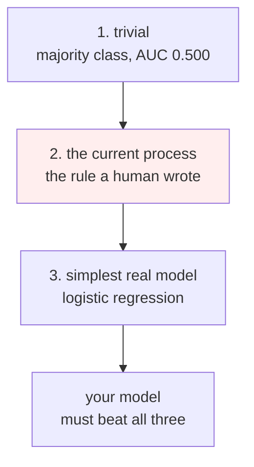

# Lesson 05 — Baselines and Model Selection

**Goal:** find out whether you have beaten the thing the business already does,
and pick a model for reasons you can defend.

## What you will learn

- The three baselines, and which one actually matters
- A model ladder, and reading it for surprises
- Whether a difference between two models is real
- When tuning is worth the week

---

## Three baselines



The middle one is the one people skip, and it is the only one the business
recognises. Nobody is currently using a majority-class classifier; they are
using a rule someone wrote in a spreadsheet, and *that* is what you must beat.

```python
import numpy as np
import pandas as pd
from sklearn.model_selection import train_test_split
from sklearn.metrics import roc_auc_score

df = pd.read_parquet("/tmp/subscribers.parquet")
numeric = ["tenure_days", "logins_last_30d", "support_tickets_last_30d",
           "payment_failures_last_90d", "monthly_fee"]
categorical = ["plan", "country", "age_band"]
X, y = df[numeric + categorical], df["churned_next_30d"]
X_tr, X_te, y_tr, y_te = train_test_split(
    X, y, test_size=0.25, random_state=0, stratify=y)

# what the retention team does today: failed payments first, then basic plans
rule_score = (X_te["payment_failures_last_90d"] * 2
              + (X_te["plan"] == "basic").astype(int)).to_numpy()

def hit_rate_at_k(scores, truth, k):
    top = np.argsort(scores, kind="stable")[::-1][:k]
    return truth.to_numpy()[top].sum(), truth.to_numpy()[top].mean()

for k in (250, 1000):
    caught, rate = hit_rate_at_k(rule_score, y_te, k)
    print(f"current rule,  top {k:>4}: {caught:>4} churners, hit rate {rate:.1%}")
print(f"base rate in the test set        : {y_te.mean():.1%}")
print(f"rule ROC-AUC                     : {roc_auc_score(y_te, rule_score):.3f}")
```

```text
current rule,  top  250:   81 churners, hit rate 32.4%
current rule,  top 1000:  197 churners, hit rate 19.7%
base rate in the test set        : 16.1%
rule ROC-AUC                     : 0.622
```

The hand-written rule already scores **0.622 AUC**, and at the top of its list
it doubles the base rate. This is the number your model has to beat — not
0.500. If you had reported "our model achieves 0.68, far better than random"
you would have been claiming credit for 0.06.

Measure the existing process on day one, before you are attached to a result.

---

## The ladder

Run several models through the identical pipeline and read the table for things
you did not expect.

```python
from sklearn.compose import ColumnTransformer
from sklearn.pipeline import Pipeline
from sklearn.preprocessing import OneHotEncoder, StandardScaler
from sklearn.impute import SimpleImputer
from sklearn.dummy import DummyClassifier
from sklearn.linear_model import LogisticRegression
from sklearn.tree import DecisionTreeClassifier
from sklearn.ensemble import RandomForestClassifier, HistGradientBoostingClassifier
from sklearn.model_selection import StratifiedKFold, cross_validate

def make_pre():
    return ColumnTransformer([
        ("num", Pipeline([("impute", SimpleImputer(strategy="median")),
                          ("scale", StandardScaler())]), numeric),
        ("cat", OneHotEncoder(handle_unknown="ignore", sparse_output=False), categorical),
    ])

models = {
    "majority class": DummyClassifier(strategy="most_frequent"),
    "logistic regression": LogisticRegression(max_iter=1000),
    "decision tree (d=4)": DecisionTreeClassifier(max_depth=4, random_state=0),
    "random forest": RandomForestClassifier(n_estimators=300, random_state=0, n_jobs=-1),
    "gradient boosting": HistGradientBoostingClassifier(random_state=0),
}
cv = StratifiedKFold(5, shuffle=True, random_state=0)   # skip-verify: has timings
fold_scores = {}
print(f"{'model':<22}{'AUC':>8}{'+/-':>8}{'fit s':>8}")
for name, est in models.items():
    pipe = Pipeline([("pre", make_pre()), ("model", est)])
    res = cross_validate(pipe, X, y, cv=cv, scoring="roc_auc")
    fold_scores[name] = res["test_score"]
    print(f"{name:<22}{res['test_score'].mean():>8.3f}"
          f"{res['test_score'].std():>8.3f}{res['fit_time'].sum():>8.2f}")
```

```text
model                      AUC     +/-   fit s
majority class           0.500   0.000    0.03
logistic regression      0.682   0.011    0.07
decision tree (d=4)      0.660   0.012    0.08
random forest            0.613   0.015    1.60
gradient boosting        0.662   0.019    1.52

```

The AUC columns reproduce exactly; the `fit s` column will not, because it
is wall-clock time on one machine. Read timings as ratios, never as values.

Read that table in the order the surprises come.

**Logistic regression wins.** 0.682, ahead of both ensembles. It is also the
fastest to fit by a factor of twenty, the only one whose coefficients you can
put in a slide, and the only one that produces near-linear behaviour a
stakeholder can reason about.

**Random forest is last at 0.613** — worse than a depth-4 decision tree, and
barely ahead of the hand-written rule. With no `max_depth`, each tree grows
until its leaves are pure, and with 1,929 positives spread across 12,000 rows
that means memorising individual customers. Averaging 300 memorisers does not
fix an overfit that every tree shares.

**The `+/-` column is the discipline.** The gap between gradient boosting and
the decision tree is 0.002, against fold standard deviations of 0.019 and
0.012. Those two models are indistinguishable on this data, and any story
about why boosting is better here would be a story about noise.

The true relationship in this dataset is a logistic function of the features —
lesson 01 built it that way. A linear model is the correct model, and no amount
of boosting will beat correct.

---

## Is the difference real?

Cross-validation gives you five paired measurements, on the same folds. Use
the pairing.

```python
from scipy import stats

a = fold_scores["logistic regression"]
b = fold_scores["gradient boosting"]
d = a - b
print("per-fold difference (LR - GB):", " ".join(f"{x:+.4f}" for x in d))
interval = stats.t.interval(0.95, len(d) - 1, loc=d.mean(), scale=stats.sem(d))
print(f"mean difference {d.mean():+.4f}, 95% interval [{interval[0]:+.4f}, {interval[1]:+.4f}]")
print("excludes zero:", interval[0] > 0 or interval[1] < 0)
```

```text
per-fold difference (LR - GB): +0.0442 +0.0072 +0.0103 +0.0139 +0.0244
mean difference +0.0200, 95% interval [+0.0014, +0.0386]
excludes zero: True
```

Logistic regression is ahead on **all five folds**, and the interval on the
difference excludes zero — just, with a lower bound of +0.0014. So the result
survives, but honestly stated it is: *"logistic regression is better by
somewhere between 0.001 and 0.039 AUC"*. That is a wide range with five folds,
and the sentence to write in the report is the range, not the 0.0200.

Note that a paired interval is the right tool precisely because the folds are
shared. Comparing two `mean +/- std` numbers separately throws away the
pairing and will usually tell you nothing is significant.

---

## Does tuning help?

```python
import time   # skip-verify: has timings
from sklearn.model_selection import GridSearchCV

grid = GridSearchCV(
    Pipeline([("pre", make_pre()), ("model", LogisticRegression(max_iter=2000))]),
    {"model__C": [0.01, 0.1, 1.0, 10.0]},
    cv=cv, scoring="roc_auc", n_jobs=-1)
t0 = time.perf_counter()
grid.fit(X, y)
print(f"searched 4 settings in {time.perf_counter() - t0:.1f}s")
res = pd.DataFrame(grid.cv_results_)[
    ["param_model__C", "mean_test_score", "std_test_score"]]
print(res.to_string(index=False))
print(f"best C = {grid.best_params_['model__C']}, AUC {grid.best_score_:.4f}")
print("spread across all four settings: "
      f"{res['mean_test_score'].max() - res['mean_test_score'].min():.4f}")
```

```text
searched 4 settings in 1.9s   # wall clock, varies by machine
 param_model__C  mean_test_score  std_test_score
           0.01         0.681749        0.011196
           0.10         0.681825        0.011260
           1.00         0.681746        0.011272
          10.00         0.681736        0.011295
best C = 0.1, AUC 0.6818
spread across all four settings: 0.0001
```

`C` varied across **three orders of magnitude** and the score moved by
**0.0001** — one hundredth of the fold noise. There is no tuning to be had
here, and `best C = 0.1` is the winner of a coin toss between four identical
options. Reporting it as "we tuned the regularisation and improved the model"
would be false.

This is the common case with eight features and a well-conditioned problem.
Tuning pays when the model has capacity to misuse: tree depth, learning rate,
`min_samples_leaf`, the number of estimators. It does not pay on a linear model
with no collinearity, and the way to find out is the cheap grid you just ran —
**before** the week of Bayesian optimisation.

---

## The decision, in business terms

AUC does not pay anyone. Convert to the thing the retention team will feel.

```python
best = Pipeline([("pre", make_pre()),
                 ("model", LogisticRegression(C=0.1, max_iter=2000))]).fit(X_tr, y_tr)
model_score = best.predict_proba(X_te)[:, 1]

def at_k(scores, k):
    top = np.argsort(scores, kind="stable")[::-1][:k]
    return y_te.to_numpy()[top].sum()

print(f"{'k':>6}{'rule':>10}{'model':>10}{'extra churners':>18}")
for k in (250, 500, 1000):
    r, m = at_k(rule_score, k), at_k(model_score, k)
    print(f"{k:>6}{r:>10}{m:>10}{m - r:>18}")

value = 199.0 * 6 * 0.30
extra = at_k(model_score, 1000) - at_k(rule_score, 1000)
print(f"\nat k=1000 the model finds {extra} more churners, "
      f"worth {extra * value:,.0f} EGP/month")
print("cost of the calls is identical: 1000 x 50 = 50,000 EGP either way")
```

```text
     k      rule     model    extra churners
   250        81        85                 4
   500       120       158                38
  1000       197       256                59

at k=1000 the model finds 59 more churners, worth 21,134 EGP/month
cost of the calls is identical: 1000 x 50 = 50,000 EGP either way
```

The answer depends entirely on `k`, which is a fact about the retention team,
not about the model.

**At k=250 the model finds four more churners than the rule.** Four. If the
team can only make 250 calls a week, this project is not worth deploying, and
the correct recommendation is to say so and go work on something else.

**At k=1000 it finds 59 more**, worth 21,134 EGP a month at the same call cost.
That is a project.

The single most valuable question in this lesson is therefore not "which
model?" — it is **"how many calls can you make?"**, and it should have been
asked in lesson 02's framing document. It was: `BUDGET 1,000 calls/week`.

| Choose the simpler model when | Choose the complex one when |
|---|---|
| The gap is inside the fold noise | The gap is real *and* worth money at your k |
| You must explain individual scores | Nobody asks why |
| It retrains in 0.07s, not 1.6s | Retraining is rare |
| Fewer moving parts matters more than 0.02 AUC | 0.02 AUC is worth the on-call burden |

---

## Common mistakes

| Mistake | Why it hurts |
|---|---|
| Comparing to 0.500 | The rule already scored 0.622; you claimed its work |
| Skipping the simple model | Logistic regression won here, and would never have been tried |
| `RandomForestClassifier()` with defaults on imbalanced data | Unlimited depth memorises; 0.613, worse than a depth-4 tree |
| Reporting the winner without the spread | A 0.002 gap is a coin toss reported as a finding |
| Tuning before checking the tuning matters | Three orders of magnitude of `C` moved AUC by 0.0001 |
| Choosing the model before knowing k | The same model is worthless at 250 and valuable at 1,000 |

---

## Exercises

1. Add `RandomForestClassifier(n_estimators=300, max_depth=5, min_samples_leaf=20)`
   to the ladder. Does constraining it move it past the decision tree? Past
   logistic regression?
2. Run the paired interval between the decision tree and gradient boosting.
   Report the interval and write the one-sentence conclusion.
3. Extend the grid to `C=[1e-4, 1e-3, 0.01, 0.1, 1, 10, 100]`. At which end
   does the score finally move, and what is happening to the coefficients
   there?
4. Recompute the final table with `value_per_save = 99 * 3 * 0.15`. At which k,
   if any, does the model still justify its deployment cost of 15,000 EGP?

---

**Next:** [Lesson 06 — Evaluating Against the Decision](06-evaluating-the-decision.md)
