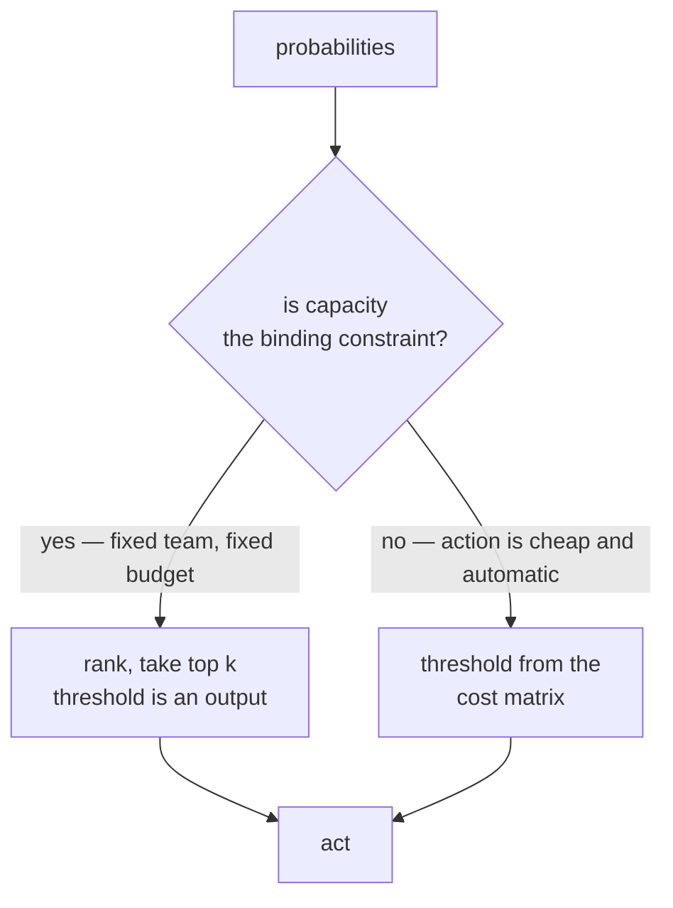

# Lesson 06 — Evaluating Against the Decision

**Goal:** stop scoring the model and start scoring the decision it drives.

## What you will learn

- The threshold is a business parameter, not a default
- Cost matrices, and the profit curve they produce
- Capacity constraints, which override thresholds
- Calibration, and when a probability has to mean something
- Gains and lift, the table stakeholders actually read

---

## Setup

```python
import numpy as np
import pandas as pd
from sklearn.compose import ColumnTransformer
from sklearn.pipeline import Pipeline
from sklearn.preprocessing import OneHotEncoder, StandardScaler
from sklearn.impute import SimpleImputer
from sklearn.linear_model import LogisticRegression
from sklearn.model_selection import train_test_split

df = pd.read_parquet("/tmp/subscribers.parquet")
numeric = ["tenure_days", "logins_last_30d", "support_tickets_last_30d",
           "payment_failures_last_90d", "monthly_fee"]
categorical = ["plan", "country", "age_band"]
X, y = df[numeric + categorical], df["churned_next_30d"]
X_tr, X_te, y_tr, y_te = train_test_split(
    X, y, test_size=0.25, random_state=0, stratify=y)

pre = ColumnTransformer([
    ("num", Pipeline([("impute", SimpleImputer(strategy="median")),
                      ("scale", StandardScaler())]), numeric),
    ("cat", OneHotEncoder(handle_unknown="ignore", sparse_output=False), categorical)])
model = Pipeline([("pre", pre),
                  ("model", LogisticRegression(C=0.1, max_iter=2000))]).fit(X_tr, y_tr)
p = model.predict_proba(X_te)[:, 1]
truth = y_te.to_numpy()

print(f"predicted probabilities: min {p.min():.3f}  median {np.median(p):.3f}  "
      f"max {p.max():.3f}")
print(f"how many exceed 0.50: {(p > 0.5).sum()} of {len(p)}")
print(f"how many exceed 0.30: {(p > 0.3).sum()}")
print(f"how many exceed 0.20: {(p > 0.2).sum()}")
```

```text
predicted probabilities: min 0.007  median 0.151  max 0.632
how many exceed 0.50: 7 of 3000
how many exceed 0.30: 214
how many exceed 0.20: 930
```

The **highest** churn probability the model assigns to anyone is 0.632, and
only seven customers out of 3,000 are above 0.5. `model.predict()` — which uses
0.5 — therefore labels 2,993 people "will not churn" and calls it a day. That
is where lesson 01's recall of 0.031 came from.

0.5 is the right threshold for exactly one situation: a balanced problem where
a false positive and a false negative cost the same. Neither is true here.

---

## The cost matrix, and the profit curve

Write down the four cells. Get the numbers from the business, in a meeting,
with the owner's name attached.

| | actually churns | actually stays |
|---|---|---|
| **we call** | save them: **+358.2 EGP**, less the 50 call = **+308.2** | wasted call: **-50 EGP** |
| **we do not call** | lost customer: 0 extra cash cost, lost upside | correct: 0 |

```python
from sklearn.metrics import confusion_matrix

VALUE_SAVED = 199.0 * 6 * 0.30   # true positive: 6 months kept, 30% accept
COST_CALL = 50.0                 # every contact, right or wrong
COST_MISS = 0.0                  # no extra cash cost, only lost upside

print(f"{'threshold':>10}{'contacted':>11}{'TP':>6}{'FP':>6}"
      f"{'precision':>11}{'recall':>8}{'profit':>12}")
best = None
for t in [0.05, 0.10, 0.15, 0.20, 0.25, 0.30, 0.40, 0.50]:
    pred = (p >= t).astype(int)
    tn, fp, fn, tp = confusion_matrix(truth, pred).ravel()
    contacted = tp + fp
    profit = tp * VALUE_SAVED - contacted * COST_CALL - fn * COST_MISS
    prec = tp / contacted if contacted else float("nan")
    print(f"{t:>10.2f}{contacted:>11}{tp:>6}{fp:>6}{prec:>11.3f}"
          f"{tp / (tp + fn):>8.3f}{profit:>12,.0f}")
    if best is None or profit > best[1]:
        best = (t, profit)
print(f"\nbest threshold {best[0]:.2f} at {best[1]:,.0f} EGP; the 0.50 default earns "
      f"{(truth[(p>=0.5)].sum()*VALUE_SAVED - (p>=0.5).sum()*COST_CALL):,.0f}")
```

```text
 threshold  contacted    TP    FP  precision  recall      profit
      0.05       2752   477  2275      0.173   0.990      33,261
      0.10       2164   430  1734      0.199   0.892      45,826
      0.15       1511   343  1168      0.227   0.712      47,313
      0.20        930   245   685      0.263   0.508      41,259
      0.25        463   144   319      0.311   0.299      28,431
      0.30        214    78   136      0.364   0.162      17,240
      0.40         41    19    22      0.463   0.039       4,756
      0.50          7     4     3      0.571   0.008       1,083

best threshold 0.15 at 47,313 EGP; the 0.50 default earns 1,083
```

**The default threshold captures 2% of the available value.** 1,083 EGP against
47,313 — a factor of 44, from one number that has nothing to do with the model.

The shape of that curve is worth understanding, because it is the same shape
every time:

- **Precision rises as the threshold rises** — 0.173 up to 0.571. The people
  the model is most confident about really are likelier to churn.
- **Profit does not follow precision.** It peaks in the middle, at 0.15. The
  most precise threshold, 0.50, is the least profitable, because it acts on
  almost nobody.
- **The peak is broad.** 0.10 to 0.20 all return between 41,000 and 47,000. A
  broad peak is good news: you do not need to know the business constants
  precisely, only roughly.

If `COST_MISS` were not zero — a churned enterprise customer who tells the
market why they left — the peak would move down, toward calling more people.
Change one cell of the matrix and the recommendation changes; this is why the
matrix is a business artefact, signed off, not a constant in your notebook.

---

## Capacity overrides the threshold

```python
budget = 1_000
order = np.argsort(p)[::-1]
chosen = order[:budget]
tp = truth[chosen].sum()
print(f"top {budget}: threshold implied = {p[chosen][-1]:.3f}, TP {tp}, "
      f"profit {tp * VALUE_SAVED - budget * COST_CALL:,.0f}")
print(f"threshold {best[0]:.2f} would contact {(p >= best[0]).sum()} people "
      f"- capacity is {budget}")
```

```text
top 1000: threshold implied = 0.192, TP 256, profit 41,699
threshold 0.15 would contact 1511 people - capacity is 1000
```

The profit-optimal threshold asks for **1,511 calls**. The retention team can
make 1,000. So the threshold is not 0.15 — it is 0.192, whatever value falls at
position 1,000 in the ranking, and it will be a slightly different number every
week as the population moves.



Most business problems are the left branch and get modelled as the right one.
Ask which you have before you tune anything.

---

## ROC vs precision-recall

```python
from sklearn.metrics import roc_auc_score, average_precision_score, precision_recall_curve

print(f"ROC-AUC          {roc_auc_score(truth, p):.3f}")
print(f"average precision {average_precision_score(truth, p):.3f}")
print(f"base rate         {truth.mean():.3f}")
prec, rec, thr = precision_recall_curve(truth, p)
for want in (0.2, 0.4, 0.6, 0.8):
    i = np.argmin(np.abs(rec - want))
    print(f"recall {rec[i]:.2f} -> precision {prec[i]:.3f} "
          f"at threshold {thr[min(i, len(thr)-1)]:.3f}")
```

```text
ROC-AUC          0.683
average precision 0.285
base rate         0.161
recall 0.20 -> precision 0.354 at threshold 0.284
recall 0.40 -> precision 0.292 at threshold 0.226
recall 0.60 -> precision 0.247 at threshold 0.178
recall 0.80 -> precision 0.216 at threshold 0.129
```

Two numbers for the same model: **0.683** and **0.285**. Both are correct.

ROC-AUC is the probability that a random churner is ranked above a random
stayer. Its baseline is 0.500 regardless of imbalance, which makes it
comparable across datasets and *flattering* on imbalanced ones — the enormous
true-negative count props up the specificity axis.

Average precision is the area under the precision-recall curve, and its
baseline is the **base rate, 0.161**. So 0.285 against 0.161 is the honest
statement of how much better than guessing this model is on the class you care
about.

| Use | When |
|---|---|
| ROC-AUC | Comparing models on the same data; roughly balanced problems |
| Average precision / PR-AUC | Imbalanced problems where you act on positives |
| Precision@k | There is a fixed budget of actions — usually the real metric |
| Recall at fixed precision | A quality bar you must not fall below |
| Expected profit | You have a cost matrix; the best metric when you can get it |

The last line of the block is the one to put in front of a stakeholder: *"to
catch 60% of churners we must accept that 3 in 4 calls are to people who would
have stayed."* No AUC conveys that.

---

## Calibration

A ranking is enough for "call the top 1,000". It is **not** enough the moment
anyone multiplies the probability by money.

```python
from sklearn.ensemble import RandomForestClassifier
from sklearn.metrics import brier_score_loss

rf = Pipeline([("pre", pre), ("model", RandomForestClassifier(
    n_estimators=300, random_state=0, n_jobs=-1))]).fit(X_tr, y_tr)
p_rf = rf.predict_proba(X_te)[:, 1]

print(f"{'bucket':>12}{'n':>7}{'LR pred':>10}{'LR actual':>11}"
      f"{'RF pred':>10}{'RF actual':>11}")
edges = [0, 0.05, 0.10, 0.15, 0.20, 0.30, 1.0]
for lo, hi in zip(edges, edges[1:]):
    m = (p >= lo) & (p < hi)
    m_rf = (p_rf >= lo) & (p_rf < hi)
    print(f"{f'{lo:.2f}-{hi:.2f}':>12}{m.sum():>7}{p[m].mean():>10.3f}"
          f"{truth[m].mean():>11.3f}"
          f"{p_rf[m_rf].mean() if m_rf.sum() else float('nan'):>10.3f}"
          f"{truth[m_rf].mean() if m_rf.sum() else float('nan'):>11.3f}")
print(f"\nBrier score  LR {brier_score_loss(truth, p):.4f}   "
      f"RF {brier_score_loss(truth, p_rf):.4f}")
```

```text
      bucket      n   LR pred  LR actual   RF pred  RF actual
   0.00-0.05    248     0.036      0.020     0.020      0.110
   0.05-0.10    588     0.075      0.080     0.072      0.134
   0.10-0.15    653     0.125      0.133     0.122      0.181
   0.15-0.20    581     0.174      0.169     0.174      0.176
   0.20-0.30    716     0.240      0.233     0.241      0.223
   0.30-1.00    214     0.360      0.364     0.492      0.232

Brier score  LR 0.1270   RF 0.1520
```

Compare the two pairs of columns.

**Logistic regression is calibrated.** Where it says 0.360, 0.364 of those
customers churned. Where it says 0.125, 0.133 churned. You can multiply its
output by revenue and get a number that means something.

**The random forest is not.** In its top bucket it predicts **0.492 and
observes 0.232** — it overstates risk by a factor of two. In its bottom bucket
it predicts 0.020 and observes 0.110, understating by five times. Its Brier
score, 0.1520 against 0.1270, records the same failure in one number.

A random forest's probability is the fraction of trees voting yes. On a small
positive class, with deep trees, that fraction is not a probability at all —
which is the same overfitting that put it last in lesson 05's ladder, seen from
another angle.

If you need calibrated output from a tree ensemble, wrap it:
`CalibratedClassifierCV(rf, method="isotonic", cv=5)`. Fit it on training data
only — it is an estimator, and lesson 04's rule applies to it too.

| The decision | Needs |
|---|---|
| Call the top 1,000 | Ranking only |
| Call everyone above 15% risk | Calibration |
| Offer a discount worth `p x LTV` | Calibration, and tightly |
| Report "we expect 340 cancellations next month" | Calibration; ranking says nothing about totals |

---

## The gains table

This is the artefact to bring to the business review. It contains no
statistics vocabulary and answers the question they are actually asking.

```python
dec = pd.DataFrame({"p": p, "y": truth})
dec["decile"] = pd.qcut(dec["p"], 10, labels=False, duplicates="drop")
g = dec.groupby("decile").agg(n=("y", "size"), churners=("y", "sum"),
                              rate=("y", "mean")).sort_index(ascending=False)
g["lift"] = (g["rate"] / truth.mean()).round(2)
g["cum_churners"] = g["churners"].cumsum()
g["cum_capture"] = (g["cum_churners"] / truth.sum()).round(3)
print(g.to_string())
```

```text
          n  churners      rate  lift  cum_churners  cum_capture
decile
9       300       101  0.336667  2.10           101        0.210
8       300        78  0.260000  1.62           179        0.371
7       300        58  0.193333  1.20           237        0.492
6       300        61  0.203333  1.27           298        0.618
5       300        42  0.140000  0.87           340        0.705
4       300        49  0.163333  1.02           389        0.807
3       300        33  0.110000  0.68           422        0.876
2       300        38  0.126667  0.79           460        0.954
1       300        14  0.046667  0.29           474        0.983
0       300         8  0.026667  0.17           482        1.000
```

The sentence for the slide: **"the riskiest 10% of customers contain 21% of
next month's cancellations — 2.1 times their share."** And: "the top 30%
contains 49% of them."

Now read it critically, because a gains table has a failure mode.

**It is not monotone.** Decile 6 (0.203) is above decile 7 (0.193), and decile
4 (0.163) is above decile 5 (0.140). With 300 customers and ~50 churners per
decile, the standard error on each rate is about 2 percentage points, so
neighbouring deciles that differ by 1 point are the same decile with noise on
top. Do not explain those inversions to a stakeholder — say the middle deciles
are indistinguishable, which is true and shorter.

**The lift in the top decile, 2.10, is the whole product.** Everything else in
this course exists to move that number.

---

## Common mistakes

| Mistake | Why it hurts |
|---|---|
| `model.predict()` on an imbalanced problem | 0.5 earned 1,083 EGP where 0.15 earned 47,313 |
| Choosing the threshold by F1 | F1 assumes precision and recall are equally valuable; your cost matrix says otherwise |
| Tuning a threshold when capacity is fixed | The threshold is an output of `k`, not an input |
| Quoting ROC-AUC on a 2% base rate | 0.90 can coexist with 5% precision |
| Multiplying uncalibrated probabilities by money | The RF was off by 2x at the top and 5x at the bottom |
| Explaining every wiggle in the gains table | Half of them are sampling noise |
| Picking the threshold on the test set and reporting the same number | That is tuning on test; use a validation split |

---

## Exercises

1. Set `COST_MISS = 200` and rerun the sweep. Which way does the optimal
   threshold move, and state the business reason in one sentence.
2. The optimal threshold was chosen on the test set — mild cheating. Split
   `X_tr` into train and validation, pick the threshold on validation, and
   report the profit it earns on test. How much of the 47,313 survives?
3. Wrap the random forest in `CalibratedClassifierCV(..., method="isotonic",
   cv=5)` and rerun the calibration table. Does its Brier score reach the
   logistic regression's 0.1270?
4. Build the gains table with 5 buckets instead of 10. The inversions largely
   disappear — explain why that is a presentation improvement and not an
   analysis improvement.

---

**Next:** [Lesson 07 — Reproducibility and Experiment Tracking](07-reproducibility.md)
